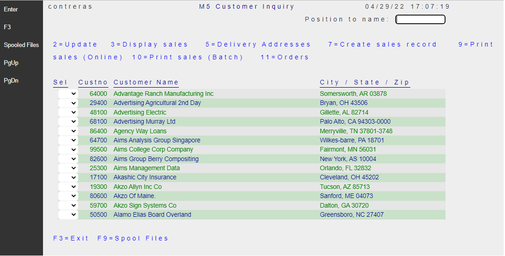

Zebra striping—also known as candy striping or half-shadow—is the application of faint shading to alternate lines or rows in data tables or forms.

## How to add alternating background colors to Subfile rows

1. Identify the subfile in the Displayfile (.cshtml) where you want to apply this style.
2. Add the class="zebra-stripe-subfile" to the subfile markup.
3. Define the CSS style which will select the subfile rows (even and odd) to apply the desired background color.
4. Done! (you may want to *force-refresh* the page to get immediate results - updating Browser cache -).

For example, assume you have a Displayfile `~\Areas\Views\Pages\CUSTDSPF.cshtml`

```html
<div Row="8" RowSpan="@SFLC_SubfilePage">
    @for (int rrn=0; rrn < Model.SFLC.SFL1.Count; rrn++)
    {
        int row = 8 + rrn;
        <DdsSubfileRecord RecordNumber="rrn" For="SFLC.SFL1">
            <DdsDecField Col="4" For="SFLC.SFL1[rrn].SFSEL" VirtualRowCol="@row,4" EditCode="Z" ValuesText="'0','2','3','5','7','9','10','11'" tabIndex=2 />
            <DdsDecField Col="7+1" For="SFLC.SFL1[rrn].SFCUSTNO" Color="Green : !61 , DarkBlue : 61"  EditCode="Z" Comment="CUSTOMER NUMBER" />
            <DdsCharField Col="14+1" For="SFLC.SFL1[rrn].SFNAME1" Upper=true Color="Green : !61 , DarkBlue : 61"  />
            <DdsCharField Col="55+1" For="SFLC.SFL1[rrn].SFCSZ" Upper=true Color="Green : !61 , DarkBlue : 61"  Comment="CITY-STATE-ZIP" />
        </DdsSubfileRecord>
    }
</div>
```

<br>

* Add the attribute `class="zebra-stripe-subfile` to the subfile markup.


```html
<div class="zebra-stripe-subfile" Row="8" RowSpan="@SFLC_SubfilePage">
    @for (int rrn=0; rrn < Model.SFLC.SFL1.Count; rrn++)
    {
        int row = 8 + rrn;
        <DdsSubfileRecord RecordNumber="rrn" For="SFLC.SFL1">
            <DdsDecField Col="4" For="SFLC.SFL1[rrn].SFSEL" VirtualRowCol="@row,4" EditCode="Z" ValuesText="'0','2','3','5','7','9','10','11'" tabIndex=2 />
            <DdsDecField Col="7+1" For="SFLC.SFL1[rrn].SFCUSTNO" Color="Green : !61 , DarkBlue : 61"  EditCode="Z" Comment="CUSTOMER NUMBER" />
            <DdsCharField Col="14+1" For="SFLC.SFL1[rrn].SFNAME1" Upper=true Color="Green : !61 , DarkBlue : 61"  />
            <DdsCharField Col="55+1" For="SFLC.SFL1[rrn].SFCSZ" Upper=true Color="Green : !61 , DarkBlue : 61"  Comment="CITY-STATE-ZIP" />
        </DdsSubfileRecord>
    }
</div>
```

* Define the following `CSS` to the file `~\Site\wwwroot\css\site.css`

```cs
.zebra-stripe-subfile > div:nth-child(even) {
    background-color: rgba(51, 170, 51, .2);
    /*  20% opaque green */
}

.zebra-stripe-subfile > div:nth-child(odd) {
    background-color: rgba(224, 224, 224, .5);
    /*  50% opaque gray */
}
```

* Done!



<br>

>Note: You may have more than one subfile on the Page. Adding the same "zebra-stripe-subfile" class to each subfile will every one of the instances. (Or you can have different class names with different CSS rules, if so desired).


