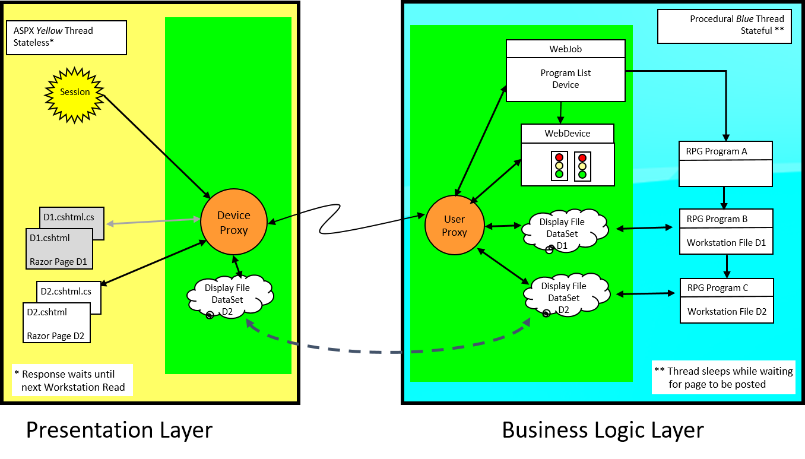
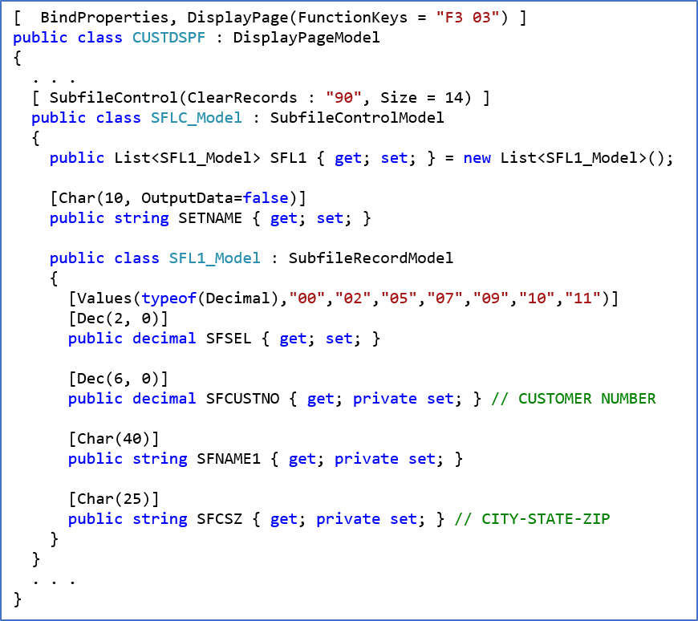
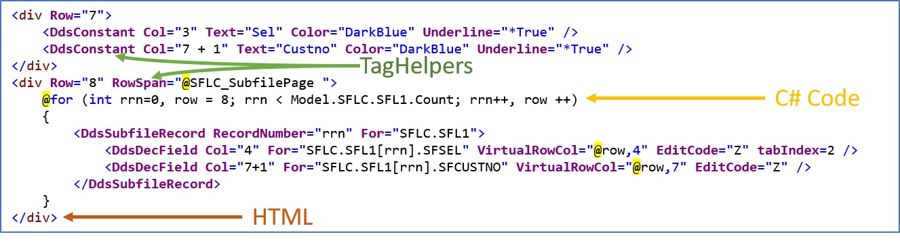

The document provides an overview of the interaction between a program's  **Workstation File** and the Razor **Display Page** on the website.

Handling the user interface of an interactive application is a cooperative effort between the procedural program running in the application *blue thread* and the Razor Page model and view in the ASP.NET Core *yellow thread*.

The procedural program uses a workstation file to issue read and write instructions against the record formats to provide or request user data. A [DataSet](//docs.microsoft.com/en-us/dotnet/api/system.data.dataset) serves as the repository for the program and the user's data. The program's data is transferred to the Razor Page model and further processed by Helper Tags to produce the HTML presented to the user. Similarly, the user data is transferred back from the Razor Page model, via the DataSet, to the program's workstation file.

_User Interface : Program - Transitions_

## Workstation File
The Workstation File is the mechanism by which a program handles the user interface to communicate with the user. Each workstation file has an associated DataSet.

The DataSet has one DataTable for each record format found in the Razor Page and the DataTables have one DataColumn for each field found in the record format plus a couple of extra fields to hold a direction (In/Out) flag and a snapshot of the Indicators.

When the program Writes a record to the workstation file, a new DataRow is added to the DataTable of the record format populated with the values of the fields belonging to that record, a snapshot of the current state of the program indicators is also added to the DataRow. If the record format written is not a subfile, the DataTable is cleared before adding the DataRow such that at most one row is ever present in the DataTable. DataTables corresponding to Subfile records are allowed to accumulate multiple DataRows. DataRows written by the program are marked with a *direction* of **Out**.

When the program issues a Read operation to a non-subfile record, the corresponding DataTable is checked to see if there is a DataRow present marked with a direction of **In**, if it exists, then data in the DataRow is used to populate the program's field and program execution continues. If there is no available **In** DataRow, then the program signals the device that **data is ready for the user** (meaning, it should be displayed in the browser) and it enters a wait state until the device is signaled with a message of **data is ready for the program**. Once the signal arrives, execution continues by taking the data entered by the user from the DataSet, populating the program's fields and returning control the program.

## Razor Page

### The Model
After a user enters data on the browser page representing a program's screen, the data is posted to the website. When the data arrives at the web server it is routed the the Razor Page corresponding to to the request. A working thread is made available by ASP.NET Core to handle the request, Monarch calls this thread the *Yellow* thread. ASP.NET Core and the Monarch Base framework take the submitted data and populate the Razor Page's Model, from there a DataSet is populated with the data and sent across to Monarch Application Server (MAS).  MAS locates the Job corresponding to the user request and copies the DataSet values to the DataSet of the Workstation File that prompted the user for the screen data. MAS then signals that **data is ready for the program** to the Job which in turn wakes up the program and execution continues on the *blue* thread. Meanwhile the Yellow enters a wait state until the next screen is ready for the user.

The [ASNA.QSys.Expo.Model.DisplayPageModel](../user-interface/qsys-expo-display-page-model.html) serves as the base class for the Razor Pages Models and encapsulates the behavior just described.

_Razor Page Model_

As the Job continues execution, the same program, or potentially a different one called by it, will eventually issue a new Read operation to prompt the user for some new data.  As described in the previous section, the data to create that new user screen will be sent as a DataSet by the *blue* thread to the *yellow* thread which will then continue its execution to respond to the browser.

There are two options at this point, either the same program will respond using the same Workstation File or a different program will be the one making the response to the user with a different Workstation File and Razor Page.  In the former case where the same Razor Page will respond to the user, the DataSet will be used to repopulate the Razor Page Model and the new data will be made available to the Razor Page View to generate the HTML for the browser. In the case where a different Razor Page will be used to respond to the user, a redirect is sent to the browser pointing it to the new page where the DataSet will be used to formulate the new Page's HTML.

### The View
As part of a GET or POST request, the Razor Page View is responsible to turn the values of the page's Model into a response for the browser.  A View acts as a template for generating the HTML. The typical view includes static HTML, TagHelpers that emit HTML dynamically, and C# code.

_Razor Page View_

#### Expo TagHelpers
The Monarch Base provides a set of [TagHelpers](../user-interface/qsys-expo-dds-elements.html) to assist in the generation of HTML out of the data produced by the Program and stored in the Razor Page Model.  

The Expo TagHelpers are aware of the original application DDS idioms like Indicators and edit codes.

