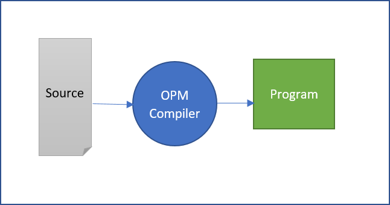
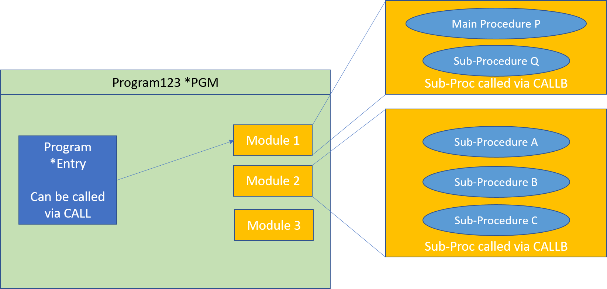
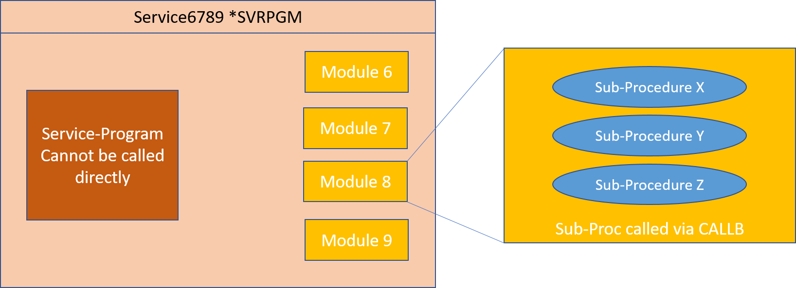

IBM i Programs were created using one of two models.  Initially, all programs belonged to what later became known as the Original Program Model or [OPM](https://www.ibm.com/docs/en/i/7.4?topic=ile-original-program-model-description) .  Newer programs were created using the Integrated Language Environment or [ILE](https://www.ibm.com/docs/en/i/7.4?topic=introduction-what-is-ile).

When IBM introduced ILE it produced a new generation of the compilers for its main languages.  We are particularly concerned with ILE RPG and ILE CL.  In general, these new versions of the languages were supersets of the older RPG/400 and CL.

ASNA technology can be used to migrate OPM and ILE programs, however the resulting programs do not make distinction between OPM and ILE, they all appear to have their origin in the ILE world.

## IBM Programs
A program is a first class object on the OS/400 (or IBM i) operating system, its type is ```*PGM```.

A program is the target of a CALL operation: the CALL CL command or the CALL RPG op-code.  The CALL operation finds the target program at the point of execution by searching for the program by its name and library name, or by searching the library list for the program name.

A program has a single entry-point.

### OPM Programs
An OPM program is produced by the compilation of a source file and any other optional *included* source files.


_OPM Program Creation_

 
The CRTRPGPGM and CRTCLPGM were used to create OPM programs.

### ILE Programs and Modules
#### Modules
ILE introduced the concept of Modules into the OS/400 system.

A module is a first level operating system object of type ```*MODULE```. A module is produced by the compilation of a source file.

The CRTRPGMOD and CRTCLMOD commands are used to create modules.

A module is composed of one or more procedures. One of the procedures may be designated as the main procedure, the rest are considered sub-procedures. One or more procedures should be exported from the module.

Procedures are the target of a CALLB RPG op-code, a CALLPRC CL command or are invoked by CL and RPG in an expression.

A module cannot be invoked directly by a program, instead one or more modules are bound together into an ILE program using the CRTPGM command or an ILE service-program via de CRTSRVPGM command.


_ILE Program Creation_

#### ILE Program
ILE programs have one of their modules designated as the Entry Program Module, the module should have one of its procedures marked as the main procedure and is this procedure the one who receives controls when the ILE program is CALLed.


_ILE Program with 3 Modules_

#### ILE Service-Programs
A service-program is also a first level object of the operating system, its type is ```*SRVPGM```.
Similar to an ILE program, a service-program is produced by binding one or more modules.

A service-program cannot be called directly by another program, instead, the service-programs surfaces a set of public procedures which can be bound to and then invoked. A program that uses a service-program will have its name, and potentially its library name, annotated within it so that when the program is activated, the service-program can be also located and activated too.


_ILE Service-Program with 4 Modules_

### Single-Module Programs
The vast majority of ILE programs are composed of a single module.  User written Service-Programs are not common, they are considered and 'advanced' technology in many shops.


__ILE Single Module Program_

In many ways this common single-module ILE program is very similar to an OPM program.

This programming style is so common that IBM provided special commands to facilitate their production. The CRTBNDRPG program takes a source member, compiles into a temporary Module in library QTEMP and then immediately binds it into a program.  The CRTBNDCL does the equivalent for CL programs.

## Activations
Before a target program is given execution control, the program’s activation instance has to be found or created; if and activation exists in the Job it is used, otherwise, the program must be activated first (like in the case when the program is first called in the job).

When a program is activated, its variables are allocated in memory and some one-time initialization code is ran (like opening files).

When a program ends execution and before returning to the caller, the program may be deactivated.  For OPM, CL programs are always deactivated, RPG program can control their deactivation by means of the special *INLR (last record indicator); if the *INLR is ON, then the program is deactivated, otherwise its state is preserved for the next time the program is called within the same Job. The deactivation rules for ILE programs are a bit more sophisticated as they can be instantiated in a variety of activation groups.
