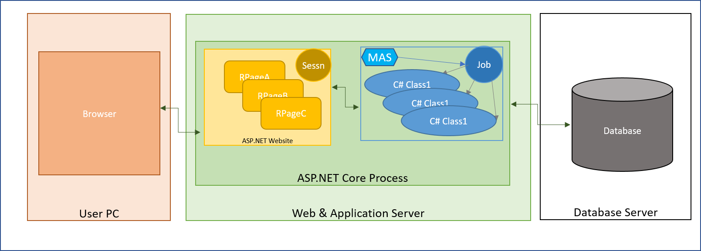

## Monarch Migration Output
The ASNA Monarch migration solution translates IBM i programs written in RPG and CL into .NET C# classes.  RPG interactive programs make use of Display Files where the layout and data schema for the screens are defined, these Display Files are translated by Monarch into Razor Pages. 

A Monarch Migrator organizes an RPG application into clusters of programs or GamePlans. The output of the migration of an interactive GamePlan is a pair of related projects: A Class Library with the C# source code derived from the GamePlan's programs and a Website with the set of Razor Pages, contained in an Area, representing the programs' screens. For non-interactive GamePlans, i.e. those composed solely of programs that do not interact with the screen, the migration output is the set of C# classes bundled as a Class Library or as an Executable project.  Each Program, or ILE Module, becomes one class and each Display File a Razor Page.

_Migration Output_

Migrated programs and the Website containing the Migrated Razor Pages Areas have a dependency on assemblies provided by ASNA as part of a framework.

You should become familiar with the rest of the [Concepts](/concepts/concepts-overview.html) behind the IBM i source environment and the target Monarch environment.

When looking at a Monarch application's architecture the first thing to note is the type of job that will be needed to run the application. Batch Jobs have a simpler architecture as they run in their own process whereas Interactive Jobs are associated with a web site. 

In its simplest configuration, the migrated code along with the website can be run in a single process. 

_Interactive Job running in process on the Web Server_

## Base Assemblies
Migrated Class Libraries and Executables as well as the Websites containing the Migrated Razor Pages Areas have a dependency on class libraries known as the ASNA Monarch Base (Base).

Here is the [Reference](/reference/reference-overview.html) documentation on the Monarch Base classes and their members.

The ASNA Monarch Base framework consists of the following assemblies:
- ASNA.DataGate.Client.dll
- ASNA.QSys.Runtime.dll
- ASNA.QSys.Expo.Model.dll
- ASNA.QSys.Expo.Tags.dll
- ASNA.QSys.MonaServer.dll
- ASNA.QSys.MonaLisa.exe

### Dependencies on Base
Assemblies migrated from Programs, regardless of being Interactive or Batch, depend on:
- ASNA.DataGate.Client.dll
- ASNA.QSys.Runtime.dll

The Websites hosting the Razor Pages Areas depend on:
- ASNA.QSys.Expo.Model.dll
- ASNA.QSys.Expo.Tags.dll

## NuGet Packages
To facilitate the building of migrated applications, Monarch Base is made available via the following NuGet packages:

- **ASNA.DataGate.Client package**
  - ASNA.DataGate.Client.dll

- **ASNA.QSys.Runtime package**
  - ASNA.DataGate.Client package
  - ASNA.QSys.Runtime.dll

- **ASNA.QSys.MonaServer package**
  - ASNA.QSys.Runtime package
  - ASNA.QSys.MonaServer.dll

- **ASNA.QSys.Expo package**
  - ASNA.QSys.Expo.Model.dll
  - ASNA.QSys.Expo.Tags.dll

[Here](/manuals/programming/get-asna-qsys/get-asna-qsys-overview.html) is the information on getting the NuGet packages.
