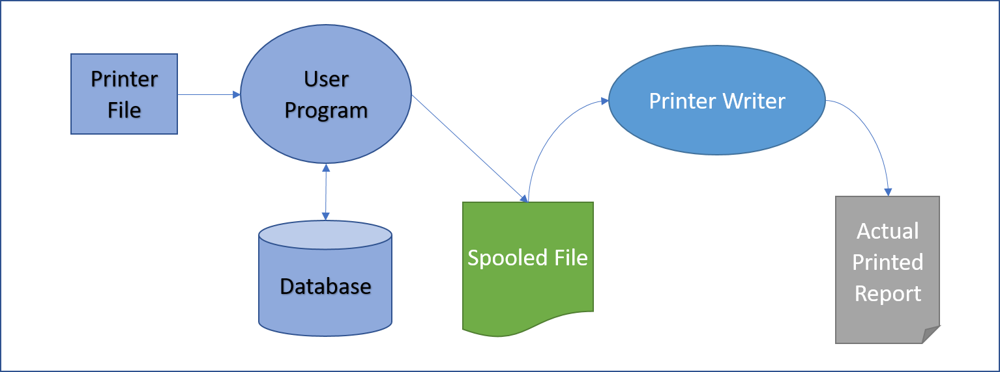
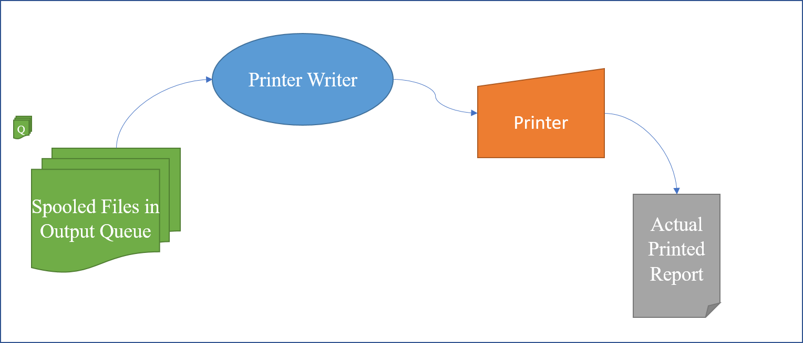
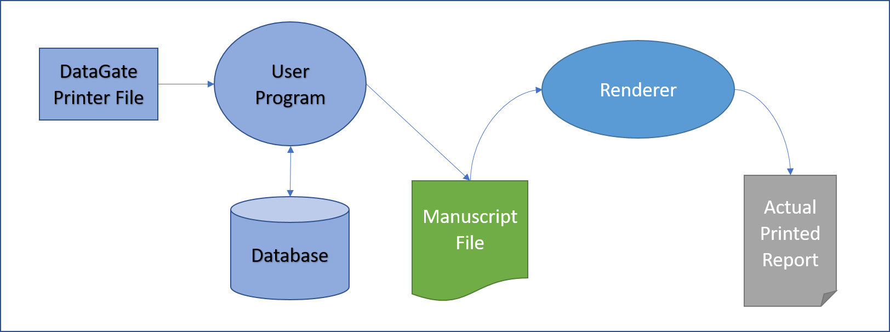
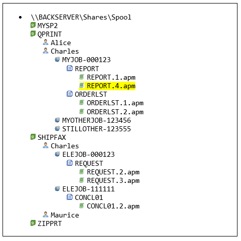

This document discusses the general concepts and some implementation details of the facilities provided by the Framework meant to replace the IBM i artifacts used to generate printed output.
The IBM i artifacts and their equivalents in the Framework are:

| IBM i Artifact  | Framework Replacement     |
| --------------- | ------------------------- |
| Printer File    | DataGate Printer File     |
| Spooled File    | Manuscript                |
| Output Queue    | Windows Folder            |
| Printer Writer  | Printer Writer & Renderer |

On the IBM i, printed output can be sent directly to a printer device or it can be spooled. In Monarch, all printed output is spooled, even if it is intended for paper as soon as the printing is completed.

## Spooled Printing on the IBM i
Printing on an IBM i involves a Program and two ‘files’: a Printer File and a Spooled File.
A Printer File defines one or more ‘templates’ with constants and fields, typically all on the same line, these templates are formally known as Records. The Printer File also defines parameters that control the generated output, among these are: number of copies to print, printer to handle the output, page size, font size, overflow line, etc.
A Program that creates a report, opens a Printer File and writes Records passing the value of the fields defined in the Record.  When the program opens the Printer File, the OS prepares a Spooled File to serve as buffer where the report’s output is to be held until it is ready to be printed on a physical device. 


_Figure 1: Producing a Report on IBM i_

Each time the program writes a record, the OS takes the data for the fields and combines it with the template defined in the Printer Files’ record to produce a line of output which is stored in the Spooled File. 

A Spooled File is uniquely identified by the following parameters:
1.	Spooled file name
2.	Job ID (Name-User-Number) that produced the spooled file
3.	Spooled file number

A Spooled File has several other attributes but one of the most important ones is the Output Queue name. An Output Queue contains an entry for each Spooled File associated with it. Notice that the Output Queue name is not used in the unique identifier of the Spooled File.

One or more Printer Writer jobs can be associated with an Output Queue, each Printer Writer is uniquely assigned a printer device.  It is the task of the Printer Writer to take Spooled Files and print them on an actual printer. 



_Figure 2: Printing to Paper on IBM i_

A Spooled File can remain in an Output Queue indefinitely but it is usually deleted after being printed by the Printer Writer, it can also be deleted programmatically by the job that produced it or by a user. 

## Printing on a Monarch Application
Printing on a Monarch program is similar to the process of the IBM i. Since Monarch uses DataGate Printer Files for printing, let’s review how DataGate handles printed output.

### DataGate Support for Printing
In DataGate, a Spooled File is known as a Manuscript file, the renaming is done intentionally because the formats of a Spooled File and a Manuscripts are very different, while the first one contains one text record per line, the later one is a text file formatted in XML.  DataGate uses the extension **.apm** (_Asna Print Manuscript_) to identify manuscript files.

DataGate does not implement the concept of an Output Queue.  Instead it leaves it to the user program to determine the location and fate of the Manuscript file.  There are two possibilities:

1.	Before the Printer File is opened, the user program can set a property (ManuscriptPath) with a windows path to name the Manuscript file. It is the responsibility of the program to determine the fate of the Manuscript, DataGate does provide a program (a Renderer) that can print or render the Manuscript to an actual printer, but it is the responsibility of the user program to invoke the Renderer.

2.	The program can open the Printer File without setting the manuscript path property, in which case DataGate will use a temporary file location and name and will call the Renderer as soon as the Printer File is closed instructing the Renderer to delete the Manuscript file when it finishes printing it.



_Figure 3: Producing a Report in Windows_

Monarch will utilize the first approach to implement Output Queues.

### Output Queues in Monarch
Monarch implements the concepts of an Output Queue by utilizing a folder structure to hold the Manuscripts. On migrated programs, the `ManuscriptPath` property is set in the constructor of the program to signal DataGate to create the manuscript in a particular location. 

The following naming convention is used to store Manuscript Files on a folder, typically on a shared location, designated by the customer. The ‘~’ represent the root folder for the Output Queues:

   `~\{OutputQueue}\{UserName}\{JobName}-{JobNum}\{SpoolFileName}\{SpoolFileName}.{SpoolFileNum}.apm`

The root folder (value of ‘~’) is set at Job initiation using the `OutputQueuesRoot` property on the Monarch Job.

In the next diagram, a user called Charles has a Manuscript file under path:
   `~\QPRINT\Charles\MYJOB-000123\REPORT\REPORT.4.apm`



The path to the manuscript intrinsically holds some attributes of the ‘spool file’, namely: 
1.	Spooled file name
2.	Job ID (Number/User/Name) that produced the spooled file
3.	Spooled file number

When a Queue is held, a status file called _ONHOLD_ is placed at the root of the Queue’s folder, when the Queue is released, the file is deleted.

### Manuscript Attributes

On the IBM i, a spooled file has many attributes, only some of them are carried over to the Monarch environment. The supported attributes are implemented using different techniques as shown in the next table.

| **Spooled File Attribute** | **Manuscript Attribute** | **Mutable** |
| --- | --- | --- |
| **File** (Name) | File Location & Name Prefix | No |
| **Job** (Number/User/Name) | File Location | No |
| **Spool Number** | File Name suffix | No |
| **Create Date** | File Date | No |
| **Form Type** [^1] | XML \<Init formtype= /\>attribute | Yes |
| **Copies** | XML \<Document copies= /\> attribute | No |
| **Output Queue** | File Location | Yes |
| **Save** (after printed) | XML \<Init saveafter= /\> attribute | Yes |
| **User Data** | XML \<Init userdata= /\> attribute | Yes |
| **Status** | File Extension | Yes |


#### Manuscript Status

The extension of a manuscript file represents its status. The five supported status with their corresponding extensions are:

| **Status** | **File Extension** | **Settable** |
| --- | --- | --- |
| Ready | ".apm" | Via Release |
| Held | ".apm-held" | Via Held and Override-File |
| Open | ".apm-open" | No |
| Printing | ".apm-printing" | No |
| Saved | ".apm-saved" | No |

Once an application has created a report (printer output) in the form of a manuscript and it has been placed in one of the Windows folders, the manuscript will have one of four fates:

1. The data in the manuscript will be processed (read) by the same application and the manuscript may be deleted.
2. The manuscript will sit in the folder until it is deleted by a user or an operator.
3. The 'report' will be sent to some other subsystem like a document management facility or fax system.
4. The report will be processed by a Printer Writer on a printer (potentially a PDF printer).

## The Printer Writer

Monarch provides an implementation of the Printer Writer in the form of a console program.

The program receives up to 3 parameters, "/q=" is the only mandatory parameter:

- /q= &#x2794; The Full Path to the queue's folder
- /p= &#x2794; Name of Printer to force all output
- /t &#x2794; Use text only format

Assuming there was a fax machine that could be configured in Windows as a printer (let's call it FaxPrinter), then to start the Writer to process the manuscripts of the SHIPFAX queue in the example above, and print them on the FaxPrinter, use the following parameters.

```
C:\MyPrograms\PrinterWriter /q=\\BACKSERVER\Shares\Spool\SHIPFAX /p=FaxPrinter /t
```

Each instance of PrinterWriter can only process manuscripts from a single folder and its descendants. If a printer name is given (/p=) all of the manuscripts are sent to the printer specified, if there is no /p= parameter, then each manuscript is sent to the printer given when the printer file was opened.

After PrinterWriter starts, it waits until a 'q' is entered on the console to signal it to end.

[^1]: DataGate printer file has a different attribute called FormName which determines the Windows PaperSize.Kind property used to establish the type of paper to be used when printing. FormName is stored in the manuscript at XML <Document papersizekind \> and is immutable.
