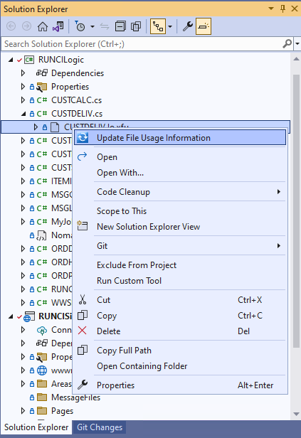
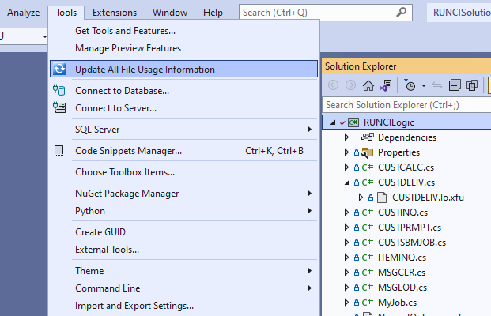

## Two C# Sources: .cs & .io.cs

When an RPG program is initially translated to C#, there are two source files generated for the program with a partial class in each source. The first source contains all the ‘visible’ code and the second source contains the members need to support the ‘externally described’ fields, record formats and data-structures; the second source also provided methods to move data in and out of global fields and the buffers used in file I/O.  For a program called `ProgramName`, the first source is called `ProgramName.cs` and the second `ProgramName.io.cs`.

## The .io.xfu File

There is an additional file generated as part of the migration process of a program: `ProgramName.io.xfu`, this file contains the File Usage of the program. The file includes  a description of how the program originally declared files and data-structures that were based on external descriptions. This information can be used to re-create the second source `ProgramName.io.cs` using a tool provided by ASNA (Update File Usage Information).  It is not necessary to use the tool to modify the `ProgramName.io.cs`, this can be done by hand.

> The `ProgramName.io.xfu` file is not used at runtime.

The `ProgramName.io.cs` only needs to be updated (either manually or via the tool) when any of the files used by the program have changed their record format in any way, i.e.: added or removed a field, change a field’s name, type or position in the record format, etc.

## Update File Usage Information
When a database/printer/workstation file is modify in a manner that affects its record format, the change should be reflected in the `ProgramName.io.cs` source. FOr example, if a new field has been added, the field will have to be declared in the program and then the data should be copyied to/from the datarow that serves as a buffer for the file. This modification can be done by hand in the editor or using the menu option *Update File Usage Information* as shown in the next image.

*Update File Usage Information on a single XFU*

The Tool is installed as part of the DataGate Studio.

The tool can be applied to a single .io.xfu file as shown above or to a whole project as shown below.

*Update File Usage Information for all XFUs in a Project*

