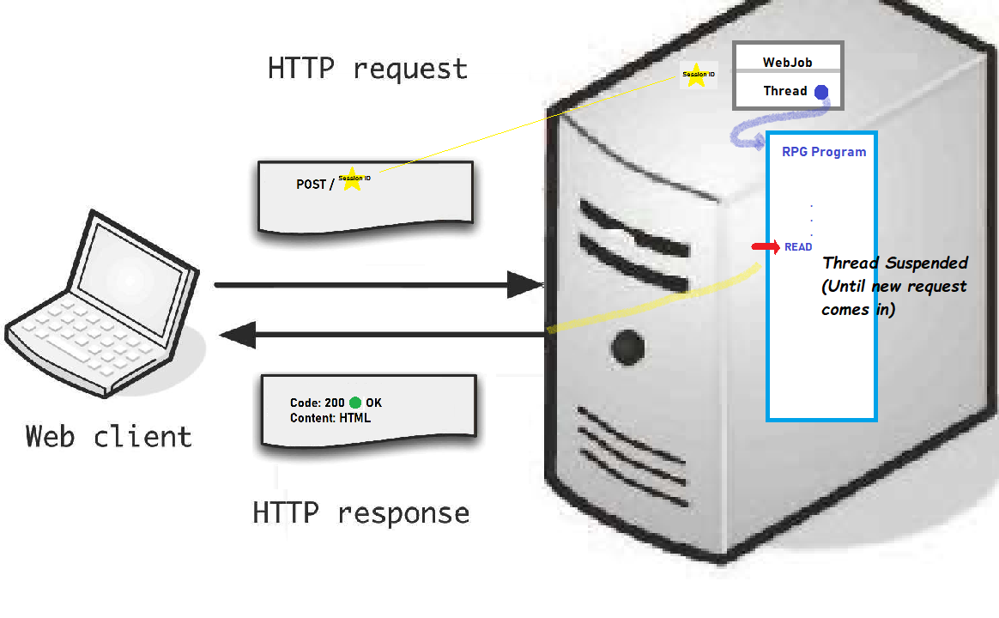

[The IBM i RPG Application development Model](/concepts/background/ibmi-developer-model.html) includes the concept of a [WORKSTN File](https://www.ibm.com/docs/en/i/7.2?topic=devices-using-workstn-files)

* A `WORKSTN File` *is* a **File**.

* A **File** is associated with a DEVICE.

* The DEVICE type allowed by RPG to interact with User via the *WORKSTN File* is called `Displayfile`[^1].

* Operations on **File**(s) include: *Open*, *Write*, *Read* and *Close*.

* *Execute Format* is a typical operation on `WORKSTN File`(s) that translates to *Write immediately followed by Read*.

> `WORKSTN File` contains Display file information and a description of the fields in the records.

 

## What does it mean to **Read** a *Displayfile* in a Web Environment?
The most challenging `WORKSTN File` operation to implement in a Request/Response Paradigm environment (such as Internet Web), is *Read*.

## Procedural Display File Model
Interactive Programs typically open the Workstation file, execute Database Management operations, continue with logic calculations and eventually reach a point where information from the user is needed. Requesting input from user, involves Reading (or Executing) from the Workstation file. The Program waits, maintaining the full state of the program, until the user inputs the data and then continues its procedural execution. The program is in control of the execution path and the user simply provides data.

## Request/Response Model
Web based applications operate differently. In Web based applications, **the user** requests a particular Page and waits until the server sends it back in the form of a response.

ASNA.QSys Application Life-Cycle logic uses the `Session ID` to find the WebJob associated with the *Active* session and refers to the Job's thread - which was suspended -. The Job's thread instruction pointer continues executing the RPG Program until it gets to the next Workstation Read. At that point, the Response is formulated, the thread is suspended and the Response is sent back to the Web client.

 
 
 

> Job start: Initially, there will not be any `Session ID` and when the first Request comes into the Web Server, the Web Server will start a Session, instance a new Job, remember the Job in the newly created Session, instances the Entry Point Program (according to MyJob class) and starts executing the Program.

## Monarch Display Page Application Architecture
Just as we have discussed how **ASP.NET Core Website Architecture** [simplifies complexity by separating data from presentation logic](/concepts/user-interface/razor-pages.html), Monarch further architects the Interactive Application by separating the Business Logic from the `Display Page` Logic.

On each Web Request/Response cycle, *data flows* from the *Yellow* `Display Page` layer all the way to the *Blue* `Program` layer passing thru intermediate components.

Components:
1. Display Page "Yellow"- Presentation logic with a *thin* data-layer (PageModel). ASP.NET Core extended with QSys Monarch Expo TagHelpers.
2. DataSet "Green"- Active Record's Field data (no markup or constants). The DataSet is serialized into an XML string.
3. MonaLisa - Monarch Application Server. Coordinates which Session's Active Program should process the [DataSet](/concepts/user-interface/qsys-expo-display-pages.html) requested.
4. Workstationfile - Application side abstraction of a **File** that represents to a Program the DataSet.
5. RPG-like Program "Blue"- Business Logic (programming language is C#, but logic follows RPG-like semantics)

&#128161; The colors indicated in quotes: "Yellow", "Green" and "Blue" were selected to assist the *thought process*, with the analogy of simple color combination theory, where:

`Green = Yellow + Blue`

Meaning that:
1. The "Yellow" side is the Website side or `yellow thread` in execution terms.
2. The "Blue" side is the Business Logic side or `blue thread`.
3. The only common concept between the `yellow` and `blue` threads is the `green` [DataSet](/concepts/user-interface/qsys-expo-display-pages.html).

It is important to remember that: 
1. `Yellow` components **cannot** be reached from the `Blue` side.
2. `Blue` fields **cannot** be reached reached from the `Yellow` side.
3. Any data-logic (including *indicators*) needs to be placed on the *intersection* of the `Yellow` and `Blue`, that is, the `Green` [DataSet](/concepts/user-interface/qsys-expo-display-pages.html).

> Productions installations may have all components running on a **single** server, or **multiple** servers.

 
 
 

[^1]: ICF-device are also allowed. This is outside the scope of this documentation.
