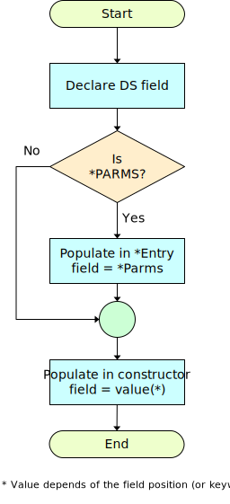

RPG Programs define two different data structure kinds that are used by the IBM i operating system to provide *feedback information* to the RPG logic.

## Program Status Data Structure (PSDS)
This Data Structure defines several members that report runtime status related to the current program being executed. Information such as: name of module running (as created), last exception or error result code, etc. (See: [Program Status Data Structure on IBM i docs](https://www.ibm.com/docs/en/i/7.3?topic=exceptionerrors-program-status-data-structure) )

The .NET execution environment is completely different to the IBM i counterpart, but there are several pieces of information that have equivalences and can be reported back to the RPG logic, to allow it to run seamlessly.

`PSDS` fields are defined in RPG by either their position in the buffer or by a reserved *keyword*. Note that the actual name of the member field is up to the programmer, and only those members *used* are defined in the Data Definition (the Data Structure size is well known to the compiler).

As for keywords, instead of *from/to* positions, a predefined name, such as one starting with `*` like `*PROC`, `*STATUS` are used.

Example 1: *Program expects `DSWPGM` field to have value of current procedure name*
```
D                SDS   
D  DSWPGM                 1     10
```
<br>

Example 2: *Program expects `NbrOfparms` field to have value of number of parameters passed*
```
D                SDS 
D NbrOfparms        *PARMS 
```
<br>

Example 3: *Program expects `wUserId` field to have value of the user associated with the currently running Job*
```
D                SDS   
D wUserId               254    263 
```
<br>

Example 4: *Program expects `$$JobName`, `$$User`, `$$JobNbr`, `$$JobDate` and `$$SysTime` fields to have values of : Job name, User name, Job Number, Job date, System date and System time.*
```
D PSDS           SDS                                               
D  $$JobName            244    253
D  $$User               254    263
D  $$JobNbr             264    269  0
D  $$JobDate            270    275  0
D  $$SysDate            276    281  0
D  $$SysTime            282    287  0
```
<br>

Example 5: *Program expects `PROC_NAME`, `CRT_DATE` fields to have values of : Current Procedure name and Creation Date.*
```
DPSDS            SDS
D PROC_NAME         *PROC
D CRT_DATE              288    293
D
```

Complete Example 6: *Not from real-world program, rather to show all available fields. Field names are just suggestions*.

```
D                SDS
D PROC_NAME         *PROC                                                  * Procedure name
D PGM_STATUS        *STATUS                                                * Status code
D PRV_STATUS             16     20S 0                                      * Previous status
D LINE_NUM               21     28                                         * Src list line num
D ROUTINE           *ROUTINE                                               * Routine name
D PARMS             *PARMS                                                 * Num passed parms
D EXCP_TYPE              40     42                                         * Exception type
D EXCP_NUM               43     46                                         * Exception number
D PGM_LIB                81     90                                         * Program library
D EXCP_DATA              91    170                                         * Exception data
D EXCP_ID               171    174                                         * Exception Id
D DATE                  191    198                                         * Date (*DATE fmt)
D YEAR                  199    200S 0                                      * Year (*YEAR fmt)
D LAST_FILE             201    208                                         * Last file used
D FILE_INFO             209    243                                         * File error info
D JOB_NAME              244    253                                         * Job name
D USER                  254    263                                         * User name
D JOB_NUM               264    269S 0                                      * Job number
D JOB_DATE              270    275S 0                                      * Date (UDATE fmt)
D RUN_DATE              276    281S 0                                      * Run date (UDATE)
D RUN_TIME              282    287S 0                                      * Run time (UDATE)
D CRT_DATE              288    293                                         * Create date
D CRT_TIME              294    299                                         * Create time
D CPL_LEVEL             300    303                                         * Compiler level
D SRC_FILE              304    313                                         * Source file
D SRC_LIB               314    323                                         * Source file lib
D SRC_MBR               324    333                                         * Source file mbr
D PROC_PGM              334    343                                         * Pgm Proc is in
D PROC_MOD              344    353                                         * Mod Proc is in
```

## PSDS Migration

During Migration, the Data Structure is declared (just as any other data-structure).
Then **if field is actually used in the program**, the value is populated on either `*Entry` method/procedure
 or inside the constructor.

 The following  simple flow-diagram shows how each field is migrated.





<br>

Example 1: *Program expects `DSWPGM` field to have value of current procedure name*
```cs
#region Program Status Data Structure
   DataStructure _DS1 = new (10);
   FixedString<_10> DSWPGM { get => _DS1.GetString(0, 9); set => _DS1.SetString(((string)value).AsSpan(), 0, 9); } 
#endregion

   public MyProgram()
   {
      _instanceInit();

      .
      .
      .

#region Populate Program Status Data Structure
      DSWPGM = this.GetType().FullName.Substring(this.GetType().Namespace.Length+1).PadRight(10).ToUpper()
#endregion
   }
```
<br>
>Note: If `DSWPGM` was not used, then the assignment code in the constructor **would not** have been generated.

Example 2: *Program expects `NbrOfparms` field to have value of number of parameters passed*
```cs

#region Program Status Data Structure
   DataStructure _DS7 = new (3);
   FixedDecimal<_3, _0> NbrOfparms { get => _DS7.GetZoned(0, 3, 0); set => _DS7.SetZoned(value, 0, 3, 0); } 
#endregion

   void StarEntry(int cparms)
   {
       int _RrnTmp = 0;
       do
       {
           NbrOfparms = _parms;

           .
           .
           .
       }
   }
```
<br>
>Note: If `NbrOfparms` was not used, then the assignment code in StarEntry **would not** be generated.

Example 3: *Program expects `wUserId` field to have value of the user associated with the Job*

```cs
#region Program Status Data Structure
DataStructure _DS3 = new (10);
FixedString<_10> wUserId { get => _DS3.GetString(0, 10); set => _DS3.SetString(((string)value).AsSpan(), 0, 10); } 
#endregion

public MyProgram()
{
   _instanceInit();

   .
   .
   .

#region Populate Program Status Data Structure
   wUserId = CurrentJob.PsdsJobUser.ToUpper();
#endregion
}
```
>Note: If `wUserId` was not used, then the assignment code in the constructor **would not** have been generated.
<br>

Example 4: *Program expects `$$JobName`, `$$User`, `$$JobNbr`, `$$JobDate` and `$$SysTime` fields to have values of : Job name, User name, Job Number, Job date, System date and System time.*

```cs
#region Program Status Data Structure
    DataStructure PSDS = new (38);
    FixedString<_10> ssJobName { get => PSDS.GetString(0, 10); set => PSDS.SetString(((string)value).AsSpan(), 0, 10); }
    FixedString<_10> ssUser { get => PSDS.GetString(10, 10); set => PSDS.SetString(((string)value).AsSpan(), 10, 10); }
    FixedDecimal<_6, _0> ssJobNbr { get => PSDS.GetZoned(20, 6, 0); set => PSDS.SetZoned(value, 20, 6, 0); }
    FixedDecimal<_6, _0> ssJobDate { get => PSDS.GetZoned(26, 6, 0); set => PSDS.SetZoned(value, 26, 6, 0); }
    FixedDecimal<_6, _0> MonarchPSDS_PGMDATE { get => PSDS.GetZoned(32, 6, 0); set => PSDS.SetZoned(value, 32, 6, 0); }  // Monarch generated
    FixedDecimal<_6, _0> ssSysDate { get => PSDS.GetZoned(32, 6, 0); set => PSDS.SetZoned(value, 32, 6, 0); }
    FixedDecimal<_6, _0> ssSysTime { get => PSDS.GetZoned(26, 6, 0); set => PSDS.SetZoned(value, 26, 6, 0); }
#endregion

public MyProgram()
{
   FixedDate<_ISO, _Default> StartupDate = DateTime.MinValue;
   _instanceInit();

#region Populate Program Status Data Structure
   ssJobName = CurrentJob.PsdsJobName.ToUpper();
   ssUser = CurrentJob.PsdsJobUser.ToUpper();
   ssJobNbr = CurrentJob.PsdsJobNumber;
   StartupDate = StartupMoment;
   MonarchPSDS_PGMDATE = StartupDate.MoveRight(MonarchPSDS_PGMDATE);
#endregion
}
```
>Note: If `$$JobName` or `$$User` or `$$JobNbr` or `$$JobDate` or `$$SysTime`were not used, then their assignment code in the constructor **would not** have been generated.
<br>

Example 5: *Program expects `PROC_NAME`, `CRT_DATE` fields to have values of : Current Procedure name and Creation Date.*

```cs
#region Program Status Data Structure
   DataStructure PSDS = new (16);
   FixedString<_10> PROC_NAME { get => PSDS.GetString(0, 10); set => PSDS.SetString(((string)value).AsSpan(), 0, 10); } 
   FixedString<_6> CRT_DATE { get => PSDS.GetString(10, 6); set => PSDS.SetString(((string)value).AsSpan(), 10, 6); } 

   /Error Unsupported: Field CRT_DATE not supported for Program Status DS
#endregion

public MyProgram()
{
   FixedDate<_ISO, _Default> StartupDate = DateTime.MinValue;
   _instanceInit();
#region Populate Program Status Data Structure
   PROC_NAME = this.GetType().FullName.Substring(this.GetType().Namespace.Length + 1).PadRight(10).ToUpper();
#endregion
}
```
>Note: The Program *Creation Date* would be the date when the class was compiled. The concept loses meaning for several reasons, first the program is **no longer** an isolated user object (it became now a class within an assembly), secondly, .NET deployment is significantly different than IBM i, the assembly has an associated version metadata record, plus the whole application likely has a build number.

## Unsupported PSDS field migration (Cocoon V10)
The following are the fields that **will not** be populated (at constructor nor at `StarEntry`):

```
PGM_STATUS        *STATUS                                                * Status code
PRV_STATUS             16     20S 0                                      * Previous status
LINE_NUM               21     28                                         * Src list line num
ROUTINE           *ROUTINE                                               * Routine name
EXCP_TYPE              40     42                                         * Exception type
EXCP_NUM               43     46                                         * Exception number
PGM_LIB                81     90                                         * Program library
EXCP_DATA              91    170                                         * Exception data
EXCP_ID               171    174                                         * Exception Id
DATE                  191    198                                         * Date (*DATE fmt)
YEAR                  199    200S 0                                      * Year (*YEAR fmt)
LAST_FILE             201    208                                         * Last file used
FILE_INFO             209    243                                         * File error info
CRT_DATE              288    293                                         * Create date
CRT_TIME              294    299                                         * Create time
CPL_LEVEL             300    303                                         * Compiler level
SRC_FILE              304    313                                         * Source file
SRC_LIB               314    323                                         * Source file lib
SRC_MBR               324    333                                         * Source file mbr
PROC_PGM              334    343                                         * Pgm Proc is in
PROC_MOD              344    353                                         * Mod Proc is in
```
>Note: the field names are suggested names, as discussed earlier, the definition is given by either buffer position or *keyword*.

<br>
<br>
<br>

## File Information Data Structure (INFDS)
A File Information Data Structure (`INFDS`) can be defined for each file to make file exception/error and file feedback information available to the program or procedure. (See: [File Information Data Structure](https://www.ibm.com/docs/en/i/7.3?topic=exceptionerrors-file-information-data-structure#filinda) on IBM i docs).

The file association is made using the keyword `INFDS` when declaring the file in `F` Specs or using the free-form DCL-DS command. The name provided in the keyword is the name od the associated Data-structure, following are two examples.

Fixed format:
```
FMYFILE    IF   E             DISK    INFDS(FILEFBK)
```

Free-format:
```
DCL-F MYFILE DISK(*EXT) INFDS(FILEFBK);
```

Just like `PSDS` (above), the `INFDS` data-structure member fields are indicated by either position in the buffer or by the use of *keywords* like `*FILE`, `*SIZE`, `*ROUTINE` etc.

>The name of the data-structure field member is used-defined.

The `INFDS` contains the following feedback information:

* [File Feedback](https://www.ibm.com/docs/en/i/7.3?topic=structure-file-feedback-information#flfeed) (length is 80)
* [Open Feedback](https://www.ibm.com/docs/en/i/7.3?topic=structure-open-feedback-information#opfeed) (length is 160)
* [Input/Output Feedback](https://www.ibm.com/docs/en/i/7.3?topic=structure-inputoutput-feedback-information) (length is 126)
* [Device Specific Feedback](https://www.ibm.com/docs/en/i/7.3?topic=structure-device-specific-feedback-information#dsfeed) (length is variable)
* [Get Attributes Feedback](https://www.ibm.com/docs/en/i/7.3?topic=structure-get-attributes-feedback-information#gafeed) (length is variable)

Example 7: *INFDS for File Feedback*

```
DFeedBack         DS
D FILE              *FILE                                                  * File name
D OPEN_IND                9      9N                                        * File open?
D EOF_IND                10     10N                                        * File at eof?
D STATUS            *STATUS                                                * Status code
D OPCODE            *OPCODE                                                * Last opcode
D ROUTINE           *ROUTINE                                               * RPG Routine
```

Example 8: *INFDS for Open Feedback*

```
DFeedBack         DS
D ODP_TYPE               81     82                                         * ODP Type
D FILE_NAME              83     92                                         * File name
D LIBRARY                93    102                                         * Library name
D SPOOL_FILE            103    112                                         * Spool file name
D SPOOL_LIB             113    122                                         * Spool file lib
D SPOOL_NUM             123    124I 0                                      * Spool file num
D RCD_LEN               125    126I 0                                      * Max record len
D KEY_LEN               127    128I 0                                      * Max key len
D MEMBER                129    138                                         * Member name
D TYPE                  147    148I 0                                      * File type
```

Example 9: *INFDS for Input/Output Feedback*

```
DFeedBack         DS
D WRITE_CNT             243    246I 0                                      * Write count
D READ_CNT              247    250I 0                                      * Read count
D WRTRD_CNT             251    254I 0                                      * Write/read count
D OTHER_CNT             255    258I 0                                      * Other I/O count
D OPERATION             260    260                                         * Cuurent operation
D IO_RCD_FMT            261    270                                         * Rcd format name
D DEV_CLASS             271    272                                         * Device class
D IO_PGM_DEV            273    282                                         * Pgm device name
D IO_RCD_LEN            283    286I 0                                      * Rcd len of I/O 
```

Example 10: *INFDS for Device Specific Feedback*

```
DFeedBack         DS
D DSP_FLAG1             367    368                                         * Display flags
D DSP_AID               369    369                                         * AID byte
D CURSOR                370    371                                         * Cursor location
D DATA_LEN              372    375I 0                                      * Actual data len
D SF_RRN                376    377I 0                                      * Subfile rrn
D SF_MINRRN             378    379I 0                                      * Subfile min rrn
D SF_NUMRCDS            380    381I 0                                      * Subfile num rcds
D ACT_CURS              382    383                                         * Active window
D                                                                          *  cursor location
D DSP_MAJOR             401    402                                         * Major ret code
D DSP_MINOR             403    404                                         * Minor ret code
```

Example 11: *INFDS for Get Attributes Feedback*

```
DCL-DS ICFATRFBK;
     PGM_DEV       CHAR(10)   POS(241);    // Program device
     DEV_DSC       CHAR(10)   POS(251);    // Dev description
     USER_ID       CHAR(10)   POS(261);    // User ID
     DEV_CLASS     CHAR(1)    POS(271);    // Device class
     DEV_TYPE      CHAR(1)    POS(272);    // Device type
     REQ_DEV       CHAR(1)    POS(278);    // Requester?
     ACQ_STAT      CHAR(1)    POS(279);    // Acquire status
     INV_STAT      CHAR(1)    POS(280);    // Invite status
     DATA_AVAIL    CHAR(1)    POS(281);    // Data available
     SES_STAT      CHAR(1)    POS(291);    // Session status
     SYNC_LVL      CHAR(1)    POS(292);    // Synch level
     CONV_TYPE     CHAR(1)    POS(293);    // Conversation typ
     RMT_LOC       CHAR(10)   POS(294);    // Remote location
```

## INFDS Migration

In contrast with how `PSDS` is migrated, `INFDS` does not generate a data-structure, but instead a collection of [class properties](https://docs.microsoft.com/en-us/dotnet/csharp/programming-guide/classes-and-structs/properties). Depending on the field, some properties are generated as *read-only*, others with *full-access*.


Example 7: *INFDS for File Feedback (assumes associated with file MYFILE, MYFILE2, MYFILE3)*

```cs
#region File Information Data Structures

      string FILE => "MYFILE";

      int STATUS
      {
         get => MYFILE.StatusCode;
         set => MYFILE.StatusCode = value;
      }

      FixedString<_8> SPCL_STAT => MYFILE.FormatName;

      FixedString<_8> RECORD => MYFILE.FormatName;

      short ROWS => 27;

      short COLUMNS => 132;

      FixedString<_10> IO_RCD_FMT => MYFILE.FormatName;

      string DSP_FLAG1 => MYFILE.FeedbackFlags.ToString();

      byte DSP_AID
      {
         get => MYFILE.FeedbackAID;
         set => MYFILE.FeedbackAID = value;
      }

      short CURSOR => MYFILE.FeedbackCursor;

      string SF_RRN => MYFILE.SflRRN.ToString();

      short SF_MINRRN => MYFILE.FeedbackLowestSubfile;

      short SF_NUMRCDS => (short)MYFILE.FeedbackSubfileRecords;

      string ACT_CURS => MYFILE.FeedbackActiveWindowCursor.ToString();

      int STS02
      {
         get => MYFILE2.StatusCode;
         set => MYFILE2.StatusCode = value;
      }

      int REC02 => (int)MYFILE2.RecNum;

      int STS01
      {
         get => MYFILE1.StatusCode;
         set => MYFILE1.StatusCode = value;
      }

      int REC01 => (int)MYFILE1.RecNum;
#endregion
```


