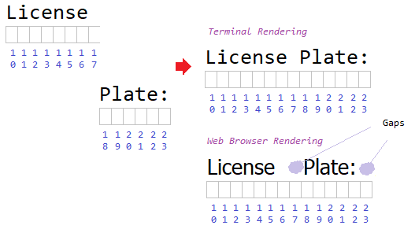
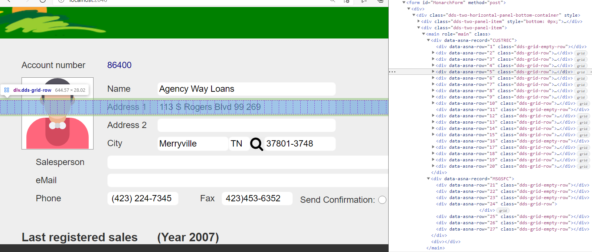
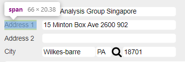

The Expo Client Library consists of the following Web resources:

1. CSS
2. JavaScript
3. Sound

> There is a collection of images, but these are SVG descriptions imbedded in the JavaScript components that uses them.

There are two CSS files in the library:
* 5250.css - defines types to be used while rendering 5250 streams.
* expo.css - defines types to be used for Migrated Display Pages.

Web Technology:
* Javascript is implemented using [ES6 modules](https://developer.mozilla.org/en-US/docs/Web/JavaScript/Guide/Modules)
* CSS layout styles rely heavily on [advanced CSS features](/concepts/user-interface/qsys-expo-client-advanced-css) 


Every Display Page will loads the Expo Client Library as described by [Expo Web Content](/concepts/user-interface/qsys-expo-web-content)

> The Browser *cache* technology optimizes the loading of these web resources.

The sound files are only used when a page was designed to produce an audible ALARM (*Beep*) on IBM i terminals. This resource is loaded *on demand*.

## Expo Client Library Architecture

The Expo Client Library provides a flexible rendering framework to support:
1. Legacy Layout model (IBM i Display element positioning system)
2. Modern User Interface enhancements.

In order to describe how Expo Client Library was architected, we will first proceed to compare the basic capabilities of the **IBM i Displayfile** and the **Web Browser**.  

## Display Canvas Comparison

|                     | IBM i Displayfile [^1]           | Web Browser
| ------------------- | -------------------------------- | ---
| *Display surface*   | Fixed Size [^2]                  | Undefined [^3]
|                     | No scrolling                     | Horizontal and Vertical Scrolling
| *Positioning*       | Line, char position              | Defaults to flow [^4]
| *Font family*       | Monospace                        | Defaults to variable pitch
| *Element "Length"*  | Positions                        | Width (pixels) [^5]
| *Color*             | Refers to "text" or "forecolor"  | Anything can be colored
|                     | Seven colors                     | Unlimited colors
|                     | Fixed dark "background" color    | Defaults to light background color
|                     | REVERSE image used for "white" background.  | REVERSE image not a style
| *Underline usage*   | Used to indicate "input" text    | Rarely used
|                     |                                  | Shadows and borders used on input text
| *High intensity*          | Just a color (i.e. white)        | Font weight (numeric value)
| *Numeric right alignment* | Left pad with spaces | CSS text-align *right*
| *Column separator*        | Small dots between chars         | Undefined
| *Font opacity*            | Opaque                           | Transparent
|                           | (a char position can be used for only **one** char) | No concept of "char position"

## IBM i Display element positioning

The terms **Line** and **Char Position** have a [Punched Card](https://en.wikipedia.org/wiki/Computer_programming_in_the_punched_card_era) origin. It became more common to call these positioning terms as *Row* and *Col*, and for the total Size: *Rows* and *Cols*.

> Since the Display **Size** on the Web Browser is undefined (practically *limitless*), Monarch assumes that our *target* canvas is the largest possible: 27 rows x 132 columns. [^6]

The fact that the font family used on IBM i Displayfile is **Monospace** has **several** important implications when computing the *implicit* "Length" of elements.

> "Length" in this contexts means: *character* positions (or *cols*) used on the screen.

**First implication**: Ending *col* calculation discrepancy.

Take a look at the following image, where a constant `'License Plate'` is positioned on the page at column 10:


To visualize, consider the previous image. The first rendering shows how a Terminal would display `'License Plate:'` constant. Note how a *true* Monospace [^7] font renders each character *inside* a *cell*, such that to compute the ending *col*, we can safely compute:

```cs
ending_col = starting_col + text_length - 1
```
Referring back to the image, we compute [^8]: 

```cs
ending_col =  10 + 14 - 1

ending_col =  23

// Assuming:
// 1. Char width = 10 px
// 2. Col 10 starts at left offset = 100px

ending_col_pixels = starting_col_pixels + width_of_text_pixels - 1
ending_col_pixels = 100px + (14 * 10px) - 1 
 
ending_col =  239px 
```

But, as you can see in the image, the the **Web Browser** would render:

```cs
ending_col = 207px
```

> Instead of `Length` in Monarch we use the term **Column Span** (or *ColSpan*) to describe the number of columns an element occupies. In the image, the `ColSpan` is equal to `14` units. 

**Second implication** : Headings formed by multiple elements.

Now consider this other scenario. Instead of defining `'License Plate:'` as one element, two elements are defined: `'License'` and `'Plate:'`, the first at col `10` and the second at col `18`. The next image shows the resulting rendering on a Terminal vs on a Web Browser. 



In the case for the Terminal, the text looks just as in the case where we defined just one element. In the case for the Web Browser, the *spacing* between the two words has an extra *gap*.

> This may not look too bad for a single two word label, but it may become very distracting when some of these label parts are aligning constants in more than one row.

**Third implication** : Right aligned numeric values.

Now consider the challenge to render numeric values for fields, which are presented right aligned.


The alignment happens by an **Edit code** applied to the number, where a *comma* is added and three blanks are pre-pended to the text representation for the number `1234.11`. On a Terminal Display, the field is specified as starting on col `10`, and due to the formatting, the ending col is `20`.

Let's assume that Monarch knows how to apply the same edit code and send the text value:

~~~
   1,234.11 // Note: there are exactly three blanks before the numeric value.
~~~

Assuming Monarch has the right CSS, and the value is rendered at *Col* `10` - just as the Terminal did - the resulting rendering has two problems:

1. Only one blank is rendered, instead of three. [^9]
2. The ending *col* is around `16.2` instead of `20`.


* * * 


## Expo Client Library *Legacy Layout Support* Design

Assumptions:
1. Display Pages should look *modern*. The use of Monospace Web Font should be kept to a minimum (or eliminated).
2. Adding inter-character spacing for text constants is acceptable to achieve a higher *initial* fidelity to the original alignment.
3. Early conversion from legacy row, col to pixels is unacceptable. An absolute positioning layout with all positioning in pixels makes it very hard to maintain and enhance a Page's Layout.
4. Discrete positioning, like the one used by *legacy layout units*, is acceptable so long:
    1. The Legacy maximum size limitation (27 x 132) is removed.
    2. The `row, col` positioning system **is not** the only way to specify element's positions.
5. Additional elements may be desirable to be added later **without** having to re-compute `row` values. That is, allow new elements to be added *between rows* without disturbing markup.
6. Respecting leading blanks on *output-only* numeric values to improve right-alignment is desirable. [^10]
8. Allow standard [CSS](https://en.wikipedia.org/wiki/CSS) to be used to **manually** further improve Look and Feel, particularly when dealing with numeric values and *Subfile Controller* field headings.  

**Expo Display Page Design**

There are two sides where the Application Developer will spend most of his time and attention when maintaining a Display Page:

1. Working on the Markup (Razor Page code) - The *input* -.
2. Examining the generated HTML on the Web Browser - The *output* -.

Working on the Markup: The following code is a section of the Markup for [Customer Maintenance](https://asna.github.io/SunFarm/customer-maintenance-enhancement/) Sample Page, which is shown with two *Active* records: `CUSTREC` and `MSGSFC`. We have eliminated code to focus primarily on how  Rows 4 and 5 are specified, and how `Address 1` constant and `SFADDR1` char field are described on the Page's markup. [^11]

```html
<DdsRecord For="CUSTREC" StretchConstantText=false KeyNames="ENTER 'Submit'; F3 'Exit'; F4 'Prompt'; F6 'New Customer'; F11 'Remove Customer'; F12 'Back';">
    <div Row="2"> ...  </div>
    <div Row="3"> ... </div>

    <div Row="4">
        <DdsConstant Col="20" Text="Name" />
        <DdsCharField Col="27" For="CUSTREC.SFNAME" PositionCursor="40" tabIndex=2 />
    </div>
    <div Row="5">
        <DdsConstant Col="20" Text="Address 1" />
        <DdsCharField Col="27" For="CUSTREC.SFADDR1" PositionCursor="41" tabIndex=3 />
    </div>

    <div Row="6"> ... </div>
    <div Row="7"> ... </div>
    <div Row="8"> ... </div>
    <div Row="9"> ... </div>
    <div Row="10"> ... </div>
    <div Row="12"> ... </div>
    <div Row="13"> ... </div>
    <div Row="14"> ... </div>
    <div Row="15"> ... </div>
    <div Row="17"> ... </div>
    <div Row="18"> ... </div>
    <div Row="19"> ... </div>
    <div Row="20"> ... </div>
</DdsRecord>

@{  int MSGSFC_SubfilePage = 1; int MSGSFC_SubfileRowsPerRecord = 1; }
<DdsSubfileControl For="MSGSFC" KeyNames="ENTER 'Enter'; " SubfilePage="@MSGSFC_SubfilePage">
    <div Row="24" RowSpan="@MSGSFC_SubfilePage * @MSGSFC_SubfileRowsPerRecord">
        @for (int rrn = 0, row = 24; rrn < Model.MSGSFC.MSGSF.Count; rrn++, row += @MSGSFC_SubfileRowsPerRecord)
        {
            <DdsSubfileRecord RecordNumber="rrn" For="MSGSFC.MSGSF"> ...  </DdsSubfileRecord>
        }
    </div>
</DdsSubfileControl>
```

Notice how we have two *container* TagHelpers: `DdsRecord` and `DdsSubfileControl`. Each contributes with some `Row` specifications. The `Row` is a TagHelper for an attribute to a standard HTML `div`. The  `Row` will generate two standard HTML attributes (which we will describe in detail below).

*Inside* the `div` that represents a particular `Row`, we specify as many elements as we need. To specify them *positionally* we use the `Col` TagHelper attribute.

Looking closer to only Rows `4` and `5` (on record `CUSTREC`), we can see that on Row 4, we want to display two elements: the constant `Name` and the field value for the field `SFNAME` (qualified as a property of the C# class `CUSTREC`). The constant is positioned at column "20" and the field `SFNAME` at column 27. 

```html
<div Row="4">
    <DdsConstant Col="20" Text="Name" />
    <DdsCharField Col="27" For="CUSTREC.SFNAME" PositionCursor="40" tabIndex=2 />
</div>
<div Row="5">
    <DdsConstant Col="20" Text="Address 1" />
    <DdsCharField Col="27" For="CUSTREC.SFADDR1" PositionCursor="41" tabIndex=3 />
</div>
```
Similarly, on Row 5, we want to display: `Address 1` constant and field `SFADDR1`, with the following markup code:

```html
<div Row="5">
    <DdsConstant Col="20" Text="Address 1" />
    <DdsCharField Col="27" For="CUSTREC.SFADDR1" PositionCursor="41" tabIndex=3 />
</div>
```

Adjusting the location of these fields is as easy as changing their Row and/or Col values.

> Row and Col values are **not limited** to 27 by 132. 

> &#128161; You can *experiment* with adjustments by using expressions inside the quotes, for example you can enter `Col="20+5"` and `Col="27+5"` to express *move the fields 5 positions to the right*, avoiding having to calculate each of the new values. [^12]

Note how **not all the Rows** nor **all** the **Cols** need to be specified. The following Rows on record "CUSTREC" are not explicitly defined: `1, 11` and `16`. 

> Rows not included become *empty rows* and Cols become *unused* columns on a Row.

The following image shows the partial rendering of `CUSTREC` and `MSGSFC` *Active* records to form the "Customer Maintenance" Page for the Sample [SunFarm](https://asna.github.io/SunFarm/) Application.



The image also shows the HTML generated, and highlights `Row 5`.

Let's examine now the `HTML` generated. The right side of the image shows the HTML as presented by the *Browser Developer Tools*.

It shows something like the following *pseudo* HTML representation:

```html
<form>
   <main>
    <div data-asna-record="CUSTREC">
       <div data-asna-row="1" class="dds-grid-empty-row">
       <div data-asna-row="2" class="dds-grid-row">
       <div data-asna-row="3" class="dds-grid-row">
       <div data-asna-row="4" class="dds-grid-row">
       <div data-asna-row="5" class="dds-grid-row">
              .
              .
              .
       <div data-asna-row="20" class="dds-grid-row">
    </div>

    <div data-asna-record="MSGSFC">
       <div data-asna-row="21" class="dds-grid-empty-row">
       <div data-asna-row="22" class="dds-grid-empty-row">
       <div data-asna-row="23" class="dds-grid-empty-row">
       <div data-asna-row="24" class="dds-grid-row">
       <div data-asna-row="25" class="dds-grid-empty-row">
       <div data-asna-row="26" class="dds-grid-empty-row">
       <div data-asna-row="27" class="dds-grid-empty-row">
    </div>
   </main>
</form>
```
Note how [data attributes](https://developer.mozilla.org/en-US/docs/Learn/HTML/Howto/Use_data_attributes) like `data-asna-record` and `data-asna-row` are used to *document* how the HTML reflects the *Display Page Razor Markup* source.

Then the standard HTML [class](https://developer.mozilla.org/en-US/docs/Web/HTML/Global_attributes/class) on each *Row* describes how the *Row* should be displayed. It is either a:
1. Vertical empty row - vertical white space, or
2. A *Row* that contains application elements (constants, field values) - all positioned within the same *used* vertical space.

> Note how **all** the 27 rows are included. This is different from the markup. Expo JavaScript code sorted and completed all the missing rows as `div` elements with the `class="dds-grid=empty-row"`.

Let's peek at the definition for the style `dds-grid-empty-row`, on file [^13]: 

~~~
...\wwwroot\lib\asna-expo\css\expo.css :
~~~

```css
.dds-grid-empty-row {
    padding-top: var(--dds-grid-row-padding-top);
    padding-bottom: var(--dds-grid-row-padding-bottom);
    min-height: calc(var(--body-font-size) * 1.1429);
}
```

Don't worry if you are not familiar with how CSS style definition works in detail, it is sufficient to understand that the `div` where this class is used in the Display Page, will appear as vertical space with a height selected based on the height of the font used in the `body` to support the Legacy DDS full Terminal definition.

> Note: standard HTML may be added later between these div Rows. The intent is to start with the vertical space a Terminal would use.

Now, let's focus our attention to how fields are rendered on **non** empty Display Page rows.

The following image shows the details of `Row="5"` in the markup, where we want to display `Address 1` constant and the value `113 Rogers Blv 99 269` which happens to be a particular Customer's address 1 field.


Row 5's `div` element is the *container* which shows two elements, something like:


```html
<div data-asna-row="5" class="dds-grid-row">
    <span style="grid-column: 20 / 28; grid-row: 1">Address 1</span>
    <input style="grid-column: 27 / 51; grid-row: 1" name="CUSTREC.SFADDR1" value="113 S Rogers Blv 99" >
</div>
```

The *Row* 5 has two elements, a constant value and an input-capable field named `CUSTREC.SFADDR1`. Expo Client Library sets inline style for both elements using the `Col` attribute TagHelper. 

The `Col` attribute TagHelper is meant to work on containers that have the `Row` attribute TagHelper which sets the HTML `class` attribute to the CSS name `dds-grid-row`.

Let's peek at the definition for the style `dds-grid-row`, on file: 

~~~
...\wwwroot\lib\asna-expo\css\expo.css :
~~~

```css
.dds-grid-row {
    display: grid;
    grid-template-columns: repeat(var(--dds-grid-columns), var(--dds-grid-col-width));
    padding-top: var(--dds-grid-row-padding-top);
    padding-bottom: var(--dds-grid-row-padding-bottom);
}
```

<br>

> For better understanding, review [Library Advanced CSS](/concepts/user-interface//qsys-expo-client-advanced-css/) 


Now look again at the image we used previously (repeated here for clarity):


> &#128161; Each `Row` displays as a [Grid](https://developer.mozilla.org/en-US/docs/Web/CSS/CSS_Grid_Layout) with `132` [^14] columns of a preset column width (in pixels).

The image shows the Grid for Row 5, represented by a collection of squares with dotted gray border line. 

Elements contained in the `div` with Grid display can be added at specified starting columns spanning a number of columns from the start.

The first element, a [span](https://developer.mozilla.org/en-US/docs/Web/HTML/Element/span) with the `Address 1` text is placed in Grid for Row 5 at the position:

```css
grid-column: 20 / 28;
grid-row: 1;
```

which is a *shortcut* for styles:

```css
grid-column-start: 20;
grid-column-end: 28;
grid-row: 1;
```

Which means, the element will be positioned starting on column 20 and ending at column 28. You probably guessed correctly that the starting column is our `Col` TagHelper value, so where does 28 come from? The constant text is `Address 1`, with a length (in chars) equal to `9`. `grid-column-end = 20 + 9 - 1`

As we discussed before in this topic how Monospace fonts have implications regarding calculation of length of field, using `9` for column span is too wide:


causing the constant and the input box to *overlap* which in most cases it does not matter, since painting on Web canvas is `transparent` (by default). As long as the order in which elements are placed on the page is correct, the *miscalculation* does not matter. But there are some situations where you want to *adjust* this discrepancy, which you can do it with the `ColSpan` TagHelper. 

For example, the Font selected by Expo Client by default is such that the length of text can be reduce by `25%`. Instead of using `9` positions we can use `7` positions (from 20 to 26 inclusive). 

The markup for this constant would be:

```html
<DdsConstant Col="20" ColSpan="7" Text="Address 1" />
```
And the following image shows the adjusted use of the Grid positions:



>&#128161; Not only is `ColSpan` useful to *reduce* positions taken by legacy constants, but is also useful to *increase* the width of the *box* used for other elements, such as input-capable elements. *Widening* input *boxes* to align consecutive elements is a technique commonly used to improve aesthetics. (On input boxes, the maximum number of characters allowed **is not** controlled by the width of the box).

**Expo Display Page Subfile Design**

You may have noticed in the listing for the markup, that the record "MSGSFC" is a little more complex and has more C# Razor code. 

The following shows the Markup for a Subfile Controller and the Subfile record collection:

```html
@{  int MSGSFC_SubfilePage = 1; int MSGSFC_SubfileRowsPerRecord = 1; }
<DdsSubfileControl For="MSGSFC" KeyNames="ENTER 'Enter'; " SubfilePage="@MSGSFC_SubfilePage">
    <div Row="24" RowSpan="@MSGSFC_SubfilePage * @MSGSFC_SubfileRowsPerRecord">
        @for (int rrn = 0, row = 24; rrn < Model.MSGSFC.MSGSF.Count; rrn++, row += @MSGSFC_SubfileRowsPerRecord)
        {
            <DdsSubfileRecord RecordNumber="rrn" For="MSGSFC.MSGSF"> ...  </DdsSubfileRecord>
        }
    </div>
</DdsSubfileControl>
```

[Continue with Subfile Design ...](/concepts/user-interface/qsys-expo-client-subfile)

<br>
<br>

[^1]: Book SC41-5715-02
[^2]: The Terminal hardware defined the "Capability", more capable models could display 27 lines and 132 positions.
[^3]: Browser vendor dependent, but we can consider *very large*.
[^4]: HTML5 allows several element positioning systems.
[^5]: Several "units of measure" provided with automatic conversion to pixels.
[^6]: Migration logic may compute columns beyond 132. Display Page initialization will compute the *real* maximum.
[^7]: Monospace Web font do not warrantee that all characters, symbols and blank take the exact width in pixels.
[^8]: The image shows the *next* pixel, one to the right of the cell.
[^9]: Pre-formatted tag element to be used, but this implies Monospace font which does would not look as consistent and pleasing as the rest of the text.
[^10]: [Non-breaking space](https://en.wikipedia.org/wiki/Non-breaking_space) is acceptable, bt avoided when possible.
[^11]: You can get the [Full listing here](https://github.com/ASNA/SunFarm/blob/master/CustomerAppSite/Areas/CustomerAppViews/Pages/CUSTDSPF.cshtml)
[^12]: The C# compiler is responsible to calculate the expression result. Razor is responsible to the syntax.
[^13]: Actual code may differ depending on the version of the library used.
[^14]: The default 132 can be configured to any value. There is logic in the JavaScript to expand this limit, if it is exceeded at runtime by any element.