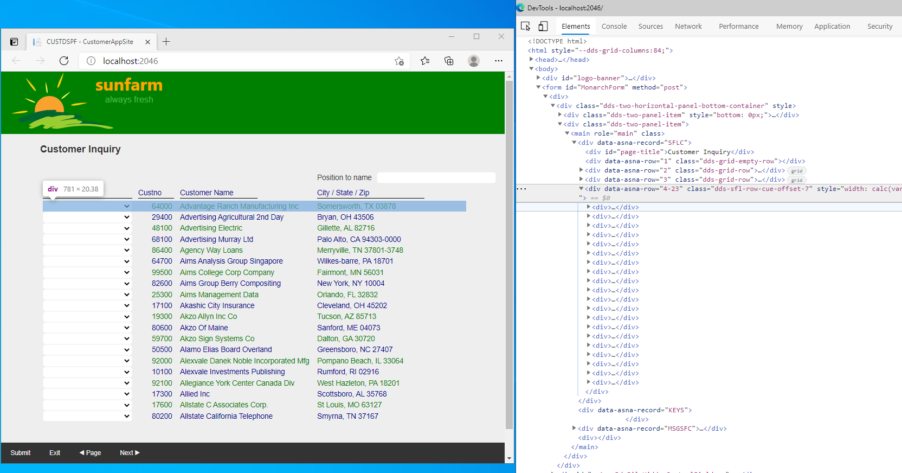

DdsSubfileControl record is a bit more complex than a regular DdsRecord as explained in topic [Expo Client Library](/concepts/user-interface//qsys-expo-client-library).

Let's review the page [Customer Inquiry](https://github.com/ASNA/SunFarm/blob/master/CustomerAppSite/Areas/CustomerAppViews/Pages/CUSTDSPF.cshtml) and focus our attention on the Subfile Control Record named `"SFLC"`, as follows:

```html
@{
    int SFLC_SubfilePage = 20;
    int SFLC_SubfileRowsPerRecord = 1;
}
<DdsSubfileControl For="SFLC" StretchConstantText=false KeyNames="ENTER 'Submit'; F3 'Exit'; PageUp '◀ Page'; PageDown 'Next ▶';" SubfilePage="@SFLC_SubfilePage" CueCurrentRecord=true ClickSetsCurrentRecord=true>
    <div id="page-title">Customer Inquiry</div>
    <div Row="2">
        <DdsConstant Col="52+1+1" Text="Position to name" />
        <DdsCharField Col="63+1" For="SFLC.SETNAME" ColSpan="20" VirtualRowCol="2,70" tabIndex=1 />
    </div>
    <div Row="3">
        <DdsConstant Col="4+1+3" ColSpan="15" Text="Selection" Color="DarkBlue" Underline="*True" />
        <DdsConstant Col="4+12+7+1" Text="Custno" Color="DarkBlue" Underline="*True" />
        <DdsConstant Col="4+12+14+1" Text="Customer Name" Color="DarkBlue" Underline="*True" />
        <DdsConstant Col="4+12-8+45+1" Text="City / State / Zip" Color="DarkBlue" Underline="*True" />
    </div>
    <div Row="4" RowSpan="@SFLC_SubfilePage * @SFLC_SubfileRowsPerRecord">
        @for (int rrn = 0, row = 8; rrn < Model.SFLC.SFL1.Count; rrn++, row += @SFLC_SubfileRowsPerRecord)
        {
            <DdsSubfileRecord RecordNumber="rrn" For="SFLC.SFL1">
                <div IsGridRow>
                    <DdsDecField Col="4+4" For="SFLC.SFL1[rrn].SFSEL" VirtualRowCol="@row,4" EditCode="Z" ValuesText="' ','Update','Display sales','Delivery Addresses','Create sales record','Printsales (Online)','Print sales (Batch)','Orders'" tabIndex=2 />
                    <DdsDecField Col="4+20" For="SFLC.SFL1[rrn].SFCUSTNO" VirtualRowCol="@row,7" Color="Green : !61 , DarkBlue : 61" EditCode="Z" Comment="CUSTOMER NUMBER" />
                    <DdsCharField Col="4+27" ColSpan="30" For="SFLC.SFL1[rrn].SFNAME1" Upper=true VirtualRowCol="@row,14" Color="Green : !61 , DarkBlue : 61" />
                    <DdsCharField Col="4+50" For="SFLC.SFL1[rrn].SFCSZ" Upper=true VirtualRowCol="@row,55" Color="Green : !61 , DarkBlue : 61" Comment="CITY-STATE-ZIP" />
                </div>
            </DdsSubfileRecord>
        }
    </div>
</DdsSubfileControl>
```

Which renders as the image below:



Observe the Browser's *Object Inspector* window to the right, which is invoked in your Browser as the *Developer Tools* feature.

Let's first identify the similarities in the generated HTML, with respect to the simple DdsRecord:

1. The *Record* container becomes a `div` with the name of the record in a [data attribute](https://developer.mozilla.org/en-US/docs/Learn/HTML/Howto/Use_data_attributes) named `data-asna-record` with the value in this case of `"SFLC"`. 
2. Contained elements above (or below) the Subfile, are also rendered as `div`s with the row number as a value of the attribute `data-asna-row`, like `"2"`, `"3"`. Rows non-specified in markup are also rendered with the appropriate `data-asna-row` - filling the gaps - but with `class=dds-grid-empty-row`.
3. If you were to open any of the `div` nodes with the `data-asna-row` attribute, you would find elements with the rendering for the `DdsConstant` and `DdsCharField` as  indicated in the markup with their corresponding grid-column positioning style, following the markup's `Col` TagHelper attribute.

All should be familiar [if you followed Expo Client Library](/concepts/user-interface/qsys-expo-client-library) discussion.

After `<div data-asna-row="3" class="dds-grid-row">`, there is something new:

```html
<div data-asna-row="4-23" class= ... >
   <div>
   </div>
     .
     .
     .
    <div>
    </div>
</div> 
```

The `RowSpan` TagHelper attribute is calculated and represented in the HTML generation as the value `"4-23"` meaning: from Row=4 to Row=23.

Each of the `div` groups contained in the `div` with `data-asna-row="4-23"` represents a **Subfile record**.

Where do the calculations come from ?

Let's examine the Markup again, now in more detail.

Right before the declaration of `DdsSubfileControl`, we have a block of C# with the following two lines:

```cs
@{
    int SFLC_SubfilePage = 20; // Note: legacy had 14, was later increased
    int SFLC_SubfileRowsPerRecord = 1;
}
```

These C# variables have the prefix `SFLC_` which is the name of the Subfile Control record where a Subfile is defined.

The first variable comes from DDS keyword `SFLPAG`

```
0030.00     A                                      SFLPAG(0014)  
```

The second variable comes from the definition of the fields in the subfile. In this case all of the fields in the subfile definition are specified in the same *line* (or Row). It is possible specify subfiles with more than one *line* (to be presented *folded* on the page). Think of this value as the *height* in *Rows*

```html
<div Row="4" RowSpan="@SFLC_SubfilePage * @SFLC_SubfileRowsPerRecord">
    .
    .
    .
</div>
```

Applying the values and computing:

```cs
data-asna-row-from=4
data-asna-row-to= (4 + (20 *1)) - 1 = 23

// short for 
data-asna-row="4-23"
```

> Changing the value of `SFLC_SubfilePage` requires re-compilation of the Logic program. Records written to the Subfile need to march records indicated in the Markup.

Inside the `div` with Row RowSpan in the SubfileControl record comes the `for` loop, defined as follows:

```html
@for (int rrn = 0, row = 8; rrn < Model.SFLC.SFL1.Count; rrn++, row += @SFLC_SubfileRowsPerRecord)
{
    <DdsSubfileRecord RecordNumber="rrn" For="SFLC.SFL1">
        .
        .
        .
    </DdsSubfileRecord>
}
```

This loop will generate *SFL1.Count* number of `DdsSubfileRecord` instances. `rrn` goes from *zero* to `SFL1.Count-1`, where *SFL1.Count* is the number of records *written* to the subfile when the Display Page renders.

The `row` variable used in the for loop, may be seem odd. It starts with the *line* number defined in the DDS specifications as follows:

```
0007.00     A          R SFL1                      SFL
0009.00     A            SFCOLOR        1A  B  8  2DSPATR(ND PR)
0010.00     A            SFSEL          2Y 0B  8  4VALUES(0 2 3 5 7 9 10 11)
0014.00     A            SFCUSTNO       6Y 0O  8  7TEXT('CUSTOMER NUMBER')
0019.00     A            SFNAME1   R        O  8 14REFFLD(CMNAME)
0023.00     A            SFCSZ         25   O  8 55TEXT('CITY-STATE-ZIP')
```

> Some lines with DDS *keyword* removed for clarity.

The fields SFCOLOR, SFSEL, SFCUSTNO, SFNAME1 and SFCSZ are all specified in *line* `8` (positions 2, 4, 7, 14 and 55) respectively.

The use of `row` is to compute the value for `VirtualRowCol` TagHelper attribute that will be used as a *feedback* information when the page is posted to the server.

Lastly, for each round in the loop, the following Markup generates a record in the subfile:

```html
<DdsSubfileRecord RecordNumber="rrn" For="SFLC.SFL1">
    <div IsGridRow>
        <DdsDecField Col="4+4" For="SFLC.SFL1[rrn].SFSEL" VirtualRowCol="@row,4" EditCode="Z" ValuesText="' ','Update','Display sales','Delivery Addresses','Create sales record','Printsales (Online)','Print sales (Batch)','Orders'" tabIndex=2 />
        <DdsDecField Col="4+20" For="SFLC.SFL1[rrn].SFCUSTNO" VirtualRowCol="@row,7" Color="Green : !61 , DarkBlue : 61" EditCode="Z" Comment="CUSTOMER NUMBER" />
        <DdsCharField Col="4+27" ColSpan="30" For="SFLC.SFL1[rrn].SFNAME1" Upper=true VirtualRowCol="@row,14" Color="Green : !61 , DarkBlue : 61" />
        <DdsCharField Col="4+50" For="SFLC.SFL1[rrn].SFCSZ" Upper=true VirtualRowCol="@row,55" Color="Green : !61 , DarkBlue : 61" Comment="CITY-STATE-ZIP" />
    </div>
</DdsSubfileRecord>
```

> Note: Field SFCOLOR is a *no-display* ("ND" code in DSPATR keyword). Hidden or *no-display* fields **are not** included in the markup (only in the Model).

Four fields (some decimal and others alpha) are included in the HTML generation for a *GridRow*. If `SFLC_SubfileRowsPerRecord` was greater than one, then there would be more `div` containers with the *IsGridRow* TagHelper, one per row-in-the-record.

Let's examine the HTML produced for the *first* record in the subfile (`rrn=0`):

```html
<div>
    <div class="dds-grid-row dds-row-no-gap"> 
        <select name="SFLC.SFL1[0].SFSEL" tabindex="2" data-asna-rowcol="8,4" style="grid-column: 1 / 16;">
            <option value="0"></option>
            <option value="2">Update</option>
            <option value="3">Display sales</option>
            <option value="5">Delivery Addresses</option>
            <option value="7">Create sales record</option>
            <option value="9">Printsales (Online)</option>
            <option value="10">Print sales (Batch)</option>
            <option value="11">Orders</option>
        </select> 
        <span class="dds-dec-field-alignment" data-asna-rowcol="8,7" style="grid-area: 1 / 17 / auto / 23; color: green;"> 64000</span> 
        <span data-asna-rowcol="8,14" style="grid-area: 1 / 24 / auto / 54; color: green;">Advantage Ranch Manufacturing Inc </span> 
        <span data-asna-rowcol="8,55" style="grid-area: 1 / 47 / auto / 72; color: green;">Somersworth, TX 03878 </span> 
    </div> 
   
    <input type="hidden" name="SFLC.SFL1.Index" value="0"> 
    <input type="hidden" name="SFLC.SFL1[0]._RecordNumber" value="0">
</div>
```

Each subfile record is rendered as an HTML `div` element that contains:
1. One or more `div` container(s) that represents one or more *Row*(s): one-line CSS Grid Layout, just like any Row in non-subfile Rows did, identified by the class="dds-grid-row".
2. Some *hidden* QSys.Expo-internal elements used for paging. 
(Please &#128161; Do not remove these elements when executing user-defined JavaScript code on the page).

> Note the use of an extra CSS `dds-row-no-gap` style in the **class** attribute. It is used to render subfile records very close together vertically (to improve look).

One last consideration. The markup `VirtualRowCol` became the [data attribute](https://developer.mozilla.org/en-US/docs/Learn/HTML/Howto/Use_data_attributes) `data-asna-rowcol`, with values, like:

For `rrn` = 0

```cs
data-asna-rowcol="8,4"
data-asna-rowcol="8,7"
data-asna-rowcol="8,14"
data-asna-rowcol="8,55"
```

For `rrn` = 1

```cs
data-asna-rowcol="9,4"
data-asna-rowcol="9,7"
data-asna-rowcol="9,14"
data-asna-rowcol="9,55"
```

To `rrn` = 19:

```cs
data-asna-rowcol="27,4"
data-asna-rowcol="27,7"
data-asna-rowcol="27,14"
data-asna-rowcol="27,55"
```

These values are reported as part of the *feedback* information when the Page posts, to be processed as the *legacy cursor* location, if input elements were the last with *focus* when the Page was posted.

> Note that `27` is a value outside the *legacy* terminal values, this happens because the original SubfilePage of 14 was increased during Modernization. The Business Logic program looking at the *feedback* cursor information should be tested with these larger values. (Original PageSize would produce the last subfile record at 8+14-1 = 21 which is in range of a 24 line Terminal size).