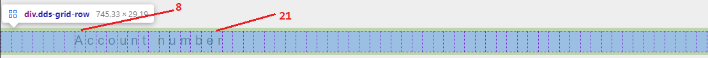
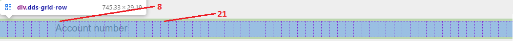
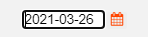
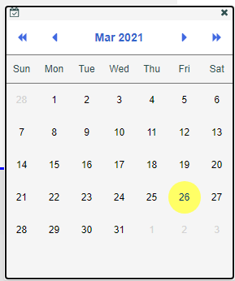

IBM i *Data Description Specifications for Displayfiles* or [DDS for Displayfiles](https://www.ibm.com/docs/en/i/7.2?topic=programming-dds) defines a *cascading* keyword description language with the following entries [^1]:

~~~
File-level
    Record-level
        Field-level
~~~

> We present here the hierarchy as *nested* entries, where in DDS syntax **is not** nested, but rather *positional*. Nested representation is better suited for Markup syntax.

In general, when a *keyword* **is not** explicitly defined at the lowest level (i.e. Field-level), the next level is used all the way up to the File-level [^2].

The same can be said for Razor Page Markup syntax, but other terminology is used:

| **DDS name** | **Razor Page name**
| Level   | TagHelper **Tag**
| Keyword | TagHelper (or HTML) **Attribute**

For TagHelper *Container* Tags QSys Expo defines:
1. DdsFile
2. DdsRecord
3. DdsSubfileControl
4. DdsSubfileRecord

For TagHelper *Fields* QSys Expo defines:
1. DdsConstant
2. DdsCharfield
3. DdsDecField
4. DdsDateField
5. DdsDecDateField

Other QSys Expo TagHelpers:
1. DdsFunctionKeys
2. DdsMessagePanel
3. DdsButton 
4. DdsCheckboxField 
5. DdsRadioButtonGroup
6. DdsSignature

## DdsFile

The **DdsFile** defines the top of the *Nomad Display Page*. It usually comes as the first node right after HTML `<form>` tag. It defines attributes that are *global* to the Display Page. The only attribute that is required is:

* `DisplayPageModel` - name to be used by the contained elements in expressions, which refers to the C# class derived from Microsoft.AspNetCore.Mvc.RazorPages (more on this in the example that follows).

Other typical attribute used is `KeyNames`, which defines the Active *Aid* keys, with an optional user-friendly name, used by the Page *Menu Bar* option clickable buttons. 

The following is the bare-bones Nomad Display Page definition:

```html
@page
@model MYPAGENAME
@{
    ViewData["Title"] = "MYPAGENAME";
}
<form id="MonarchForm" method="post">
    <DdsFile DisplayPageModel="Model">
    </DdsFile>
</form>
```

This simple HTML definition is used when the server needs to respond to a Page request *posted* by a Web Browser connected to the server that is running your Application. The request will trigger:
1. A creation of `DdsFile` class instance.
2. On `DdsFile` calls to proper methods to render HTML code inside the HTML `form` with the name "MonarchForm".
3. The resulting HTML sent back to the Web Browser as the response.

Furthermore, the Markup defines:
1. The C# *Model* to be bound to `MYPAGENAME` class which is expected to exist in the file `MYPAGENAME.cshtml.cs` (assuming the page we are defining is `MYPAGENAME.cshtml`).
2. The *Title* item on the ASN.NET Page `ViewData` collection will be set to the constant "MYPAGENAME" (which is used form a string using this ViewData item in the *Master* page `_Layout.cshtml` - in the Shared folder of your site -).
3. `DisplayPageModel` attribute, sets the property of the same name in DdsFile to `Model`. `Model` is the name that may be used to refer to MYPAGENAME class on any of the C# attribute references, in any of the DdsFile *contained* elements.

> So far, the response is empty, since we have not defined any Records (that may be Active by the running application Logic)

## DdsRecord

Defines one of the multiple *Records* that may be Active at one time according to the Application's logic.

> The DdsFile HTML is formed by HTML rendered by all *Records* that are *Active* when the request was issued.

Continuing with the example, the following defines one Record that may be *Active* when generating the HTML as the response to a Web Browser Request:

```html
@page
@model MYPAGENAME
@{
    ViewData["Title"] = "MYPAGENAME";
}
<form id="MonarchForm" method="post">
    <DdsFile DisplayPageModel="Model">
        <DdsRecord For="CUSTREC" KeyNames="ENTER 'Submit'; F3 'Exit';">
        </DdsRecord>
    </DdsFile>
</form>
```

The elements *contained* by the *Record* named `CUSTREC` (if *Active*) will be rendered as HTML. The `For` is a Razor standard TagHelper attribute that is a shortcut for `@Model.`, which in this case is `@Model.CUSTREC` property of MYPAGENAME *Model* instance.

In this example, we use the `KeyNames` attribute which sets the `CUSTREC.KeyNames` property to a string that defines the *Active* Aid Keys: `ENTER` and `F3`, with the user-friendly names "Submit" and "Exit". "Submit" and "Exit" are used as menu options on the Menu Bar used as the User Interface for the Display Page.   

> So far, the response is *still* empty, since we have not defined any visible *fields* on the *Record*. 

## Defining Fields and Constants in a Record

Just like in DDS, *Record*s may contain Constants or Field specifications.

As we have mentioned in [Expo Client Library](/concepts/user-interface/qsys-expo-client-library) Constants and Field specifications are *positioned* using *Row* and *Column*.

A Nomad Display Page conveniently uses the standard `<div>` tag as a container to group all elements in a particular *Row*.

Within that *Row* div *container*, a Nomad Display Page defines hte possible fields and constants that are visible at the present *state* according to Application Logic.

The best way to describe the syntax, is by an example:

```html
@page
@model MYPAGENAME
@{
    ViewData["Title"] = "MYPAGENAME";
}
<form id="MonarchForm" method="post">
    <DdsFile DisplayPageModel="Model">
        <DdsRecord For="CUSTREC" KeyNames="ENTER 'Submit'; F3 'Exit';">
            <div Row="2">
                <DdsConstant Col="8" Text="Account number" />
            </div>
        </DdsRecord>
    </DdsFile>
</form>
```

Assuming that the Record CUSTREC is Active (records have ben written in a program that uses a WorkstationFile C# class instance, linked to this Display Page), the label `Account number` will be rendered as a HTML `<span>`. The location on the Page will be layout out as described by [Expo Client Library](/concepts/user-interface/qsys-expo-client-library).

Notice how the spacing on constants has been *Stretched-out* (by default). This is done, to fill out the intended Legacy design, where constants may be either aligned *manually* to the right, or multiple constant sections are supposed to be joined to form a large text see [Expo Client Library](/concepts/user-interface/qsys-expo-client-library). The constant should look like the following image:



**Notes:**
1. The grid lines in the image only show when *Developer Tools* are running and the selection is the div at *Row=2*.
2. The *letter-spacing* CSS style has bee computed to stretch out the text so that it spans from column one to column 21. 
> End column equals `8 + length - 1`, where length is equal to `14` characters.

You can override the default behavior, by turning off the *Stretch Constant* property which can be done at the field-level, but more commonly done at the *Record* level (or *File* level).

Adding the attribute `StretchConstantText=false` to the *Container* DdsRecord, with markup like the following:

```html
<DdsRecord For="CUSTREC" StretchConstantText=false KeyNames="ENTER 'Submit'; F3 'Exit';">
    <div Row="2">
        <DdsConstant Col="8" Text="Account number" />
    </div>
</DdsRecord>
```

Would rendering the result as displayed in following image:



> Note: The text spans from column one to column sixteen. Not only does it look more natural - as designed by the Font maker - but it can also save horizontal screen real-state (more elements can fit in a *Row*).

Field TagHelpers: DdsCharField, DdsDecField, DdsDateField and DdsDecDateField. These four are the basic TagHelpers associated with fields in the *DataSet*.

All fields refereed to by the following TagHelpers, need support from the [Expo DisplayPageModel](/concepts/user-interface/qsys-expo-display-page-model).

> Fields cannot be declared in the Razor Page Markup. All fields must be declared in the corresponding Model class.

## DdsCharField

The DdsCharField TagHelper is used to add a character field to the *Record*. The field must have been declared in the *Model* as a string with a [fixed length](/concepts/program-architecture/qsys-fixedtypes)

The attribute `For` is required and its value is the qualified name of the field in the *Model*.

Markup example:
```html
<div Row="4">
    <DdsCharField Col="27" For="CUSTREC.SFNAME" VirtualRowCol="7,27" PositionCursor="40" />
</div>
```

Model example:
```cs
public class CUSTREC_Model : RecordModel
{

    [Char(40)]
    public string SFNAME { get; set; }
}
```

## DdsDecField
The DdsDecField TagHelper is used to add fixed decimal fields to the *Record*. The field must have been declared in the *Model* as a decimal with a [fixed](/concepts/program-architecture/qsys-fixedtypes) length and decimal positions.

The attribute `For` is required and its value is the qualified name of the field in the *Model*

> Note that *Presentation* properties are only defined in the Markup - i.e. EditCode, Colors etc. -.

Markup example:

```html
<div Row="4">
    <DdsDecField Col="20" For="CUSTREC.SFCUSTNO" VirtualRowCol="5,27" Color="DarkBlue" EditCode="Z" Comment="CUSTOMER NUMBER" />
</div>
```

Model example:
```cs
public class CUSTREC_Model : RecordModel
{
    [Dec(6, 0)]
    public decimal SFCUSTNO { get; private set; } // CUSTOMER NUMBER
}
```

## DdsDateField

The DdsDateField TagHelper is used to add fixed DateTime fields to the *Record*. The field must have been declared in the *Model* as a DateTime with a [fixed](/concepts/program-architecture/qsys-fixedtypes) length according to a DDS-like *Date Format* and *Date Separator*.

**Date Formats**

| **Name**   | **Format**
| ISO        | `yyyy-mm-dd`
| USA        | `mm/dd/yyyy`
| EUR        | `dd.mm.yyyy`
| JIS        | `yyyy-mm-dd`
| YMD        | `yy/mm/dd`
| MDY        | `mm/dd/yy`
| DMY        | `dd/mm/yy`
| SERVER     | *ISO*
| JUL        | `yy/ddd`
           
> Date format separator defaults to `-`, but it chan be any `char`.

Markup example:

```html
<div Row="4">
    <DdsDateField Col="29+2" For="CUSTREC.ORDDATE"  VirtualRowCol="4,29" Comment="ORDER DATE" />
</div>
```

Model example:
```cs
public class CUSTREC_Model : RecordModel
{
    [Date(DateFormat = DateAttribute.DdsDateFormat.USA)]
    public DateTime ORDDATE { get; private set; } // ORDER DATE
}
```

Note how during *Presentation*, the date, when formatted as text (including how it is input as text), shows according to the *DateFormat*, as shown in the following image:



> Note how, for input-capable date fields, an *icon* is presented to the right of the date text-box on the page, giving the user the option to interact with the date using a *Calendar* interface.

After selecting the new date using the calendar, JavaScript logic will convert the selected date to text, according to the *DateFormat* definition. 



<br>
<br>

## DdsDecDateField

The concept of a *Date* type came to RPG in a rather late stage. Older Legacy Applications used *decimal* types - with zero decimals - to store and manipulate dates. Typically, Programmers would use lengths of 6, 7 and 8 to store dates.

> During Migration, if a DDS defined field is of numeric type and it uses an *Edit Word* keyword that *Looks like a Date* `    -  -  `, `    /  /  `, `  /  /    `, `0 /  /    `, `  .  .    ` the assumption will be that the field represents a date. 

The DdsDecDateField TagHelper is used to add fixed decimal fields *that represent Dates* to the *Record*. The field must have been declared in the *Model* as a decimal with a [fixed](/concepts/program-architecture/qsys-fixedtypes) length according to a DDS-like *Date Format* and *Date Separator*.


Markup example:

```html
<div Row="4">
    <DdsDecDateField Col="29+2" For="CUSTREC.DELIVDATE"  Comment="Delivery Date" />
</div>
```

Model example:
```cs
public class CUSTREC_Model : RecordModel
{
    [Dec(8,0,DateFormat = DateAttribute.DdsDateFormat.USA)]
    public decimal DELIVDATE { get; private set; } // Delivery Date
}
```

<br>
<br>
<br>

[^1]: IBM i DDS also defines *Help-level* entries, but those are ignored by ASNA Cocoon Displayfile Agent.
[^2]: Not all the keywords are applicable to all entry types.


