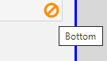
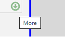

## IBM i Subfile User Interface

For those unfamiliar with the IBM i *Subfile*, it refers to a portion of the Display that is used to show records. Given than most subfile records are made up of a collection of fields (frequently coming from a database file), the appearance of the Subfile is of *tabular* data, similar to a *Table View*.

## IBM i Subfile Pagination

Commonly, a *Subfile* will present only a *partial amount* of the available records at one time on the Display. It is said that the *partial amount* of records is the unit of subdivision of the available records, historically referred to as a *Page*.

A common practice is to allow the end-user to change the visible *Page* on the screen to navigate the entire *Subfile*, moving closer to the *beginning of the File* or away towards the *end of the File*.

This navigation to move *Up* or *Down* - one *Page* at at time - also known as *Pagination*, became so common that physical keyboards are designed to have special keys for that purpose (typically labeled *Page Up* and *Page Down*).

## Subfile indication regarding *Last Page*

IBM i Display files can be designed such that there is an easy way to determine if the *Last Page* of a *Subfile* is being shown at the present moment on the Display.

The *Last Page* state of the *Subfile* is typically indicated by a label at the bottom of the *Subfile* area, indicating:

1. A label with word "More".
2. A label with "+" sign.
3. __The absence__ of the word "Bottom".

( * ) It is also possible (but rare) to show a *Scrollbar* for this purpose. It is uncommon because it required special terminals.

In particular, the IBM i *Page Description Language*, or in IBM terms ["Data Description Specifications" for Displayfiles](https://www.ibm.com/docs/en/i/7.2?topic=dds-display-files) allows the use of keyword [SFLEND](https://www.ibm.com/docs/en/i/7.1?topic=80-sflend-subfile-end-keyword-display-files) for this purpose.

## Migration for SFLEND (Last Page) keyword.

There are three properties that may be generated on the [DdsSubfileControl](/reference/expo/qsys-expo-tags/dds-subfile-control-tag-helper.html) tagHelper: `SubFileEnd`, `SubFileEndTextOn` and `SubfileEndTextOff`

| Property                 | Description                                                                  |
| ------------------------ | ---------------------------------------------------------------------------- |  
| SubFileEnd               | [Conditional Property](/reference/expo/qsys-expo-model/conditional-property.html) which determines if Subfile is showing the *Last Page*. |
| SubFileEndTextOn         | Text to show as icon *Tooltip* when **SubFileEnd** evaluates to *True*.      |
| SubfileEndTextOff        | Text to show as icon *Tooltip* when **SubFileEnd** evaluates to *False*.     |

The User Interface associated with the *Last Page* feature (formerly `SFLEND` keyword) is an icon that shows right-aligned on the bottom of the *Subfile* area on the Display.

| Icon shape                                | Condition to show                                         | Tooltip text from Property   |
| ----------------------------------------- | --------------------------------------------------------- | ---------------------------- | 
|  |  SubFileEnd evaluates to *True* meaning:  *Last Page*     |  SubFileEndTextOn            |
|      |  SubFileEnd evaluates to *False* meaning: *NOT Last Page* |  SubfileEndTextOff           |

Notes:

1. The *NOT* Last Page icon (green icon with arrow-down shape) can respond to mouse-click event, issuing a "Page Down" action (to navigate to the next available Page).
2. When the properties: `SubFileEndTextOn` or `SubfileEndTextOff` are *NOT* provided (or set to empty string), then the corresponding icon *DOES NOT* show (regardless of the condition evaluation).

>`*SCRBAR` keyboard option is unsupported. If you want this kind of user interface element, consider upgrading the *Subfile* to an [HTML Table](/manuals/enhancements/enhancing-ui/upgrading-subfiles-to-tables.html)