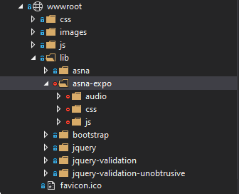

*Website Content* is the term ASNA.QSys refers to when talking about the *public* server-side web resources.

> *Public* in this context does not necessarily mean *openly accessible* worldwide. Instead, we are referring to the resources exposed to the user's once they can reach the site's [URL](https://en.wikipedia.org/wiki/URL) after applying internet security. 

Typically a Website shares a folder called the *root* or *wwwroot* where Website client-side resources will be located.

[HTML](https://en.wikipedia.org/wiki/HTML) syntax on Web Pages describes to the *Web Browser*, specifically **where** to locate *pieces* of the Page to be rendered. These *pieces* is what we are referring to as the **Content**.

ASNA QSys Expo Web Content are the *shared* resources any Nomad contains:

1. [CSS](https://en.wikipedia.org/wiki/CSS)
2. [JavaScript](https://en.wikipedia.org/wiki/JavaScript)
3. Audio files

These resources are copied to the `wwwroot` folder of the Interactive Nomad Application. This is done during the Migration of the Application, but can be [restored](https://docs.microsoft.com/en-us/dotnet/core/tools/dotnet-restore) to pick-up the most current files for a particular released version.

More specifically, the *shared* ASNA QSys Expo Web Content resources are kept in the folder: `wwwroot/lib/asna-expo` as indicated by the settings file:

Setting file: *CustomerApp*`Site\libman.json`:

```json
{
  "version": "1.0",
  "libraries": [
    {
      "provider": "jsdelivr",
      "library": "asna/asna-expo-clientside@2.0.0",
      "destination": "wwwroot/lib/asna-expo"
    }
  ]
}
```

> "jsdelivr" is the service ASNA Nomad applications use during Development, to [restore](https://docs.microsoft.com/en-us/dotnet/core/tools/dotnet-restore) files from the public [ASNA github public location](https://github.com/asnaqsys/asna-qsys-expo-web-content) to the local Application's `wwwroot` folder.

Executing Visual Studio 2019[^1]'s "Restore Client-Side Libraries" command, will refresh the QSys Expo Web Content to the released version-level as indicated (in this case to Version 2.0.0 according to the configuration in the [JSON](https://en.wikipedia.org/wiki/JSON) file).

> Note: The Visual Studio feature is available by calling the *context* menu option when the `libman.json` file is selected in the Visual Studio Explorer window.

## Application dependent Web Content
The following image shows a typical `wwwroot` web content file structure:



> Note: The ASNA QSys Expo folder is highlighted. Also note that Visual Studio Explorer shows the nodes with a *red* circle. This means that the branch is *excluded* from source control, since the sources are shared and likely "restored" from a common place (the cloud).

Other files of interest:
1. [favicon.ico](https://en.wikipedia.org/wiki/Favicon): small icon used by most Web Servers, in different ways. 
2. Application dependent resources: css, images, javascript (js).
3. Third-party open-source libraries.

> &#128161; Resources stored in `wwwroot` (or any of the sub-folders) **do not** necessarily will be requested by the Application Web Browser. In fact, [ASNA](https://asna.com/us) discourages the use of third party libraries such as **boostrap** and **jquery**, but acknowledges that they became very common - so much, that Microsoft decided to distribute them with their templates-[^2]. 

Any resource that is specific to the Application should go into `wwwroot` at the first level of folder under `wwwroot`, avoiding the `lib` which may get replaced by third-party released libraries.

> You can look at [SunFarm sample Project](https://asna.github.io/SunFarm/logo-branding/) for a description on how to use Application dependent Web resources.

## Razor Page Layout Pages

ASP.NET Razor Pages build HTML using a templated approach. Application *Views*, the markup of Nomad Display Pages, define the **Body** of the markup, and use a *Master* Layout to consistently build all Display Pages for the Application[^3].  

The *Master* Layout Template is stored in file: `Site\Pages\Shared\_Layout.cshtml`

The following is the content of _Layout.cshtml[^4]:

```html
<!DOCTYPE html>
<html>
<head>
  <meta charset="utf-8" />
  <meta name="viewport" content="width=device-width, minimum-scale=1.0, maximum-scale=1.0" />
  <meta name="google" content="notranslate" />
  <title>@ViewData["Title"] - CustomerSite</title>
  <link rel="stylesheet" href="~/lib/asna-expo/css/expo.css" />
  <link rel="stylesheet" href="~/css/site.css" />
</head>
<body>
    @RenderBody()

    <script type="module">
        import { Page } from '../lib/asna-expo/js/asna.js';

        Page.init({ formId: 'MonarchForm' });
    </script>

    @RenderSection("Scripts", required: false)
</body>
</html>
```
If you are familiar with [HTML](https://en.wikipedia.org/wiki/HTML5) you should immediately recognize the basic *tags* like `<html> <head>` and `<body>`. The `<html>` defines the page and contains the rest of the HTML elements. 

**The [head](https://developer.mozilla.org/en-US/docs/Web/HTML/Element/head) Element**

The HTML <head> element contains machine-readable information (metadata) about the document, like directives for the Browser, title and style sheets. 

Let's look closer at the **head** element in `_Layout.cshtml`:

```html
<head>
  <meta charset="utf-8" />
  <meta name="viewport" content="width=device-width, minimum-scale=1.0, maximum-scale=1.0" />
  <meta name="google" content="notranslate" />
  <title>@ViewData["Title"] - MyAppSite</title>
  <link rel="stylesheet" href="~/lib/asna-expo/css/expo.css" />
  <link rel="stylesheet" href="~/css/site.css" />
</head>
```

It defines three `<meta>` elements, the first `charset="utf-8"` defines the encoding used for the text, the  [utf-8](https://en.wikipedia.org/wiki/UTF-8) allows the full UNICODE, where the first 128 correspond to the ASCII encoding. The second `name="viewport"` provides instructions for Mobile Devices (Phones, Tablets) as to how to present the Page (initial scaling). The third `name="google"` disables a link that Chrome Browser adds when a Page shows in a language that is not the system's default. This is a translation feature that is nice for Reading articles, but not for a Business Application.

Then comes the `<title>` defines the name used in Browsers for the Tab page where the Display Page renders. It is a concatenation of two strings:
* The value of "Title" entry in the [ViewData](https://docs.microsoft.com/en-us/aspnet/core/razor-pages/?view=aspnetcore-5.0&tabs=visual-studio#viewdata-attribute) dictionary. The value defaults to the name of the Page.
* A constant, such as "MyAppSite".

If you look at the markup for any of the Display Pages (under the Areas\Pages\View folder), at the top of the markup, there is a section similar to the following:

```html
@{
    ViewData["Title"] = "MYDSPFNAME";
}
```

This C# code is telling the page to set the "Title" item in the ViewData dictionary to the name of the Page.

For this example, the concatenated string set to the Browser's Page title would be: **MYDSPFNAME - MyAppSite**. This may be useful for Tech Support, to quickly identify which Display Page is executing in an Application.[^5]  

The two last `<head>` are *link* meta elements:

```html
  <link rel="stylesheet" href="~/lib/asna-expo/css/expo.css" />
  <link rel="stylesheet" href="~/css/site.css" />
```

Both are of type "rel" (relationship) indicated as *stylesheet*.
Each refers to an external resource[^6], which will will trigger a new `HTTP` request to the server. 

The first one deserves a particular importance, because it loads the styles used by [QSys Expo Client Library]({{ site.rooturl }}/qsys-expo-client-library/).

The second one refers to *user* defined Application styles.


**The [body](https://developer.mozilla.org/en-US/docs/Web/HTML/Element/body) Element**.

The HTML <body> Element represents the content of an HTML document. There can be only one <body> element in a document.

The body (contents) of the Display Page are defined with the following Razor code[^5]:

```html
<body>
    @RenderBody()

    <script type="module">
        import { Page } from '../lib/asna-expo/js/asna.js';

        Page.init({ formId: 'MonarchForm' });
    </script>

    @RenderSection("Scripts", required: false)
</body>
```
The `@RenderBody()` calls a method that generates the HTML for the Display Page, that is the markup for the `cshtml` page that was requested (and is using the _Layout we are describing).

Next is a `script` block of type [module](https://developer.mozilla.org/en-US/docs/Web/JavaScript/Guide/Modules).

The `module` Script loads and starts the [QSys Expo Client Library]({{ site.rooturl }}/qsys-expo-client-library/).

It first *imports* the object `Page` from the QSys Expo Client Library and immediately calls the method `init` passing the name of the main HTML `form` element[^7].

> For detail description of the Client side architecture used by Nomad [Read this]({{ site.rooturl }}/qsys-expo-client-library/)

The last C# code `@RenderSection("Scripts", required: false)` calls a method to generate the script in case a particular page has a "Script" section defined. By default there will not be any Display Page with *user-defined* scripting.

> &#128161; The order of the code in <body> element is important. Do not alter it (unless you have a very good reason to do it).
<br>
<br>

[^1]: At the time of the writing of this documentation "2019" was the version that supported "Client-Side" Library management feature.
[^2]: At the time of the writing of this documentation. There is no guarantee that they will appear in the future. Nor are they essential for the execution of Monarch Nomad Applications.
[^3]: On large Websites, partitioned into *Areas*, it is possible to have different Layouts for each Area.
[^4]: The content may be a little different, depending of the Nomad Release.
[^5]: On IBMi Displayfiles usually included a constant field on each page to show the *Program Name*. Frequently the Displayfile name - by convention - had a name similar to the consuming program. All this to assist Tech Support while reporting errors.
[^6]: This is similar to the concept *INCLUDE* in several languages or *Copy-book* in RPG.
[^7]: A HTML Page may have more than one "form" element, only one will be used by QSys Expo Client Library.