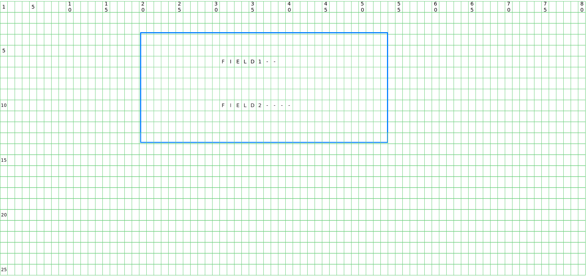
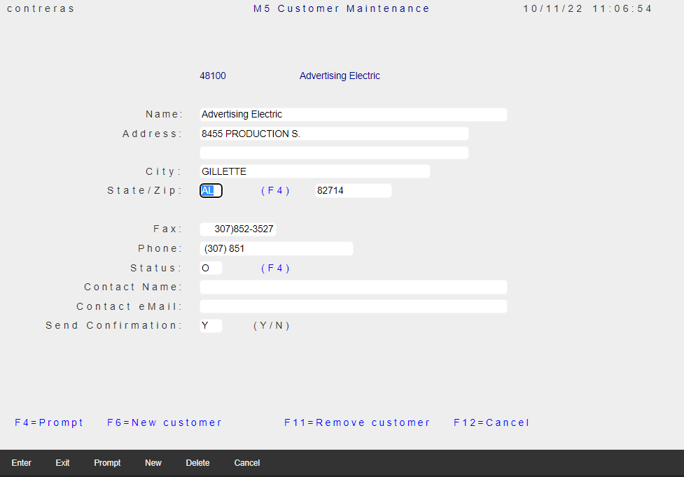
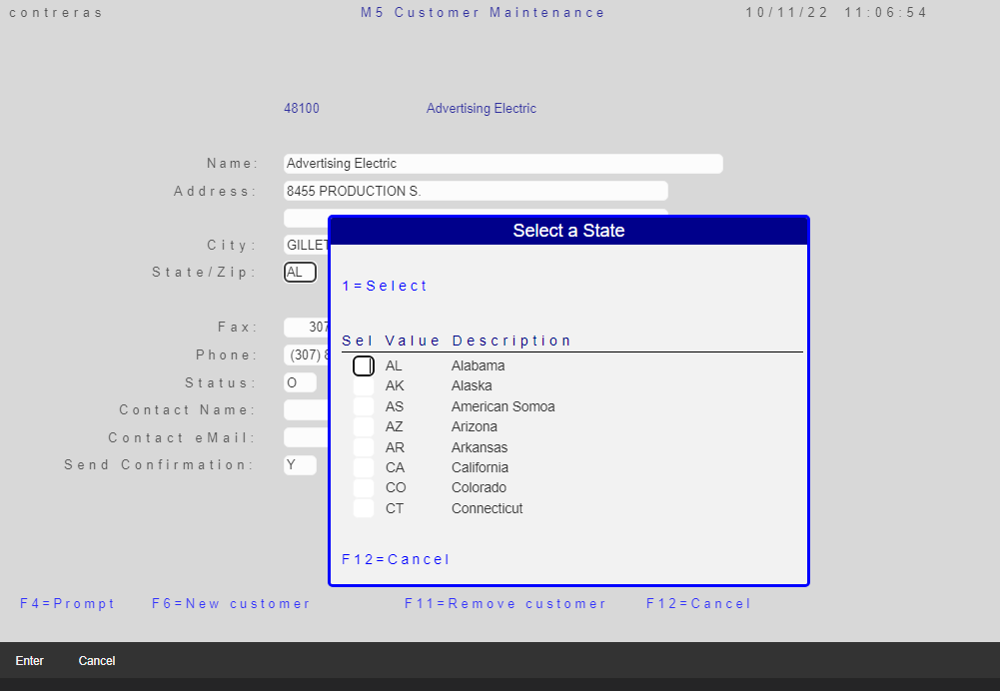
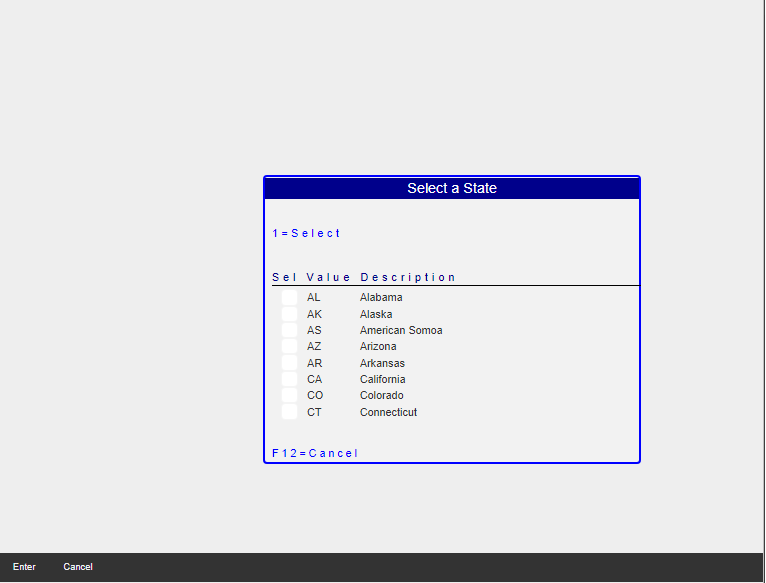
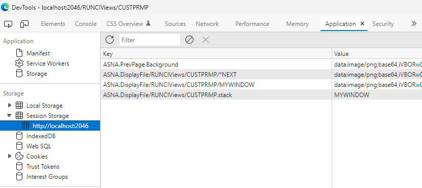
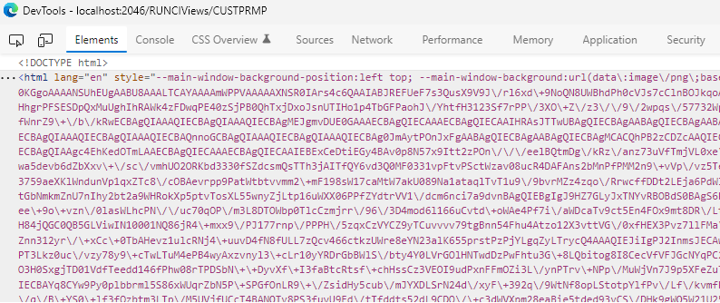
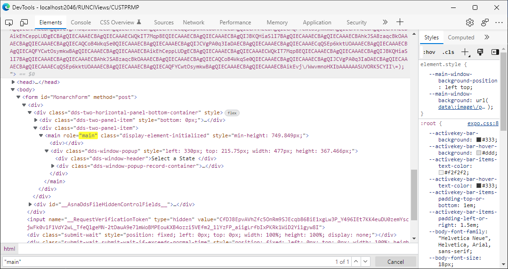

## IBM i DDS WINDOWS

IBM i DDS Keyword [WINDOW](https://www.ibm.com/docs/en/i/7.2?topic=80-window-window-keyword-display-files) is a *record-level* keyword to specify that the record format you are defining will be displayed using a window.

A DDS WINDOW defines a rectangular area on the grid screen commonly specified by a starting position (*upper-left* corner of the rectangle), a *height* (vertically occupying rows), and a *width* (horizontal columns).

For example, the following fragment of [DDS](https://www.ibm.com/docs/en/i/7.2?topic=dds-display-files) specifies a display *record* named `WINDOW1` with two fields:

```
     A          R WINDOW1                   WINDOW(4 20 9 30)
     A            FIELD1         8A  B  2 10
     A            FIELD2        10A  B  6 10
```

When the `WINDOW1` record is displayed, the *upper-left* corner of the window border is on row 4 column 20 of the display. The *lower-right* corner of the border is located 10 rows lower than the upper border and 33 columns to the right of the left border.

* *Lower* border row = *upper* border row + *height* (window-rows) + 1
* *Right* border column = *left* border column + *width* (window-columns) + 3

The `FIELD1` field starts 2 rows lower than the upper border and 11 columns (the ending attribute byte for the border character has been taken into account) to the right of the left border character (row 6, column 31 on the display).

* Actual field row = upper border row + row number of field
* Actual field column = left border column + column of field + 1

The `FIELD2` field starts 6 rows lower than the upper border and 11 columns to the right of the left border (row 10, column 31 on the display).

The following image shows the *green-screen* (terminal) rendering:



>The WINDOW frame shown in this picture does not appear in the Terminal screen - given the simple `DDS` listed above -. It is presented here for visualization clarity. The number guides for rows and columns are also not part of the screen output. Applications generate frames, title etc. using character screen attributes and other keywords such as: `WDWBORDER`, `WDWTITLE`.

### Overlaying Window records

It is very common to use `WINDOW` records that Overlay on top of other records currently displayed in the Page (See [OVERLAY](https://www.ibm.com/docs/en/i/7.2?topic=80-overlay-overlay-keyword-display-files) ).

You use this *record-level* keyword to specify that the record format that you are defining should appear on the display without the entire display being deleted first.

## Expo Overlapping WINDOW Anatomy

To describe how the legacy Displayfile rendering is implemented using RazorPage technology, let's use a real scenario.

>This topic assumes you have read [Expo DDS-like TagHelpers](qsys-expo-dds-elements.html)

An application presents a Page with *CUSTOMER MAINTENANCE* records, and enables `F4` command key to present a `WINDOW` that overlaps on the page.



When the cursor is located to the State/Zip: input field, and `F4` command key is pressed, the following Page is presented.



The Displayfile for the WINDOW record, is described in a file called `AppViews\Pages\CUSTPRMP.cshtml` and has the following contents (only a section presented to simplify explanation)

```html
<form id="MonarchForm" method="post">
    <DdsFile DisplayPageModel="Model" KeyNames="F12 'Cancel';" >
        <DdsFunctionKeys Location="HorizontalBottom" />

        <main role="main" class="display-element-uninitialized">
            <DdsRecord For="MYWINDOW" WindowLeftCol=30 WindowTopRow=9 WindowWidthCols=43 WindowHeightRows=14 WindowTitle=@Model.MYWINDOW.WINTITLE>
                @{
                    int SFLC_SubfilePage = 8;
                }
                <DdsSubfileControl For="SFLC"  SubfilePage="@SFLC_SubfilePage" ShowRecordNumber="(int)@Model.SFLC.SFLRRN" CueCurrentRecord=true ClickSetsCurrentRecord=true>
                    <div Row="2">
                        <DdsConstant Col="2" Text="1=Select" Color="Blue" />
                    </div>
                    <div Row="4">
                        <DdsConstant Col="2" Text="Sel Value Description                     " Color="DarkBlue" Underline="*True" />
                    </div>
                    <div Row="5" RowSpan="@SFLC_SubfilePage">
                        @for (int rrn=0; rrn < Model.SFLC.SFL1.Count; rrn++)
                        {
                            int row = 5 + rrn;
                            <DdsSubfileRecord RecordNumber="rrn" For="SFLC.SFL1">
                                <DdsDecField Col="3" For="SFLC.SFL1[rrn].SFLSEL" VirtualRowCol="@row,3" EditCode="Z" tabIndex=@pageTabIndex++ />
                                <DdsCharField Col="6" For="SFLC.SFL1[rrn].SFLVALUE" />
                                <DdsCharField Col="12" For="SFLC.SFL1[rrn].SFLDESC" />
                            </DdsSubfileRecord>
                        }
                    </div>
                </DdsSubfileControl>
                <div Row="14">
                    <DdsConstant Col="2" Text="F12=Cancel" Color="Blue" />
                </div>
            </DdsRecord>

            <DdsMessagePanel />
        </main>
    </DdsFile>
</form>
```

As you can see in this Markup listing, only the record `MYWINDOW` is described, containing the `Subfile` which will be used to populate with the database records (US Zip codes). Any `Previous` records shown at runtime on the Page **are not** described in this Displayfile.

Let's ignore for a moment how the `Previous` records will be recovered, and focus on the WINDOW active records. The following page would be rendered.



### The Popup Window

With reference to the previous image, you can notice that *all* records appear now on a *Popup* Window (once we recover the previous records, the Popup nature will be more obvious).

Microsoft Razor rendering output will initially have the *Rows* laid out on the "main" `DIV`. The *Expo* JavaScript Library has initialization code that will recognize the need to create a `DIV` that will be used for the *Popup* Window (with its Title and frame), using the meta-data rendered resulting from the `DdsRecord` properties `WindowLeftCol`, `WindowTopRow`, `WindowWidthCols` and `WindowHeightRows`.

Following the example, the following `HTML` will be injected to the `DIV` that defines the "Main" Displayfile area:

```html
<div class="dds-window-popup" style="left: 330px; top: 215.75px; width: 477px; height: 367.466px;">
   <div class="dds-window-header">Select a State      </div>
      <div class="dds-window-popup-record-container">

   .
   .
   .

      </div>
    </div>
</div>
```

The new `DIV` has in-line style defining the position and dimensions of the *Popup* Window and the associated `CSS` describes the rest of the needed style. Of particular importance is the `position` style, which is indicated as `relative` to its container element.

```css
.dds-window-popup {
    position: relative;
    display: block;
    overflow: hidden;
    border: var(--popup-border-width) solid var(--popup-background);
    border-radius: 5px;
    text-align: center;
    border-color: blue;
    border-width: medium;
}

.dds-window-popup-record-container {
    background: var(--popup-background);
    width: 100%;
    height:100%;
}

.dds-window-header {
    height: var(--popup-header-height);
    line-height: var(--popup-header-height);
    color: white;
    background-color: darkblue;
    cursor: grab;
    user-select: none;
}
```

The next step (of the initialization logic) is to move ALL *Rows* from the the "Main" element to the DIV with class `dds-window-popup-record-container`.


> Since records where moved from the "Main" `DIV` to the new *Popup* Window, the "Main" element does not have a *natural* height, JavaScript logic sets the `min-height` in-line style to produce an empty page. (The size comes from `27` multiplied by the computed height of a *Row*)

### The Previous record's Rendering

All Pages need to prepare an *image* of what is presently on the Page that *may* become the previous page on a subsequent Window display.

Regardless of the fact that an Application may (or may not) use WINDOW records, any Page will *Store* the an image of the *current* contents of the "Main" `DIV` to be used as the *background* of a subsequent Page with Window records.

[ASNA Expo Web Content](qsys-expo-web-content.html) JavaScript includes a third-party module to convert `HTML` to [png image format](https://en.wikipedia.org/wiki/Portable_Network_Graphics). The *trigger* event when the *Capture* of the "Main" `DIV` is converted to an image is just before calling the [Form Submit](https://developer.mozilla.org/en-US/docs/Web/API/HTMLFormElement/submit) function. The [Form Submit](https://developer.mozilla.org/en-US/docs/Web/API/HTMLFormElement/submit) function is called, in response to pushing `Command` action keys (i.e `Enter` and Function keys), of any button associated with that action.

### Storing the Background Image

Web Browsers allow private (client) storage of string items. [Web Storage API](https://developer.mozilla.org/en-US/docs/Web/API/Storage) includes [Session Storage](https://developer.mozilla.org/en-US/docs/Web/API/Window/sessionStorage), that is *transient* as long as the *Session* exists. [ASNA Expo Web Content](qsys-expo-web-content.html) JavaScript makes use of this facility to store `Previous` record state.

The following Browser's Development Tools screen-shot, shows what will appear in the *Application* storage for the example we are presenting here.



When *Submitting* (as described before), the "Main" `DIV HTML` is converted to a [png]((https://en.wikipedia.org/wiki/Portable_Network_Graphics)) - using the *string* `data:image` with the [Base64](https://developer.mozilla.org/en-US/docs/Glossary/Base64) encoding, replacing any item in the *Session* with the name `ASNA.PrevPage.Background`.


### Retrieving the Background Image

When a new page that **contains a WINDOW** is about to be rendered, the Expo initialization logic will look in the *Session* storage items, the image that will be set as the [CSS Background image](https://developer.mozilla.org/en-US/docs/Web/CSS/background-image) to be used by the "Main" `DIV`.

> For simplicity, lets assume the image we want is the one stored in item named `ASNA.PrevPage.Background`. For more advanced scenarios, where multiple-overlapping WINDOWS are used, a [stack](https://www.techopedia.com/definition/9523/stack) of items is used. 

Once the proper image is found in the [Session Storage](https://developer.mozilla.org/en-US/docs/Web/API/Window/sessionStorage), the string data is set to a [CSS Variable](https://developer.mozilla.org/en-US/docs/Web/CSS/Using_CSS_custom_properties), as follows:

Let's peek into the `CSS` for the "Main" `DIV':

```css
.display-element-initialized {
    background-image: var(--main-window-background);
    background-repeat: no-repeat;
    background-size: auto, auto;
    background-attachment: fixed;
    background-position: var(--main-window-background-position);
    width: 100%;
    height: 100%;
    overflow: hidden;
}
```

Notice that there are several styles that indicate how this image will be displayed in the background. For the sake of this description, let's focus on two styles:

```css
    background-image: var(--main-window-background);
    background-position: var(--main-window-background-position);
```

`HTML Elements` allow creation of `Custom CSS Properties (variables)` with are named by the use of prefix `--`, like:

```css
element {
  --main-bg-color: brown;
}
```

These values may be later referred to by the use of `var` keyword in the `CSS` syntax:

```css
element {
  --main-bg-color: brown;
  background-color: var(--main-bg-color);
}
```

A more common approach is to collect all these `CSS variables` and set them at the `root` element.

```css
:root {
  --main-bg-color: brown;
}
```

>The `root` element of a `HTML` page is the `html` tag. (The `:root` CSS syntax adds these properties to the `html` element in a page).

Browser's Developer Tools, show the initial value of the `:root` variables at the bottom pf the Style property panel, but when these variables are changed by JavaScript code, their new *overridden* value appears as *in-line* properties to the `html` element (as shown below):

<br>




>When setting large values (as it is the case for image encoded data), it is *unfortunate* that the inspection of elements using Developer Tools is obscured.

To make the Inspection of the Elements a good experience, it is highly recommended that you use the **Search** feature, asking the Inspector to locate the "main" element.



Using this technique, it is possible to move the large image data-value out of the way, and locate the elements inside the *Popup* Window.

We have talked about the image data and how JavaScript in Expo Library will read it from Session Storage and set the contents as variables to affect the "Main" `DIV` background. 

Now let's discuss the [background-position](https://developer.mozilla.org/en-US/docs/Web/CSS/background-position).

During Page initialization, depending on the `DdsFunctionKeys Location` property, the variable `--main-window-background-position` will be changed, from the default `left top` to possibly: `right top`, `center bottom` etc. Different locations (which governs the *two-panel* [Flex Layout](https://developer.mozilla.org/en-US/docs/Web/CSS/CSS_Flexible_Box_Layou) ) work better with the different `background-position` styles.

<br>

### Hooks to User-Defined JavaScript
The process of *Storing* new Background Images can be affected by User-defined JavaScript code. Each time a new "Main" HTML capture process is performed, the following functions (if defined) are called:

* `MonarchPageSavingForPopup()` - Called right before the HTML to image process is requested.
* `MonarchPageForPopupSaved()` - Called right after the HTML to image process completes.

No parameters are passed (the DOM is accessible to User-defined code).

In addition, there is another callback, namely, `MonarchWindowBackgroundHtmlToImageFilter(node)` which is called for every node in the DOM tree (starting at "Main" `DIV`). If the callback is implemented, User-defined code has a chance to *filter* the node (and its descendants) for inclusion. If the function returns `false`, the node is excluded from the image.

### Images that violate CORS will be excluded

When an image on the Page comes from an external site (or some other type of [CORS](https://en.wikipedia.org/wiki/Cross-origin_resource_sharing) violation), the image will be excluded and the 'Previous' page (used by subsequent WINDOW displays), will be incomplete.

You will know which images *may* be missing, just by looking at your unit-testing Pages. If this is a required image for the Pages with WINDOWS, then you need to bring the resource first to your site and use that image instead.

<br>

### Overriding WINDOW Styles

We have talked about several important `CSS` styles that affect the look of Pages with WINDOWS. Your application most likely define its own color *Theme* and/or additional *non-Monarch* `HTML` elements around the Display file "Main" area.

The standard [Cascading CSS](https://developer.mozilla.org/en-US/docs/Web/CSS/Cascade) rules apply.

[ASNA Expo Web Content](qsys-expo-web-content.html) library defines the *framework* styles in your root page at: `~\wwwroot\lib\asna-expo\css\expo.css`

Your own `CSS` most likely comes from file: `~\wwwroot\css\site.css` you can `Cascade` any of the styles on this file (it is loaded after `ASNA Expo Web Content` own `CSS`)

If you want to override the styles that the *framework* defines as computed from `CSS variables` (as explained in this topic), you can still override the setting with your hard-coded style in `~\wwwroot\css\site.css`

For more advanced customization, the `CSS variables` are accessible from your user-defined JavaScript.

### Popup WINDOW Drag/Drop

Popup WINDOW Header is draggable, when *hovering* the mouse pointer over the Window Popup header you will notice that the mouse pointer changes to a *Drag* icon hand (checkout `dds-window-header` class above). *Dragging* the Popup Window works as expected: the Window is re-positioned on it's background Page.

When the WINDOW is displayed again (the record is re-executed by the Application logic), the *new* Window position is lost, and the position defined by the Razor Page overrides any Window Dragging performed.

>This is may be particularly confusing when using multiple overlapping windows.

Of minor importance - but worth noticing - the *Window Title* (being part of the draggable element), cannot be selected to be used for Copy/Paste.


