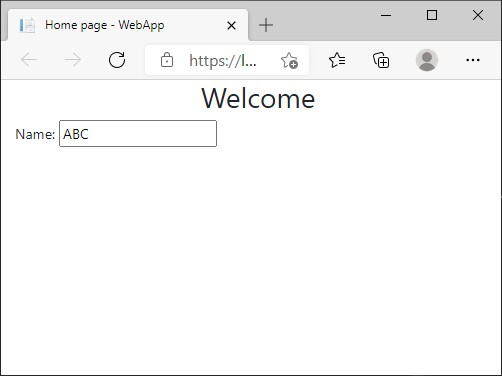
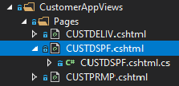

## Razor Pages
**ASP.NET Razor Pages** is a server-side page-focused framework that enables building dynamic, data-driven web sites with clean separation of concerns.

The Razor Pages framework is lightweight and very flexible. It provides the developer with full control over rendered `HTML`. 

A *Razor content page* acts as a template for generating `HTML`. The typical content page includes static `HTML`, [TagHelpers](https://www.learnrazorpages.com/razor-pages/tag-helpers/) that emit `HTML` dynamically, and **C#** code. The **C#** code is embedded within the static content and tag helpers according to a set of rules, or syntax.

>Think of *Razor Pages content Page* as the [Markup template](https://en.wikipedia.org/wiki/Web_template_system) file with the extension `.cshtml`

Sample Razor Page: `Index.cshtml`

```html
@page
@model IndexModel
@{
    ViewData["Title"] = "Home page";
}

<div class="text-center">
    <h1 class="top-header">Welcome</h1>
</div>

<form method="post">
    Name:
    <input asp-for=@Model.Name>
</form>
```

Notes: 
1. Standard `HTML` elements are used.
2. `C#` is used on sections prefixed by `@`
3. The `asp-for` TagHelper is used to bind `input` element with a property in the `Model`.

The `HTML` generated is:

```html
<!DOCTYPE html>
<html lang="en">
<head>
    <meta charset="utf-8" />
    <meta name="viewport" content="width=device-width, initial-scale=1.0" />
    <title>Home page - WebApp</title>
    <link rel="stylesheet" href="/lib/bootstrap/dist/css/bootstrap.min.css" />
    <link rel="stylesheet" href="/css/site.css" />
</head>
<body>
    <main role="main" class="pb-3">
        
        <div class="text-center">
            <h1 class="top-header">Welcome</h1>
        </div>

        <form>
            Name:
            <input type="text" id="Name" name="Name" value="ABC">
        </form>
    </main>
</body>
</html>
```

The rendering of the `HTML`:



<br>

## PageModel
The **PageModel** is a **C#** ASP.NET class that servers as the `Controller` of the `View` (the *Razor Page*). 

The **PageModel** clearly separates the following *User Interface* distinct concerns:

1. Presentation (the `View`)
2. Logic that deals with Business Data (the `Model` or View-Controller)

The [Model-View-Controller Architecture Pattern](https://www.sitepoint.com/model-view-controller-mvc-architecture-rails/) is a extensive topic - *outside the scope of this document* -. For the purposes of this document, it may be enough to understand the separation of:

1. Templated generation of `HTML` - The *Razor Page*, file extension: `.cshtml`
2. Logic that deals with `Data` - The *PageModel*, file extension: `.cshtml.cs`

*Visual Studio Solution Explorer* conveniently shows the *Page Model file* as a nested node for a *Razor Page file*, as depicted by the following image:



>&#128161; Simple rule to remember: The *Razor Page* can refer to the *PageModel* class but **NOT** the other way around.

Sample PageModel file: `Index.cshtml.cs`

```cs
using Microsoft.AspNetCore.Mvc.RazorPages;
using Microsoft.Extensions.Logging;

namespace WebApp.Pages
{
    public class IndexModel : PageModel
    {
        private readonly ILogger<IndexModel> _logger;

        public string Name { get; set; } = "ABC";

        public IndexModel(ILogger<IndexModel> logger)
        {
            _logger = logger;
        }

        public void OnGet()
        {

        }
    }
}
```

Notes:
1. The Markup file `Index.cshtml` has a reference to the `IndexModel` class
2. The `IndexModel` class defines a property named `Name` initialized with `"ABC"`
3. The `<input>` element is bound to the `IndexModel.Name` property. The binding happens thanks to the `asp-for` TagHelper.
4. The Model **DOES NOT** refer back to the *Razor Page*.

