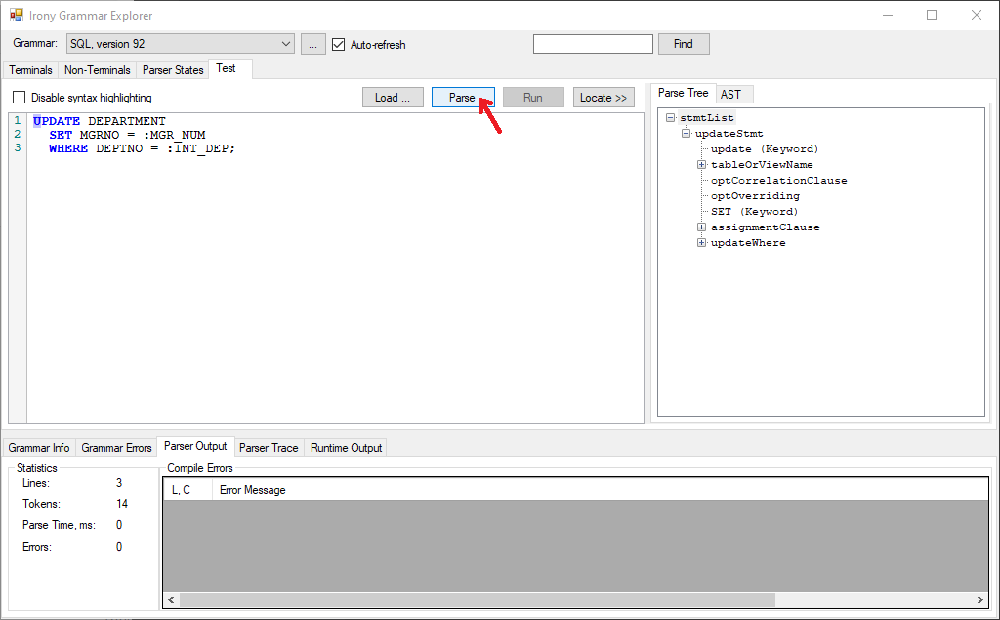
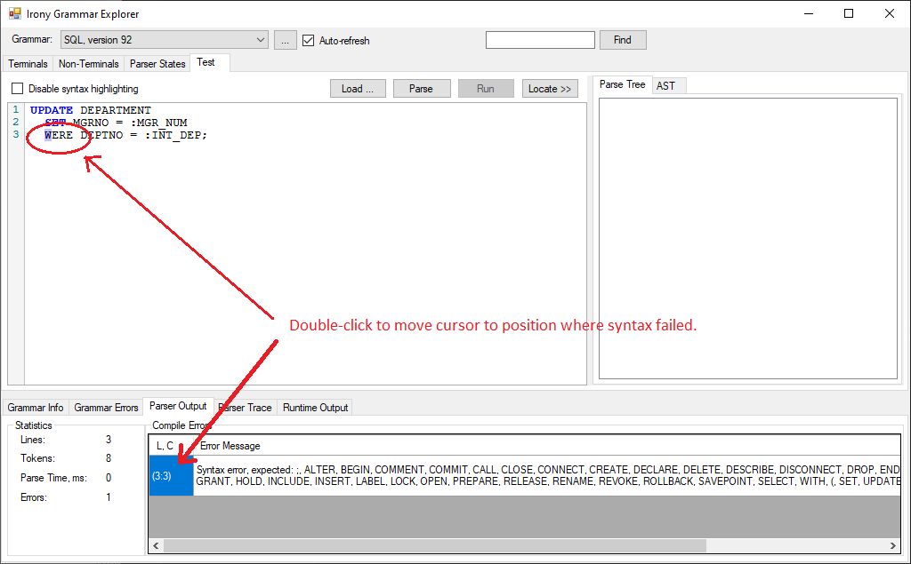

# Remediating Monarch RPG Migration *Unsupported SQL Statements*

RPG ILE Applications that use SQL may embed SQL statements to be used by RPG logic. [Embedding is supported in both calculation sections and Free format blocks](https://www.ibm.com/docs/en/i/7.1?topic=cssiira-embedding-sql-statements-in-ile-rpg-applications-that-use-sql).

Monarch Cocoon RPG Agent will extract these SQL Statements and migrate to methods defined in [Program](/reference/runtime/qsys-runtime-job-support/program.html) such as `ExecSQL_Statement`:

```cs
   ExecSQL_Statement( +
   "UPDATE DEPARTMENT " + +
   "SET MGRNO = @sql_parm_1 " + +
   "WHERE DEPTNO = @sql_parm_2;", +
   *New DBCharParm(MGR_NUM, %Len(MGR_NUM)), +
   *New DBCharParm(INT_DEP, %Len(INT_DEP))
    )
```

>Note: The first parameter is a string, the rest of the parameters are the input host variables that the statement is using, indicated by the `@sql_parm_n` placeholders.

SQL language is very powerful and the syntax may become large and complex. Some or the statements that SQL offers may not be very applicable to be used as an embedded language in RPG ILE.

The [DB2® for IBM® i SQL](https://www.ibm.com/docs/en/i/7.1?topic=programming-introduction-db2-i-structured-query-language) is the implementation that RPG ILE uses and deviates from the [SQL ANSI Standard](https://datacadamia.com/data/type/relation/sql/ansi). Monarch Cocoon RPG Agent uses a Grammar definition according to the [IBM i Reference Books](https://www.ibm.com/docs/en/i/7.1?topic=reference-about-sql).

ASNA has made the best effort to include in the Grammar every possible syntax an RPG developer may need to utilize.

When Monarch RPG Agent does not recognize the syntax of a Embedded SQL Statement, it will task an Error.

ASNA is committed to review any instance of valid IBM i SQL, and correct it to allow the Migration to succeed.

## SQL Remediation Common Practices

When facing an Unsupported SQL Task, there are typically two possibilities to remediate:

1. Rewrite the SQL statement in a different way using a valid syntax which provides the same results, such that the Migration succeeds.
2. Submit the valid program with the troublesome statement to ASNA for review, wait for a new Monarch Cocoon build with the statement supported.

Both avenues listed may be challenging, particularly when there is no simple way to identify where in the *possibly* long statement a conflict was detected, according to the current SQL Grammar defined by Monarch.

In this section we present an Open-source tool that may be used to facilitate this process.

## Irony — .NET Language Implementation Kit

Monarch RPG Agent relies on an open-source *Universal Language* Parser known as [Irony Language Kit](https://github.com/IronyProject/Irony).

The *Kit* provides sources including an excellent interactive tool called **Irony Grammar Explorer**. This tool was used during the development of the IBM i SQL grammar that Monarch uses to Parse and Migrate embedded SQL statements; and may be used to diagnose unsupported statements.

## Irony Grammar Explorer Installation
To build the Tool, Visual Studio is required (with .Net Framework 4.6 or later). Any Monarch user is expected to met this prerequisite. 

The process is simple, and can be completed in a few minutes:
1. Launch Visual Studio and Select *Clone Repository...* from the **File** menu.
2. For the "Repository location:" enter `https://github.com/IronyProject/Irony`.
3. For the "Path:" enter a local folder in your file system, such as `C:\asna-tools`.
4. Click on the "Clone" push button. All the sources for the *Irony — .NET Language Implementation Kit* will be downloaded from **GitHub** and the cloned released version will be shown in the Solution Explorer.
5. Double-click on the "Irony.sln" to load the framework Solution. Depending on the .Net framework version(s) you may have installed on your system, you may receive messages prompting to upgrade. Accept the first option offered, by clicking *Ok* a few times while upgrading several projects in the solution.
6. Select the project named "0003.Irony.GammerExplorer" as the "Startup Project": right-click on the Project and execute "Set as Startup Project" from the context menu.
7. Installation is complete. You may now Run the **Irony Grammar Explorer** typing `Ctrl + F5` (or *Run* from the toolbar icon.)

## Loading ASNA Monarch Cocoon SQL Language Grammar

The inputs for the *Irony Grammar Explorer* are:
1. The Language Grammar, in the form of a DLL. In this case, the SQL Grammar included in Monarch Cocoon installation.
2. Text with Language syntax to explore. In this case a SQL statement.  

The Irony Grammar Explorer window shows in the top-left of the page the *active* Grammar loaded into memory. As seen in the image below, there is no active grammar when the tool is launched for the first time.

* Click on the "..." push button to `Add a Grammar` and select Monarch Cocoon defined SLQ Grammar.


Using file explorer, locate the file `ASNA.Monarch.IronyParser.dll` which is likely found in the `Program Files (x86)\ASNA\Monarch` (version) folder. 


A single `Grammar Assembly` may define more than one Grammars, in this case the only Grammar found named `SQL version 92: DB2 Universal Database for iSeries` is shown. Select it (by checking the box and click on `Ok` push button).


## Check validity of SQL Statement

Suppose we want to explore the validity of a SQL statement, taking from an RPG LE source member, like the following (found in Free form):

```sql
EXEC SQL UPDATE DEPARTMENT
  SET MGRNO = :MGR_NUM
  WHERE DEPTNO = :INT_DEP;
```

* First enable the "Test" Tab Page.
* Then take the statement text (after `EXEC SQL`):

```sql
UPDATE DEPARTMENT
  SET MGRNO = :MGR_NUM
  WHERE DEPTNO = :INT_DEP;
```

* Copy these three lines to the clipboard, and paste them on the *Irony Parser Explorer* Test edit box. Then Click on the `Parse` push button.



If the Statement can be parsed with the provided Grammar, a Parse syntax Tree will appear in the window to the right of the Test input edit box. If syntax fails, this window will be empty and there will be details listed at the bottom of the page.

>Notice that the statement is highlighted with colors, making it easier to identify the different language clauses.

For the purpose of checking *Validity* the important fact is that the **Errors** log ends up *empty* and there is a *Parse Tree* resulting on the result window.

## When Parsing fails.

For illustration purposes, let's force a syntax error on the SQL statement used before. Let's remove the `H` from WHERE clause:

```sql
UPDATE DEPARTMENT
  SET MGRNO = :MGR_NUM
  WERE DEPTNO = :INT_DEP;
```

If you click `Parse` again, the following information will be presented:



Notice:
1. The is no `Parse Tree` output.
2. The `Parser Output` tab at the bottom of the page shows the error (indicating the line number and column position).

>You can double-click on the `Compile Error` line to have the corresponding text highlighted where the error was detected.

If you correct the misspelling, changing `WERE` to `WHERE`, the highlighting corrects itself, pressing the "Parse" push button makes the `Parse Tree` to load and the Parser Output window is cleared.

Use this tool to either remediate the SQL statements in your RPG LE source members, or to communicate to the ASNA Tech Support group that the Grammar used by Monarch Cocoon's SQL that needs to be corrected.


