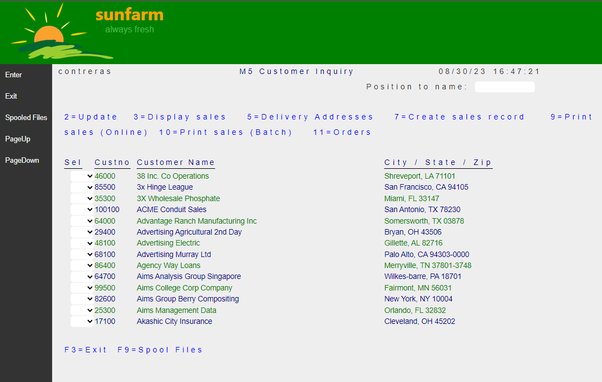
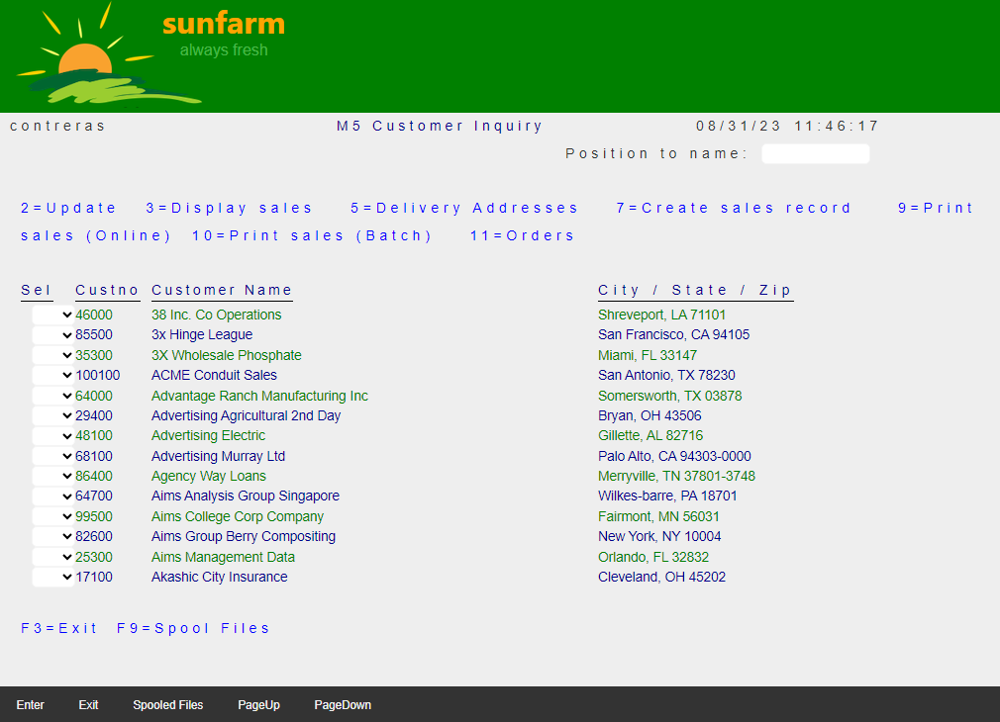

## Source

You can get the [GitHub Source Files](https://github.com/asnaqsys-examples/sunfarm-ui-enhancements) here.

## Overview

The Application Page contains a [\<form\>](https://developer.mozilla.org/en-US/docs/Web/HTML/Element/form) using a two-panel [flex box layout](https://developer.mozilla.org/en-US/docs/Web/CSS/CSS_Flexible_Box_Layout/Basic_Concepts_of_Flexbox) where the following two panels (divisions) are rendered:

1. The `Function keys` panel: Displays *active* command keys.
2. The `main` panel: Displays *active* Application display records.

The [flex box layout](https://developer.mozilla.org/en-US/docs/Web/CSS/CSS_Flexible_Box_Layout/Basic_Concepts_of_Flexbox) is very convenient, because the position and dimensions of the two two panels are auto-adjusted according to the Web Browser Window size.

The following image illustrates the layout of the two panels, where the `Function keys` panel is represented by a pale blue rectangle, while the `main` panel is represented by a light-green rectangle. The label represents the `location` name.


When Displayfiles are migrated, the default `location` used is VerticalLeft.

Note that for the two **vertical** locations the *width* of the `Function keys` panel is determined by the content *width* of the command key labels. As different Pages are rendered, the *width* of this panel varies and the panels appear to *jump*. This effect may be undesirable.

Selecting one of the **horizontal** locations may be a better choice. (Also on devices that are taller than wider - like a smart phones - this layout works better).

## Function Keys Location Enhancement

To change the `Function keys` location, explicitly add the desired property value to the `DdsFunctionKeys` tagHelper on the Razor Page markup.

```html
<DdsFunctionKeys Location="HorizontalBottom" />
```

>Note: to consistently effect the `Location` of the `Function keys` across **ALL** Application Pages, perform a global Search/Replace operation (on *.cshtml file types).

## Results

| Before | After |
| :-: | :-: |
|  |  |
