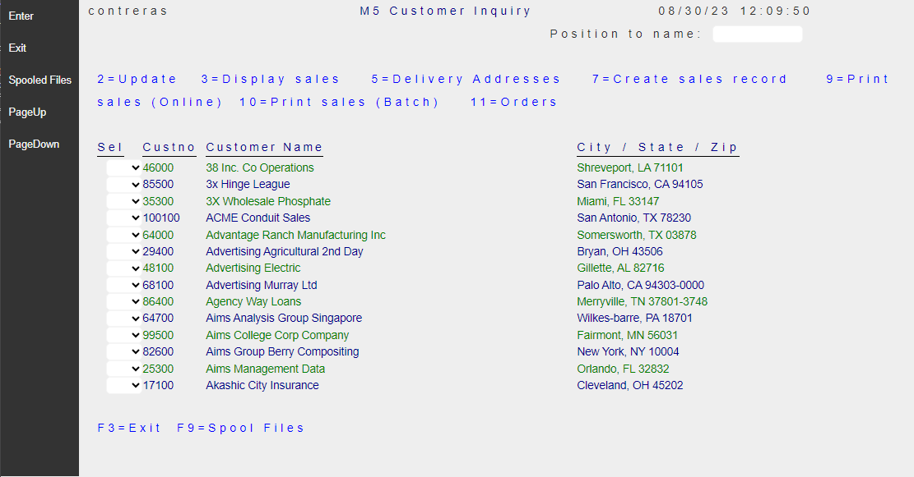

## Source

You can get the [GitHub Encore Source Files](https://github.com/asnaqsys-examples/sunfarm-encore) here.

You can get the [GitHub C# Source Files](https://github.com/asnaqsys-examples/sunfarm-csharp) here.

## Overview

[App Branding](https://www.asynclabs.co/blog/digital-design/what-is-a-brand-app-and-why-your-business-needs-it/) is the process of creating the personality of a product. App branding is how users perceive the app, its reputation, communication, and visual image.

The simplest Branding consists on presenting an image in the Page heading on **All** pages.

As we [described in previous topic](examples/sunfarm/sunfarm.md) we are assuming the name of the Modernized App is "sunfarm".

Let's proceed to add a Logo to the App in a shared place where it can be used by **All** Pages.

## Application Logo Branding

This is what we want to see at the top of any of our App pages:


As simple as it may seem, this presents some challenges:

1. We want the graphics (sun and foliage) to blend-in with green background (no border on image).
2. The name "sunfarm" should be rendered without distortion (high quality) on any device.
3. The company "motto" (always fresh) should have some transparency to reduce the label importance. Also rendered without distortion (high quality) on any device.

There are several ways to achieve our goals.

We use the following [static content](https://en.wikipedia.org/wiki/Static_web_page):

1. An image of a sunrise. A raster png format image, designed with transparency. 
2. Two lines of text:

   Application name (“sunfarm”)

   Company Motto (“always fresh”)

The folder that contains Website Assets (including static content) is called `wwwroot` in ASP.NET 

The raster image (sun-farm.png) is stored in `~/wwwroot/images` folder.

We define a few Styles by adding the following definitions to `~/wwwroot/css/site.css` file:

```css
#logo-banner {
    height: auto;
    background-color: green;
}

#logo {
    padding-left: 1em;
}

#logo-text {
    display: inline-block;
    vertical-align: top;
    margin-left: -41px;
}

#logo-title {
    color: orange;
    font-size: xx-large;
    font-family: system-ui;
    font-weight: bolder;
}

#logo-subtitle {
    text-align: center;
    color: lightgreen;
    font-size: medium;
    opacity: 0.5;
}

#page-title {
    font-size: large;
    padding-left: 4.0em;
    padding-top: 1em;
    font-weight: bold;
}

.right-aligned-constant {
    text-align: right;
}

.left-aligned-field {
    text-align: left;
}

#customer-icon {
    position: relative;
    margin-top: -109px;
    top: 109px;
    width: 109px;
    border-color: gray;
    border-width: thin;
    border-style: solid;
    background-color: white;
}

.large-bold-text {
    font-size: large !important;
    font-weight: bold;
}
```

Application Pages are Migrated to the *Areas* subfolder within the *CustomerAppSite*. Given that we want **ALL** Pages (in the Customer Area) to display the Logo header, the place where we want to define it, is:

~~~   
~SunFarmSite\Areas\SunFarmViews\_ViewStart.cshtml
~~~   

This file defines the layout shared by all Pages in the view **SunFarmViews**

```html
@{
    Layout = "_Layout";
}

<div id="logo-banner">
    
    <div id="logo-text">
        <div id="logo-title">sunfarm</div>
        <div id="logo-subtitle">always fresh</div>
    </div>
</div>
```   

The top header for all pages will contain a *division* designated for the Logo Banner which contains:
1. An image
2. A division for two legends, positioned to produce the complete Logo.


## Results

| Before | After |
| :-: | :-: |
|  |  |

