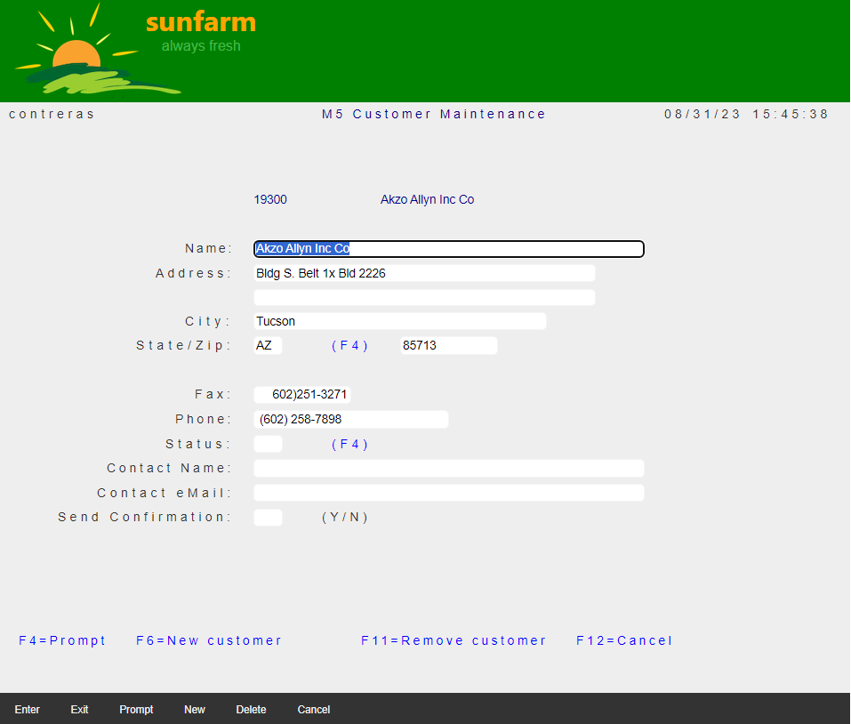
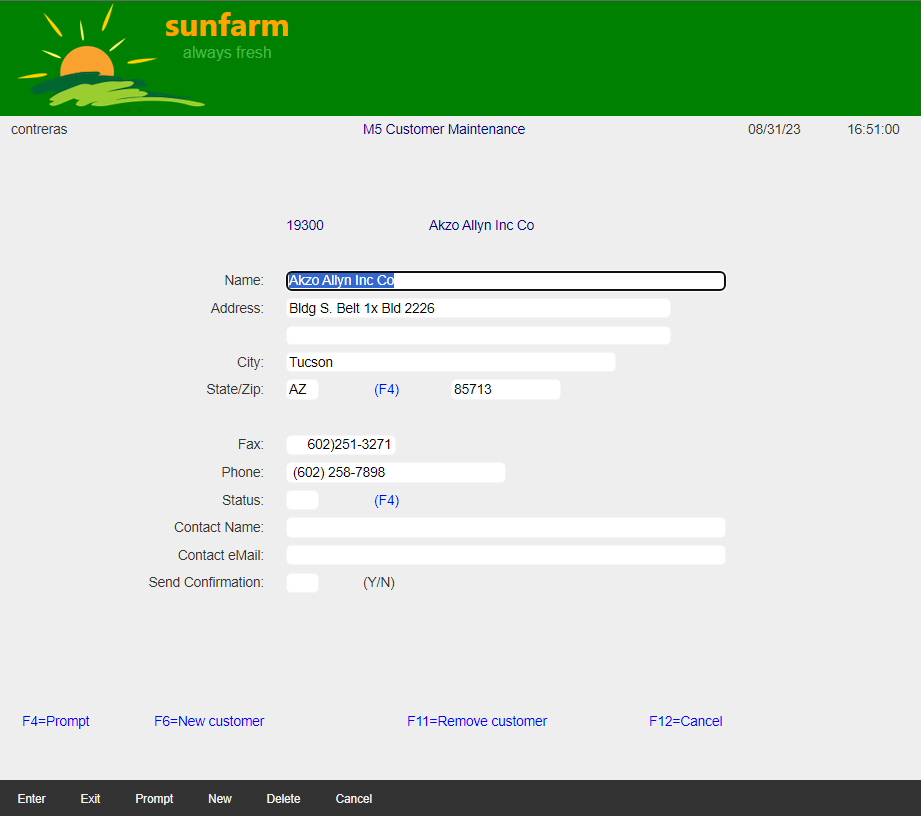

## Source

You can get the [GitHub Source Files](https://github.com/asnaqsys-examples/sunfarm-ui-enhancements) here.

## Overview
Legacy 5250 screens used a single system [Monospaced Font](https://en.wikipedia.org/wiki/Monospaced_font). The programming model for the developer was a grid-positioning system used to lay out labels with predictable end positioning.

During Migration, in an attempt to preserve legacy label positioning (particularly when labels are right-aligned *by hand*), even when the *new* constants use a Modern Font family (not Monospaced), the Migration adds styles to artificially compensate with inter-character spacing (to end-up in the same ending column position) that gives the appearance of *Old style Look*.

Visual inspection of some Pages clearly shows that most constants do not need such inter-spaced style and look better using normal spacing.

When the intension was to right-align *by hand*, there is a better way to do it, using CSS styling.

## Modernize Constant Spacing

Change this:
```html
<DdsRecord For="CUSTREC" KeyNames="F4 'Prompt'; F6 'New'; F11 'Delete'; F12 'Cancel';">
```

To this:
```html
<DdsRecord For="CUSTREC" StretchConstantText=false KeyNames="F4 'Prompt'; F6 'New'; F11 'Delete'; F12 'Cancel';">
```

The right-aligned constants will lose their alignment, to fix change:

Affected constant:
```html
<DdsConstant Col="20" ColSpan="-1" class="right-aligned-constant" Text="Name:" />
```

Properly right adjusted constant:
```html
<DdsConstant Col="20" ColSpan="-1" class="right-aligned-constant" Text="Name:" />
```

Add the following style to `~/wwwroot/css/site.css`

```css
.right-aligned-constant {
    text-align: right !important;
}
```

## Results

| Constants stretching | Constant normal spacing (some with right-alignment) |
| :-: | :-: |
|  |  |

