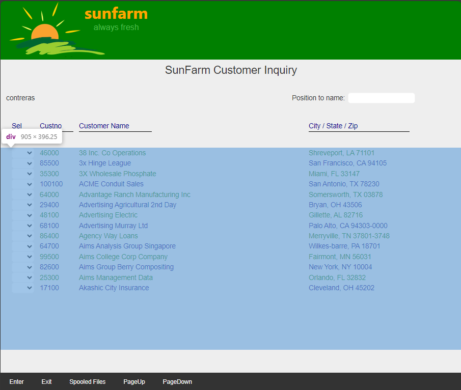
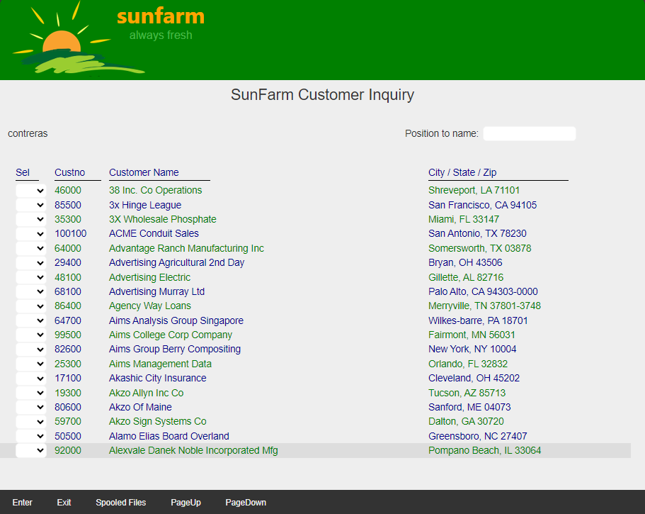

## Source

You can get the [GitHub Source Files](https://github.com/asnaqsys-examples/sunfarm-logic-enhancements) here.

## Overview

The [Pages](/concepts/user-interface/qsys-expo-display-pages.html) on the Website Project can present to the user *only* the information available in the [DataSet](/concepts/user-interface/qsys-expo-display-pages.html#asnaqsys-dataset). In order to add more information, the Programs in the Logic Project(s) need modification.

## Reading more Subfile records

Page `~\SunFarmSite\Areas\SunFarmViews\Pages\CUSTDSPF.cshtml` defines a Subfile Controller Record that uses a Subfile with a page-size of fourteen records.

Starting at Row 6, with a Span of fourteen rows, the definition of the Subfile was migrated as follows:

```html
   @{
      int SFLC_SubfilePage = 14;
   }

    <div Row="6" RowSpan="@SFLC_SubfilePage">
```

>Note how a C# constant is used to specify the RowSpan property.

We could modify `SFLC_SubfilePage` constant to display more records, for example, to display four more, we can change this constant to:

```html
   @{
      int SFLC_SubfilePage = 14 + 4;
   }
```

But that would not be enough, as you can see by running the Application with the change.



>Even when the display area allocated to the subfile grew, the Controller's Model does not have any more records in the [DataSet](/concepts/user-interface/qsys-expo-display-pages.html#asnaqsys-dataset).

Assuming we have knowledge regarding how the Logic is implemented, we can identify where the subfile is being written to, and then write more records to it.

The subroutine `LoadSfl` has a hard-coded value `14` which controls the maximum records written to the subfile. 

```csharp
    BegSr LoadSfl
        SetOff *IN61 //Start with green.
        *IN90 = "1" //Clear the subfile.
        Write SFLC

        SetOff IndList( *IN76, *IN90 ) //Display records.
        sflrrn = 0
        .
        .
        .
    //----------------------------------------------------------

        DoWhile ( *Not *IN77  /* EOF or full s/f. */ +
            *And ( sflrrn < 14 ) )
        .
        .
        .

            sflrrn = sflrrn + 1
            Write SFL1
            .
            .
            .

        EndDo
```

Instead of increasing the hard coded `14` to a new value, let's define a constant (since there are two places that refer to this value).

```csharp
BegClass CUSTINQ Extends(Program) Access(*Public) + 
    .
    .
    .

    DclConst CustomerSufilePageSize 14+5
```

Now that `CustomerSufilePageSize` has been defined, we will use it instead of the hard-coded `14`.

Compiling the `SunFarmLogic` project should read more records from the database, loading the subfile, making the new data available in the [DataSet](/concepts/user-interface/qsys-expo-display-pages.html#asnaqsys-dataset), accessible by the UI (Website).

There is one more place we need to update, the Display Page Model.

Let's add the constant definition `CustomerSufilePageSize` to the `CUSTDSPF` class, as follows:

```csharp
    public class CUSTDSPF : DisplayPageModel
    {
        public const int CustomerSufilePageSize = 14 + 5;
```

With the new constant, we can change the hard coded controller property `SubfileControl.Size`:

```csharp
        [
            SubfileControl(ClearRecords : "90",
                FunctionKeys = "F9 09;PageUp 51:!76;PageDown 50:!77",
                DisplayFields = "!90",
                DisplayRecords = "!90",
                Size = CustomerSufilePageSize,
                IsExpandable = false,
                EraseFormats = "CUSTREC , SALESREC"
            )
        ]
```

And on the Razor Page, we can use the Model's public property as follows:

```html
<div Row="5" RowSpan="@CUSTDSPF.CustomerSufilePageSize">
    @for (int rrn=0; rrn < Model.SFLC.SFL1.Count; rrn++)
    {
        .
        .
        .
```

And we accomplished our goal, instead of fourteen records we can now show nineteen per page (see results below).

>Note: we sneaked two smaller changes, first, instead of four more records we are adding five. This is possible because we also started at Row="5" instead of "6".

## Results

| Fourteen Customer per Page | Nineteen Customers per Page |
| :-: | :-: |
|  |  |

