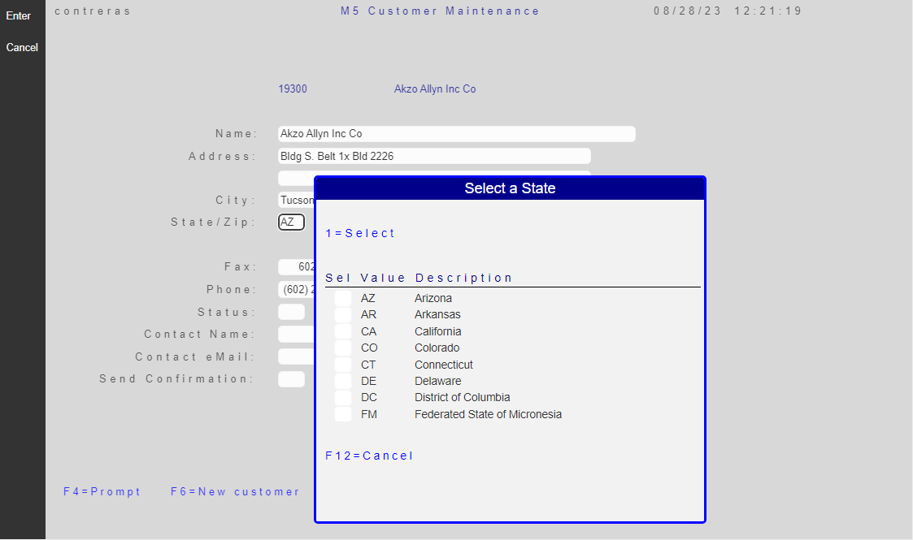
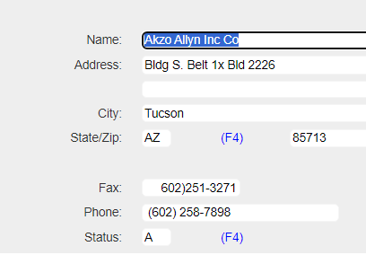
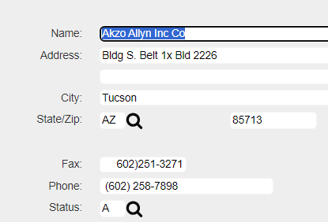

## Source

You can get the [GitHub Encore Source Files](https://github.com/asnaqsys-examples/sunfarm-encore) or the [GitHub C# Source Files](https://github.com/asnaqsys-examples/sunfarm-csharp) here.

## Overview

Prompting for the possible fields values on fields is a common screen design pattern. The IBM i operating system itself uses prompting, using the `F4` function key to display records on a window to show the possible values for the entry. The legacy practice was to show a constant like (F4) next to the field, to indicate that the field allowed prompting. A more modern interface would be to show a clickable icon. 

## Replacing promptable field with clickable icon

The Customer Maintenance Page has two fields that are promptable: State (`CUSTREC.SFSTATE`) and Status (`CUSTREC.hsSTATUS`, formerly `#STATUS`). The image below shows the window that gets displayed when `F4` function key is pressed when the cursor is positioned on State field.



The migrated markup (corresponding to the legacy) generates a `DdsConstant` to display the label `(F4)` - indicating that the field is promptable by pressing such function key -.

Notice the `DdsConstant` with Text="(F4)" right after the `DdsCharField CUSTREC.SFSTATE`. 

```html
<div Row="10">
    <DdsConstant Col="15" ColSpan="-1" class="right-aligned-constant" Text="State/Zip:" />
    <DdsCharField Col="27" For="CUSTREC.SFSTATE" VirtualRowCol="11,27" PositionCursor="43" tabIndex=@pageTabIndex++ />
    <DdsConstant Col="30+5" Text="(F4)" Color="Blue" />
    .
    .
    .
</div>
```

The `DdsConstant` right after the `DdsCharField CUSTREC.SFSTATE`, can be replaced by a `DdsButton` with the shape *Search* (a magnifying glass), indicating that to be consistent with the value the legacy logic expects, to generate a `F4` *AidKey* code, as if the cursor was located setting the focus on the **PREVIOUS** field (in this case CUSTREC.SFSTATE).

```html
<div Row="10">
    <DdsConstant Col="15" ColSpan="-1" class="right-aligned-constant" Text="State/Zip:" />
    <DdsCharField Col="27" For="CUSTREC.SFSTATE" VirtualRowCol="11,27" PositionCursor="43" tabIndex=@pageTabIndex++ />
    <DdsButton Col="40" IconId="search" ButtonStyle="Icon" AidKey="F4" FocusField="*PREVIOUS"/>
    .
    .
    .
</div>
```

>Note: For a list of available hi-resolution icons, visit this [Page](/reference/asna-qsys-expo/expo-tags/dds-button-icon-reference.html).

## Results

| Prompting (F4) | Prompting using Icon |
| :-: | :-: |
|  |  |

