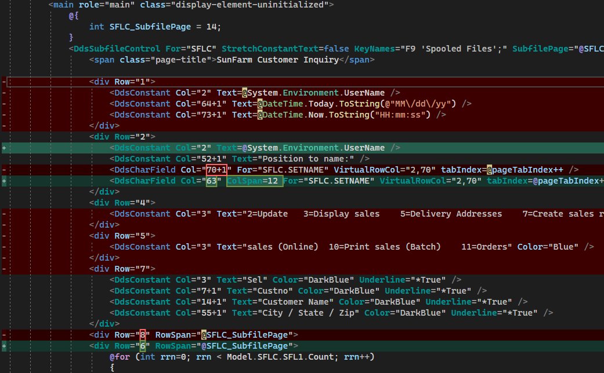

## Source

You can get the [GitHub Encore Source Files](https://github.com/asnaqsys-examples/sunfarm-encore) here.

You can get the [GitHub C# Source Files](https://github.com/asnaqsys-examples/sunfarm-csharp) here.

## Overview

Redundancy: *the state of being not or no longer needed or useful*.

Only the Application Designer can determine which elements on a Page are redundant.

For this example, the following are the items we consider redundant:

| Item | Why  |
| ---- | ---- |
|  System Date | Windows displays it already. |
|  System Time | Windows displays it already. |
|  Command key option labels | The subfile Selection column already lists the options. |
|  Function key labels | The [Function key panel](/enhance-function-keys-location.html) already displays this information. |

Notes: 
1. The more redundant items are removed, the more space is recovered to display more information to the user (outside the scope of this example).
2. When removing items, the `Row=` attribute may need to be reduced to avoid empty rows.
3. Some constants may be combined into a single `Row`.

## Remove Redundant elements

Eliminating elements from Markup, some re-ordering, combining rows and position adjustments, as indicated by the following compare:

## Results

| Before | After |
| :-: | :-: |
|  |  |

>Note: After removing redundant elements, horizontal scrolling may disappear.