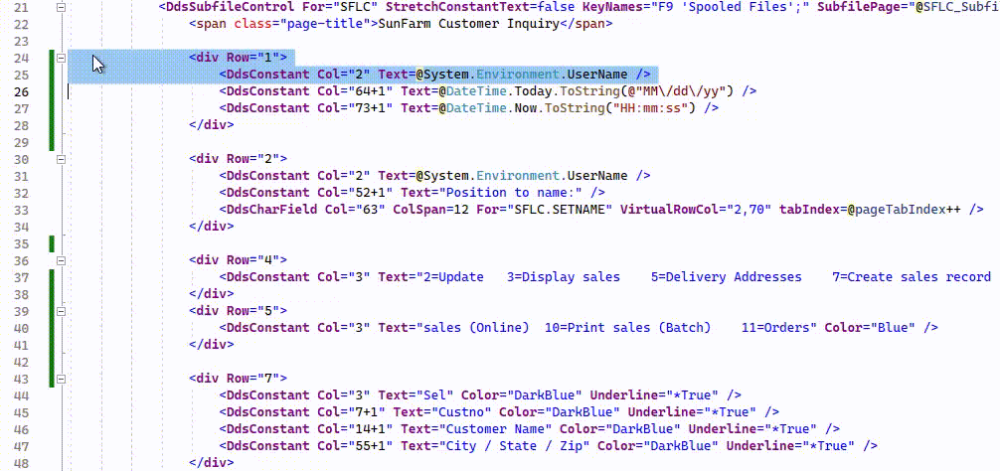
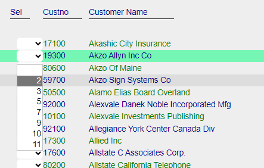
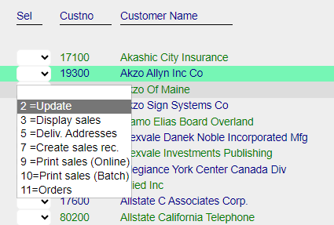
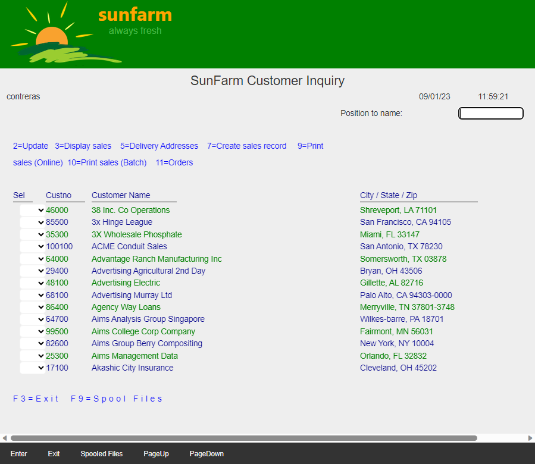
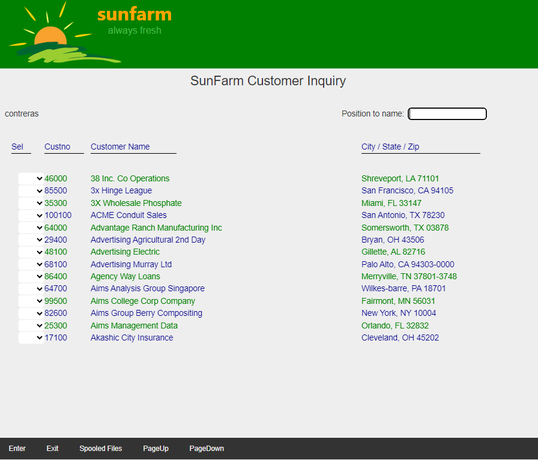

## Source

You can get the [GitHub Source Files](https://github.com/asnaqsys-examples/sunfarm-ui-enhancements) here.

## Overview

Redundancy: *the state of being not or no longer needed or useful*.

Only the Application Designer can determine which elements on a Page are redundant.

For this example, the following are the items we consider redundant:

| Item | Why  |
| ---- | ---- |
|  System Date | Windows displays it already. |
|  System Time | Windows displays it already. |
|  Command key option labels | The subfile Selection column already lists the options. |
|  Function key labels | The [Function key panel](/enhance-function-keys-location.html) already displays this information. |


Notes: 
1. The more redundant items are removed, the more space is recovered to display more information to the user (outside the scope of this example).
2. When removing items, the `Row=` attribute may need to be reduced to avoid empty rows.
3. Some constants may be combined into a single `Row`.

## Remove Redundant elements

Cleanup the Page Look by eliminating redundant items. Often, when removing full rows (as shown below), we can reuse empty space by moving remaining rows up.

Here we show the partial process required to remove redundant items and reorder some rows :




## VALUES and associated Text

We have removed the Command key option labels from the screen the `Selection` column in the subfile now shows a dropdown-list.

But the Legacy DDS VALUES keyword shows the valid values, but does not describe what each value means.

```
0010.00     A            SFSEL          2Y 0B  8  4VALUES(0 2 3 5 7 9 10 11)           000000
0011.00     A                                      EDTCDE(Z)                           000000
```

| Migration VALUES | After updating TextValues |
| :-: | :-: |
|  |  |

The definition for field `SFLSEL` was manually changed to:

```html
<DdsDecField Col="3" ColSpan="4" 
    class="dds-text-left"
    For="SFLC.SFL1[rrn].SFSEL"
    ValuesText="' ','Update','Display sales','Deliv. Addresses','Create sales rec.','Print sales (Online)','Print sales (Batch)','Orders'"
    ValuesTextOptionSeparator="="
    VirtualRowCol="@row,4" 
    EditCode="Z" 
    tabIndex=@pageTabIndex++ />
```

For reference, the field is defined (in the Model) as:
```cs
    [Values(typeof(Decimal),"00","02","03","05","07","09","10","11")]
    [Dec(2, 0)]
    public decimal SFSEL { get; set; }
```

Note:
1. To make it easier to present in this example, the field properties for `SFLC.SFL1[rrn].SFSEL` are shown using one property per line. (New lines in Markup are ignored).
2. The `ColSpan` property was added to override the default (which is the largest length of the value text items).
3. The number of `ValueText` items must match the number of `Values` in the Model definition.
4. The optional property `ValuesTextOptionSeparator="="` was added to match the Legacy Option syntax. (If not given, only the text labels are used).

## Results

| Before | After |
| :-: | :-: |
|  |  |

>Note: After removing redundant elements, horizontal scrolling may disappear.