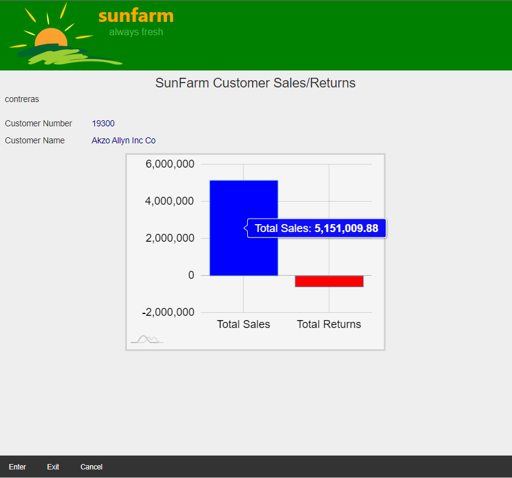
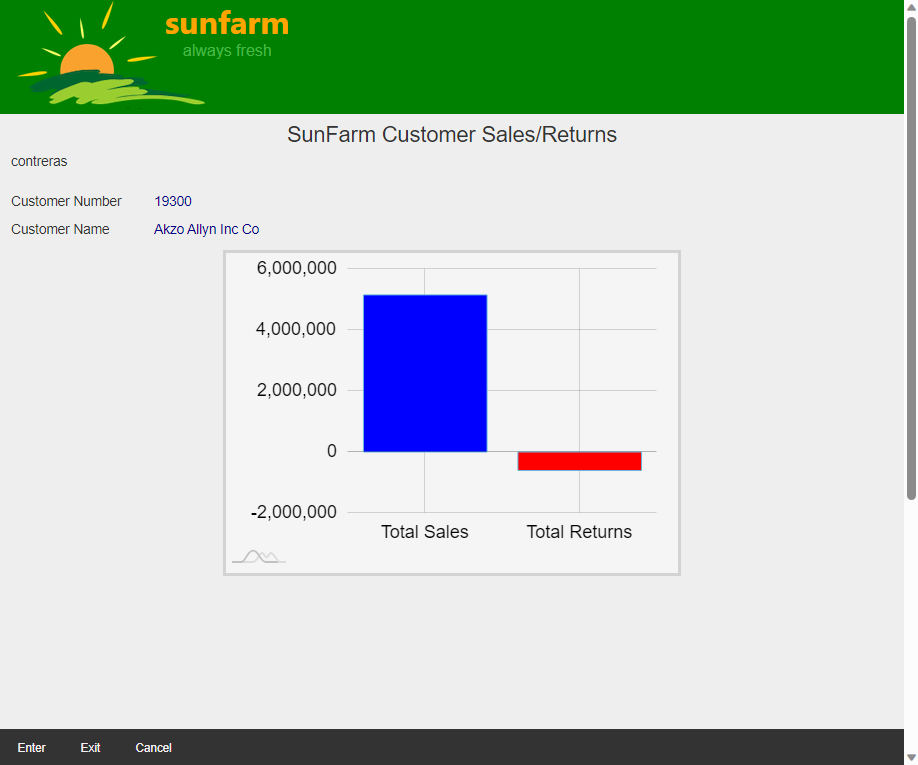
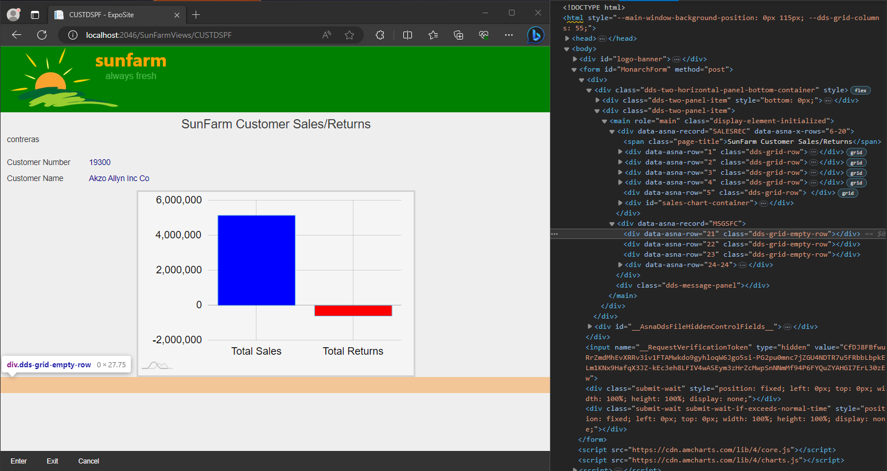

## Source

You can get the [GitHub Source Files](https://github.com/asnaqsys-examples/sunfarm-ui-enhancements) here.

## Overview

The User Interface of Migrated Legacy Applications runs on Web Browser technology. The language description is [HTML](https://developer.mozilla.org/en-US/docs/Learn/HTML/Introduction_to_HTML/Getting_started), an open standard. There are thousands of third party libraries designed to run on HTML. Business Applications can benefit from one specific kind of library, one that takes a series of data points to produce Charts.

One page in `SunFarm` Application that could benefit of a Chart to display its data, is the `Customer Sales/Returns` Page.

## Replacing numeric Data points with a Chart

A simple Bar Chart replaces the the `Total Sales` and `Total Returns` values.

The Chart is rendered by [amcharts](https://www.amcharts.com/docs/v4/getting-started/basics/) library. Its useful features include:
1. It offers a very simple [API](https://en.wikipedia.org/wiki/API).
2. It grants a [free license](https://www.amcharts.com/licenses/javascript-charts-free-license/), by imbedding a link to their website, prohibiting removing or covering such link. This is very suitable for an example.
3. Produces high-quality [SVG](https://developer.mozilla.org/en-US/docs/Web/SVG) graphics.

The basic steps to add a `amchart` are:

  a) Add a named [\<div\>](https://developer.mozilla.org/en-US/docs/Web/HTML/Element/div) with a style that includes `width` and `height` attributes.

  b) Using JavaScript, instantiate the chart given the [id](https://developer.mozilla.org/en-US/docs/Web/API/Element/id) property and the type of chart to be created.

  c) Using the new chart object, push axis, data series and any other chart objects describing the chart and/or the data in the series.

The `~\SunFarmSite\Areas\SunFarmViews\Pages\CUSTDSPF.cshtml` Razor Page, defines several Displayfile records, among them, one for the `SALESREC` Model record. The migration uses the following fields defined in that record, namely: `SALESREC.SCPGM`, `SALESREC.SFCUSTNO`, `SALESREC.SFNAME`, `SALESREC.SFSALES` and `SALESREC.SFRETURNS`.

The fields that have the Total Sales and Total Returns values are `SALESREC.SFSALES` and `SALESREC.SFRETURNS`. These will be used to Chart instead of just displaying its values (as the Legacy Application does).

The following is the modified `DdsRecord`. Rows `1` to `5` show standard output (very similar to the migration). At the bottom of the Display Record, we have added two [\<div\>](https://developer.mozilla.org/en-US/docs/Web/HTML/Element/div) s : a container and the chart itself.

Note how the [\<div\>](https://developer.mozilla.org/en-US/docs/Web/HTML/Element/div) for the chart has the [id](https://developer.mozilla.org/en-US/docs/Web/API/Element/id) set to `sales-chart`. That name will be passed as a parameter for the instantiation of the Chart object (see scripting below)

```html
<DdsRecord For="SALESREC" StretchConstantText=false KeyNames="F12 'Cancel';">
    <span class="page-title">SunFarm Customer Sales/Returns</span>

    <div Row="1">
        <DdsConstant Col="2" Text=@System.Environment.UserName />
    </div>
    <div Row="2">
        <DdsCharField Col="2" For="SALESREC.SCPGM" />
    </div>
    <div Row="3">
        <DdsConstant Col="2" Text="Customer Number" />
        <DdsDecField Col="15" For="SALESREC.SFCUSTNO" Color="DarkBlue" EditCode="Z" Comment="CUSTOMER NUMBER" />
    </div>
    <div Row="4">
        <DdsConstant Col="2" Text="Customer Name" />
        <DdsCharField Col="15" For="SALESREC.SFNAME" Color="DarkBlue" />
    </div>
    <div Row="5"> </div>

    <div id="sales-chart-container">
        <div id="sales-chart">Sales Chart</div>
    </div>
```
<br>
The following CSS centers the container and gives the chart dimensions:

```css
#sales-chart-container div {
    margin: 0 auto;
    width: 50%;
    height: 20rem;
}

#sales-chart {
    background-color: whitesmoke;
    border-style: solid;
    border-color: lightgrey;
    border-width: medium;
}
```

## Scripting to use third-party Charting Library

At the bottom of the The `~\SunFarmSite\Areas\SunFarmViews\Pages\CUSTDSPF.cshtml` Razor Page, we write three small script blocks:

1. A reference to the third-party `core.js` library file, given its source URL.
2. A reference to third-party `charts.js` library file, given its source URL.
3. Our explicit use of the library:

   a) Only if the `div` with the `id='sales-chart'` exists (as a rendered object) do we instantiate the chart object.  (The existence of the object with `id='sales-chart'` determines when the `SALESREC` record is *active*).


   b) We instance the chart (naming the `id` where the graph should be drawn), and define the data-series with two values we want plotted: `@Model.SALESREC.SFSALES` and `@Model.SALESREC.SFRETURNS`.


>Note: The details of how to use `amcharts` library is outside the scope of this example. Please [read Here](https://www.amcharts.com/docs/v4/getting-started/basics/) for more information.


```html
<script src="https://cdn.amcharts.com/lib/4/core.js"></script>
<script src="https://cdn.amcharts.com/lib/4/charts.js"></script>
<script>
    const CHART_ID = 'sales-chart';
    const chartEl = document.getElementById('sales-chart');
    if (chartEl) {
        const chart = am4core.create(CHART_ID, am4charts.XYChart);
        const xAxis = chart.xAxes.push(new am4charts.CategoryAxis());
        const yAxis = chart.yAxes.push(new am4charts.ValueAxis());

        xAxis.dataFields.category = 'category';

        const series = chart.series.push(new am4charts.ColumnSeries())
        series.dataFields.valueY = 'amount';
        series.dataFields.categoryX = 'category';
        series.columns.template.tooltipText = "{categoryX}: [bold]{valueY}[/]";

        series.columns.template.adapter.add("fill", (fill, target) => {
            if (target.dataItem.index == 0) {
                return 'blue';
            }
            return 'red';
        });

        chart.data = [
            {
                category: 'Total Sales',
                amount: @Model.SALESREC.SFSALES
            },
            {
                category: 'Total Returns',
                amount: @Model.SALESREC.SFRETURNS
            }
        ];
   }
</script>
```

## Results

| Legacy Display Values | Using Third Party Chart |
| :-: | :-: |
|  |  |

>Note: Hovering on the columns shows the numeric Sales or Returns value. 

## Eliminating scrollbar that may appear when using standard HTML elements 

Although we successfully achieved our goal to add a nice Chart by the technique introduced so far, we still have a minor challenge to solve. 

Look closely at these two renderings of the Sales/Returns page.

| After adding Chart, scrollbar appears | Scrollbar eliminated  |
| :-: | :-: |
|  |  |

The image on the *left* shows an *unexpected* vertical scrollbar (the one on the right does not).

When something like this appears, you will find that the best practice is to use [Browser Developer Tools](https://www.geeksforgeeks.org/browser-developer-tools/) to inspect how a page got generated.

Legacy Display files produce a square rendering with fixed number of rows (and character positions - aka *columns* -). Typical [Sizes](https://www.ibm.com/docs/en/i/7.5?topic=80-dspsiz-display-size-keyword-display-files) are `80x24` and `132x27`. Web Browser's canvas does not have such limitation, in fact, it is said that elements [Flow](https://developer.mozilla.org/en-US/docs/Web/CSS/CSS_Flow_Layout) down and to the right as they are naturally placed in the [DOM](https://developer.mozilla.org/en-US/docs/Web/API/Document_Object_Model/Introduction). (There are of course many ways to control how elements are positioned, for this discussion we rely on the basics).

The [Expo Display Pages](/concepts/user-interface/qsys-expo-display-pages.html) uses the [Expo Client JavaScript Library](https://asnaqsys.github.io/concepts/user-interface/qsys-expo-client-advanced-css.html) to generate elements that mimic - *a full* - legacy page.

The *pseudo* HTML code below shows how the legacy height is accomplished on an Expo Display Page:

```html
<div Record="FIRST-ACTIVE-RECORD" >
  <div Row="1" /> 
  <div Row="2" />   
  <div Row="3" />   
</div>
<div Record="SECOND-ACTIVE-RECORD" >
  <div Row="4" /> 
  <div Row="5" />   
  <div Row="6" />   
</div>
<div Record="THIRD-ACTIVE-RECORD" >
  <div Row="7" /> 
  <div Row="8" />   
  <div Row="9-18" />  <!-- Subfile renders ten rows -->  
</div>
<div Record="FOUR-ACTIVE-RECORD" >
  <div Row="19" /> 
  <div Row="20" />   
  <div Row="21" />   
  <div Row="22" />   
  <div Row="23" />   
  <div Row="24" />   
</div>
```

Imagine now that the [CSS Style](https://developer.mozilla.org/en-US/docs/Web/CSS) used on each `div` (for lines using Row attribute) is such that its height is fixed (based on the Font selected). Having exactly `24` of these vertically positioned `divs` will render a constant height of `24 * height of Row` pixels.

In reality, seldom do legacy pages define elements on **ALL** rows, the definition may more likely be like the following (again using *pseudo* HTML):

```html
<div Record="FIRST-ACTIVE-RECORD" >
  <div Row="1" /> 
</div>
<div Record="SECOND-ACTIVE-RECORD" >
  <div Row="4" /> 
  <div Row="5" />   
  <div Row="6" />   
</div>
<div Record="THIRD-ACTIVE-RECORD" >
  <div Row="7" /> 
  <div Row="9-18" />  <!-- Subfile renders ten rows -->  
</div>
<div Record="FOUR-ACTIVE-RECORD" >
  <div Row="23" />   
  <div Row="24" />   
</div>
```

Note how `Rows 2, 3, 8, 19, 20, 21 and 22` are missing. It is assumed that when rendering `Row=4`, the missing rows: `2 and 3` need to be added to fill the gap. Same happens for the remaining row gaps, as illustrated below:

```html
<div Record="FIRST-ACTIVE-RECORD" >
  <div Row="1" /> 
  <div Empty-Row="2" />   
  <div Empty-Row="3" />   
</div>
<div Record="SECOND-ACTIVE-RECORD" >
  <div Row="4" /> 
  <div Row="5" />   
  <div Row="6" />   
</div>
<div Record="THIRD-ACTIVE-RECORD" >
  <div Row="7" /> 
  <div Empty-Row="8" />   
  <div Row="9-18" />  <!-- Subfile renders ten rows -->  
</div>
<div Record="FOUR-ACTIVE-RECORD" >
  <div Empty-Row="19" /> 
  <div Empty-Row="20" />   
  <div Empty-Row="21" />   
  <div Empty-Row="22" />   
  <div Row="23" />   
  <div Row="24" />   
</div>
```

>Note: Empty-row attributed `divs` have been added to fill gaps. This is done automatically by [Expo Client JavaScript Library](https://asnaqsys.github.io/concepts/user-interface/qsys-expo-client-advanced-css.html)

Empty-row attributed `divs` use a [CSS Style](https://developer.mozilla.org/en-US/docs/Web/CSS) with a *Empty* (or blank) content with a `height` equal to the normal Row-attributed `divs`.

If we compute the total Page height: `17 * Row-height + 7 * Empty-Row-height` pixels, matching the height we desire (same as `24 * height of Row` pixels).

> For more on how how Expo Display files are rendered, read [here](/concepts/user-interface/qsys-expo-dds-elements.html).

What happens now if we suddenly added an element to the page, in the middle of our *square* geometry? 

Consider:

```html
<div id="sales-chart-container">
    <div id="sales-chart">Sales Chart</div>
</div>
```

The *height* of `div id="sales-chart-container"` <mark>will make our Page taller </mark>. With the Browser window height we had adjusted to a *normal* Display page, a **vertical-scrollbar will appear**.

We can use the [Browser Developer Tools](https://www.geeksforgeeks.org/browser-developer-tools/) to inspect how a page got generated. Looking at the elements rendered, we identify that <mark>The Empty Rows from 6 to 20 should be eliminated</mark>. (We could optionally use absolute positioned Chart, but this presents other challenges).

Using the property [ExcludeEmptyRows](/reference/expo/qsys-expo-tags/dds-record-tag-helper.html#properties)
we can eliminate <mark>Selected</mark> Empty-Row `divs`. 

[ExcludeEmptyRows](/reference/expo/qsys-expo-tags/dds-record-tag-helper.html#properties) property takes a comma-separated list of either numeric ranges, or single values describing the EmptyRow we **DO NOT** want to inject to complete the (otherwise) constant vertical height.

```html
<DdsRecord For="SALESREC" StretchConstantText=false KeyNames="F12 'Cancel';" 
           ExcludeEmptyRows="6-20">
```


| Excluding some Empty Rows with Inspector Open | 
| :-: |
|  |

Without the unnecessary Empty-row attributed `divs` <mark>the vertical scroll-bar is gone!</mark>

The image above shows the Developer Tools Inspector open to observe the new HTML, where the empty-rows from 6 to 20 have been eliminated. The Page height is back to its normal `24` rows.


