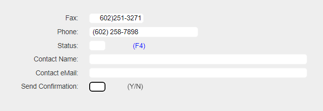
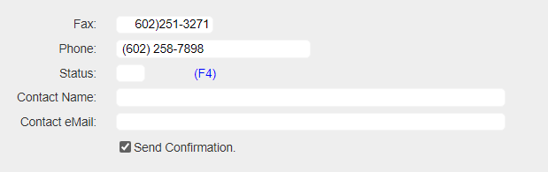

## Source

You can get the [GitHub Source Files](https://github.com/asnaqsys-examples/sunfarm-ui-enhancements) here.

## Overview

Legacy display files typically use `boolean fields` as a one-char fields expecting as their only valid value `Y` or `N`.

Even when Terminals can force the casing to be uppercase (reducing the possibility of error), this practice has been superseded by modern element called [Checkbox](https://developer.mozilla.org/en-US/docs/Web/HTML/Element/Input/checkbox).

## Replacing YES/NO fields with Check-boxes

These three lines:
```html
<div Row="18">
    <DdsConstant Col="7" ColSpan="-1" class="right-aligned-constant" Text="Send Confirmation:" />
    <DdsCharField Col="27" For="CUSTREC.SFYN01" VirtualRowCol="18,27" tabIndex=@pageTabIndex++ />
    <DdsConstant Col="29+5" Text="(Y/N)" />
</div>
```

Can be simplified with one tagHelper.
```html
<div Row="18">
    <DdsCheckboxField Col="47" Text="Send Confirmation" For="CUSTREC.SFYN01" VirtualRowCol="18,27" tabIndex=@pageTabIndex++ />
</div>
```

On the Model source file, we decorate the field, providing information for the value we want to mean checked (or true), and which for unchecked (or false).

The Values attribute for DdsCheckboxField expects the first value to be the checked and the second the unchecked.

```cs
[Char(1)]
[Values(typeof(string), "Y", "N")]
public string SFYN01 { get; set; }
```


## Results

| YES/NO input | Checkbox |
| :-: | :-: |
|  |  |

>Note: To show the associated label to the *left*, you can define a [Style](https://developer.mozilla.org/en-US/docs/Web/CSS) that changes the checkbox `float` attribute to the `right` (defaults to the `left`).
