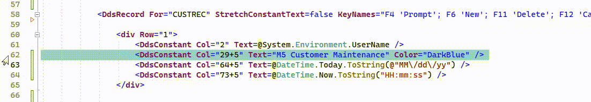
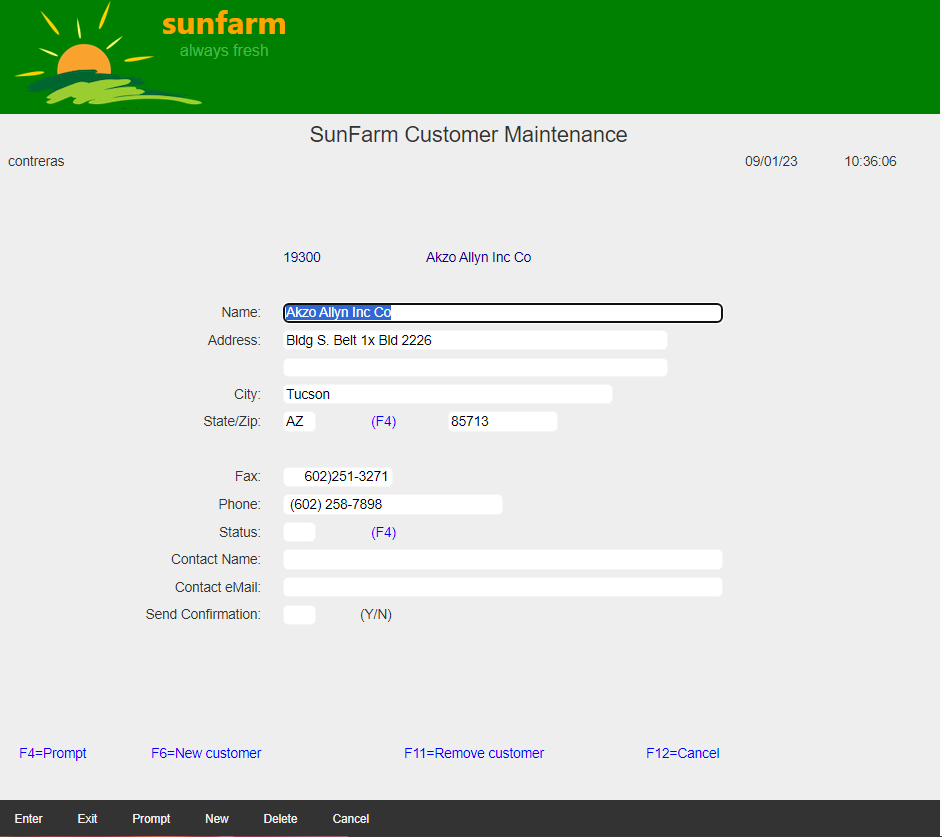

## Source

You can get the [GitHub Encore Source Files](https://github.com/asnaqsys-examples/sunfarm-encore) or the [GitHub C# Source Files](https://github.com/asnaqsys-examples/sunfarm-csharp) here.

## Overview

It is common to use **Titles** on Legacy Pages. Titles are usually centered *by hand* counting character positions and lengths using the *single* Monospaced font. We will explore how to use CSS to do it automatically with high precision.

## Properly center page titles

The Legacy Application used DDS constants to center Page Titles.
For example, the Markup for shows the following constant on Row="1":

```html
<div Row="1">
    .
    .
    .
    <DdsConstant Col="29+5" Text="M5 Customer Maintenance" Color="DarkBlue">
    .
    .
    .
</div>
```

Notice how the initial text position is 29+5 (twenty-nine was the legacy, but the migration adjusted adding five more).
The `29` was computed *by hand* by the developer with a formula like this: `(80-23)/2 + 1`.

The width of the Terminal was predetermined, but the width of a Browser Window is not. It is best to use a style like this one:

```css
.page-title {
    font-size: larger;
    text-align: center;
    width:100%;
    display: block;
    padding-top:0.5rem;
}
```
Where we indicate that text should be centered within the width (100%) of the container element (what we have [called `Main` panel](./enhance-function-keys-location.html) ). The `Main` panel is resized as the user changes the width of the Browser Window.

In addition to describing to the [DOM](https://developer.mozilla.org/en-US/docs/Web/API/Document_Object_Model/Introduction) how to position our Title, we can:

<ol type="a">
  <li>Re-use the CSS Style to apply it to *All** Page titles used by our Application. Consistency is a Good design practice.</li>
  <li>Grow the size of the Font. (Change its color if you like).</li>
  <li>Add padding to the top (or bottom).</li>
</ol>

To replace Legacy titles.

1. Add the style `page-title` to the file: `~/css/site.css`
2. Remove the DdsConstant generated in all `*.cshtml` files, defined on Row="1" (you need to find the correct pattern to locate all, in this case, we search for `Text="M5 `).
3. Add the following element as the first element (right after `DdsRecord` or `DdsSubfileControl` tagHelper).

```html
    <span class="page-title">SunFarm Customer Maintenance</span>
```

The following video illustrates how to remove the legacy `DdsConstant` and add a centered [span](https://developer.mozilla.org/en-US/docs/Web/HTML/Element/span) in the right place.





## Results

| Legacy title centering | Title centering using CSS |
| :-: | :-: |
|  |  |

