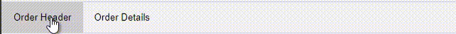
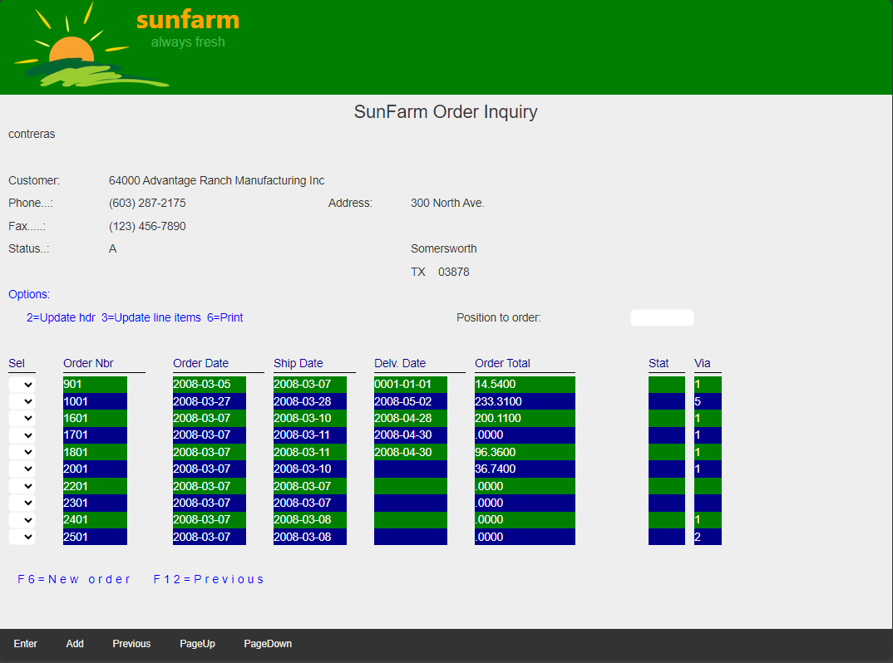
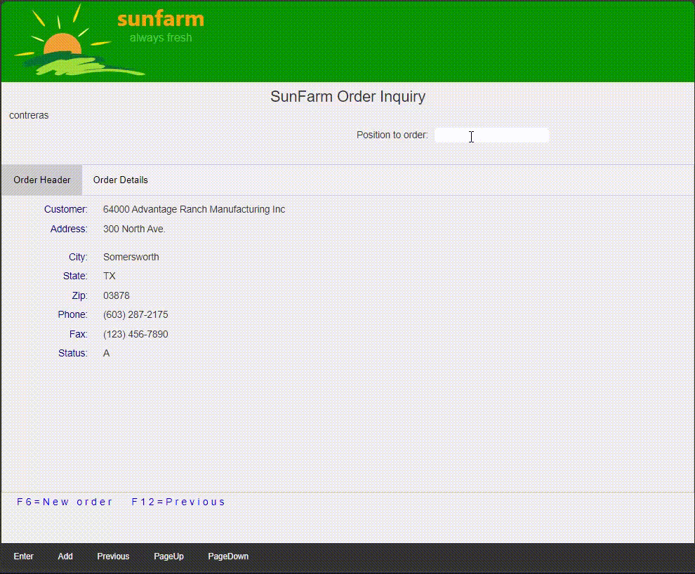

## Source

You can get the [GitHub Source Files](https://github.com/asnaqsys-examples/sunfarm-web-tabs) here.

## Overview

The "Orders" page provides functionality to manage Customer Orders, with the basic operations:
* Add order.
* Change order.
* Delete order.
* Manage order items.

Customer Orders are the typical [One-to-many database relationship](https://www.ibm.com/docs/en/control-desk/7.6.0?topic=structure-database-relationships), where a group of records (the orders) are related to a single customer.

The Legacy Application presented the Customer information (also known as *Header Table*) and a Subfile with the Orders (also known as *Detail Table*).

The *Customer Inquiry* is a good place to apply this technique, by grouping:

1. The *Header* in one Website Tab: Customer Info.
2. The *Detail* separate Tab: Order List.

Since we have a feature to *Position* the "Order List" starting at any particular order, we will keep the positioning field outside the Tab *grouping*.

>Note that the Tab technique described in this article, is a [presentation layer](https://en.wikipedia.org/wiki/Presentation_layer) modernization, no changes to the RPG logic are required.

## Website Tab navigation area

We start by defining a *Website Tab navigation area*. As depicted by the image, it consists of a `nav` HTML element as container of a collection of buttons (one per Tab):



The HTML is straightforward: 

```html
<nav class="tab-navigation">
    <button type="button" class="tab-links" >Customer Info</button>
    <button type="button" class="tab-links" >Order List</button>
</nav>
```

The two styles used: `tab-navigation` and `tab-links` are defined in ``~\SunFarmSite\css\site.css`` (at the end of the file):

```css
/* Tab navigation area: no scrollbars, thin border. */
.tab-navigation {
    overflow: hidden;
    border: 1px solid #ccc;
    background-color: #f1f1f1;
}

/* Style the buttons that are used to open the tab-navigation content */
.tab-navigation button {
    background-color: inherit;
    float: left;
    border: none;
    outline: none;
    cursor: pointer;
    padding: 14px 16px;
    transition: 0.3s;
}

/* Change background color or buttons on hover */
.tab-navigation button:hover {
    background-color: #ddd;
}

/* Create an active/current tab-links class */
.tab-navigation button.active {
    background-color: #ccc;
}

/* tab-links used only as a flag to search elements of the class */
.tab-links {
}
```
>Note: The styles for the buttons (inside the tab navigation area) include the [pseudo-class](https://developer.mozilla.org/en-US/docs/Web/CSS/Pseudo-classes): mouse *hover* and a style for when the element includes the style *active*.


In `~\SunFarmSite\Areas\SunFarmViews\Pages\ORDHDSPF.cshtml` RazorPage, add the Tab navigation area after the `UserName` and before the Order header constant:

```html
<DdsSubfileControl For="SFLC" KeyNames="F6 'Add';"  SubfilePage="@SFLC_SubfilePage" CueCurrentRecord=true ClickSetsCurrentRecord=true>
    <span class="page-title">SunFarm Order Inquiry</span>

    <div Row="1">
        <DdsConstant Col="2" Text=@System.Environment.UserName />
    </div>

    <nav class="tab-navigation">
        <button type="button" class="tab-links">Customer Info</button>
        <button type="button" class="tab-links">Order List</button>
    </nav>

    <div Row="3">
        <DdsConstant Col="2" Text="Customer:" />
        <DdsCharField Col="12+1" For="SFLC.SCRCUST" Comment="CUSTOMER NBR AND NAME" />
    </div>
```

If you build and run the Application, opening a Customer's Order Inquiry page will show the Tab navigation area, but the fields still show at their original legacy position.

## Website Tab 

Grouping fields (and constants) consists on *wrapping* elements in a div defined as:

```html
<div id="Customer Info" class="tab-content">
    .
    .
    .
</div>
```

>Note: The `id` attribute value needs to match the text in the tab-navigation button definition. As we will see in the next section, a small JavaScript function will associate the `id` name with the `openTab` logic.

Keep in mind that any *active* records written by the Application logic can participate in Tab grouping. The only restriction is that grouping cannot include fields or constants defined in different record formats. (To remove this limitation, you would have to move the fields from one record format to the one you are grouping, most likely requiring logic recompilation and/or code changes ).

If you tried running the Application, fields and constants inside `tab-content` groupings will disappear from the screen.

## Website Tab Magic

As we mentioned in the [Overview](./grouping-existing-record-fields.html#overview) the *magic* consists on appearing and disappearing groupings on demand, using the action that can be associated with any of the buttons in the *Tab navigation area*.

We need a rather simple change. Complete the definition of the *Tab navigation area* as follows:

```html
<nav class="tab-navigation">
    <button id="initial-tab" type="button" class="tab-links" onclick="openTab(event.currentTarget)">Customer Info</button>
    <button type="button" class="tab-links" onclick="openTab(event.currentTarget)">Order List</button>
</nav>
```

Note how we added:
1. `id="initial-tab"` attribute to the Tab we want to show initially (more on this explained later below).
2. `onclick` attribute  was added to the buttons, to associate a call to the function `openTab` on each on this buttons. The parameter passed is the instance of the mouse click target (the button itself).

To complete the activation of the *initial* Tab, we add the following script to the end of the `ORDHDSPF.cshtml` RazorPage:

```html
<script src="~/js/RecordTabs.js"></script>
<script>
    openTab(document.getElementById('initial-tab'));
</script>
```

Where we reference the last piece of the *Magic*, the JavaScript file where `openTab` is defined.
Lastly, we call `openTab` passing the instance to the container with the `id="initial-tab"`.

## The Website Tab script

```javascript
const openTab = (tabNavButton) => {
    const tabPage = document.getElementById(tabNavButton.innerHTML);

    if (tabPage) {
        // Get all the elements with class="tab-content" and hide them
        const tabcontent = document.querySelectorAll('[class~="tab-content"]');
        for (let i = 0, l = tabcontent.length; i < l; i++) {
            tabcontent[i].style.display = 'none';
        }

        // Get all elements with class="tab-links" and remove the class "active"
        const tablinks = document.querySelectorAll('[class~="tab-links"]');
        for (let i = 0, l = tablinks.length; i < l; i++) {
            tablinks[i].className = tablinks[i].className.replace(' active', '');
        }

        // Show the current tab, and add an "active" class to the button that opened the tab.
        tabPage.style.display = 'block';
        tabNavButton.className += ' active';
    }
}
```

>If you are not familiar with [JavaScript](https://developer.mozilla.org/en-US/docs/Web/javascript) don't worry. You can skip this section.

The `openTab` function, takes an instance to a button defined in the *Tab navigation area*. It uses the inner Text as the `id` to search in the page for the Tab page we want to activate. Activation for this feature means:

1. Hide all Tabs (container with `class="tab-content"`).
2. De-activate all buttons in the *Tab navigation area* (remove `active` style from their `class` attribute).
3. Show the `active` (requested) Tab group of elements.
4. Make the navigation button the `active` one.

## Cursor Position Field

When you group fields into different Tabs, keep in mind that *hidden* fields (fields in inactive Tabs) cannot be used to set the Page cursor position (also known as keyboard *focus*). While selecting fields to be grouped, we left the "Position to order" constant and field out of the Tab group.

## Results

| Before | After |
| :-: | :-: |
|  |  |
