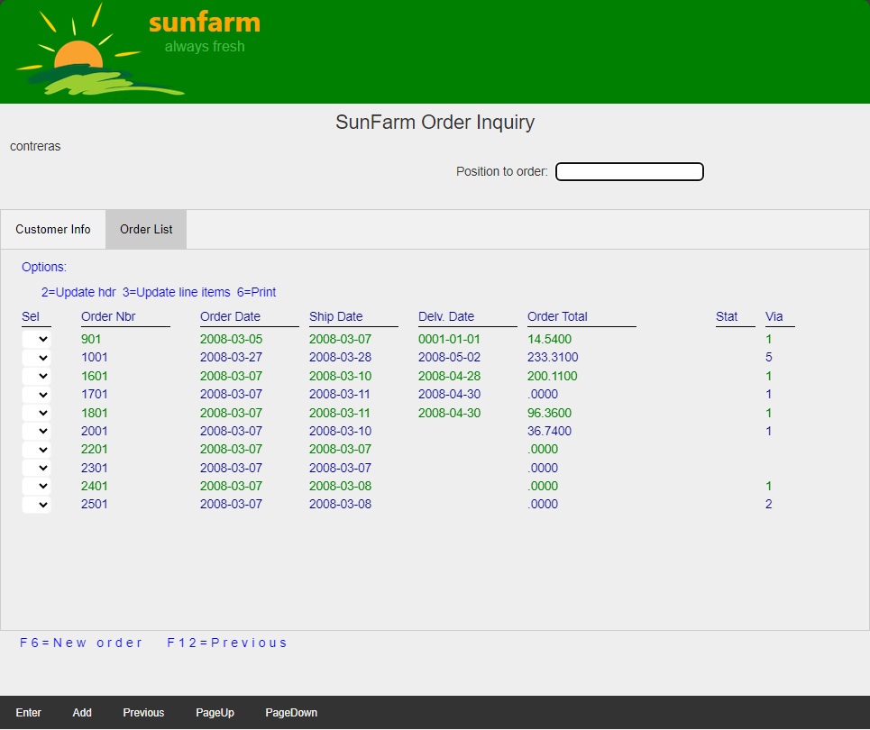
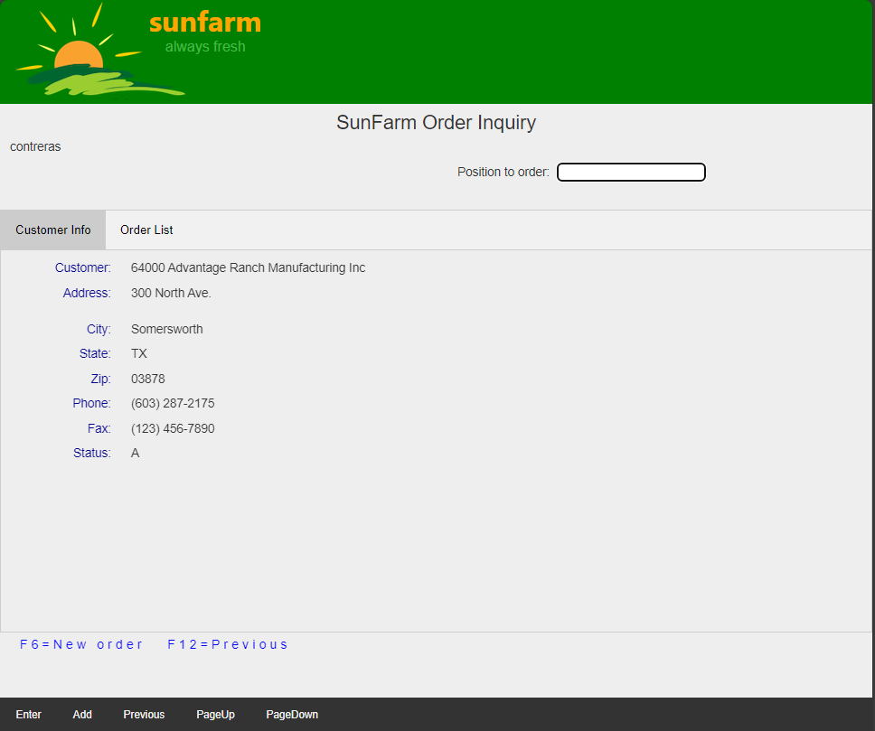
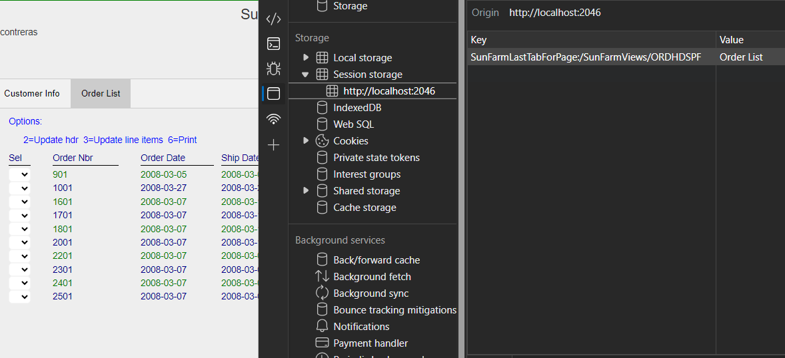
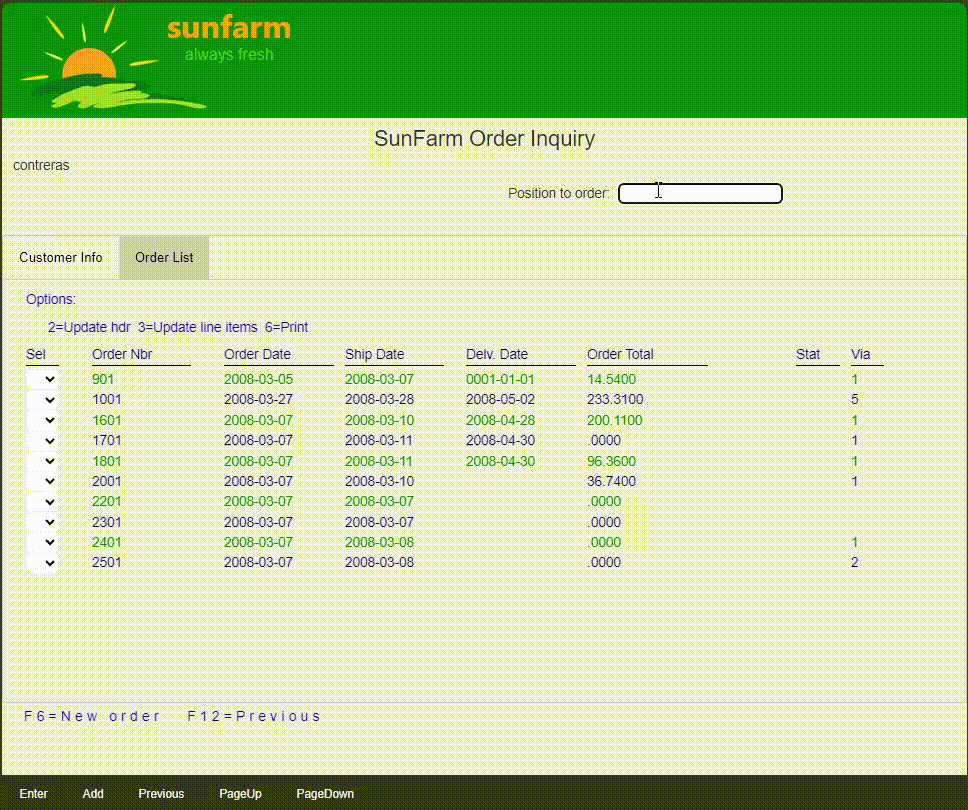

## Source

You can get the [GitHub Source Files](https://github.com/asnaqsys-examples/sunfarm-web-tabs) here.

## Overview

While improving the User Interface, more navigation paths are created for the user. Users will soon expect the Application to remember previous selections. Legacy Applications provided limited navigation paths, where preserving preferences was not really required. Web Applications run in a Browser which has the ability to store [client-side state](https://medium.com/@saransh.ahlawat94/web-applications-client-side-state-management-97e1a27006ee#:~:text=Applications%20usually%20have%20a%20client-side%20state%20that%20is,state%20stores%20the%20user%E2%80%99s%20action%20temporarily%20in%20memory.). 

## Preserving the Last used Tab in a Page
We continue in this section with the SunFarm Application, **Order Inquiry** page, [where we have added Website Tabs](./grouping-existing-record-fields.html).

If the user has navigated to the **Order List Tab** (which displays a subfile), action keys like `Page Down`, may require more records for the subfile and the Page may need to be *re-generated*.



<br>

Each time a Page is generated (rendered), the Tab hard-coded to the *initial* will be displayed. In this case, even when the user requested to see more records in the subfile, the first Tab will be displayed. 
>Note: The application may have written more than one page of records, if the requested page has been fully written, then the page does not need to be *re-generated* and the **Order List Tab** remains selected ([asynchronous AJAX request](https://developer.mozilla.org/en-US/docs/Web/Guide/AJAX) is used in this case). Continuing to page down will eventually ran out of records, the Application logic will run again, more records from database and the Page will be forced to re-generate.

<br>



<br>

Taking advantage of the fact that Browsers can store state in a [Session](https://developer.mozilla.org/en-US/docs/Web/API/Window/sessionStorage) associated with a user, we will store the name of the selected tab *each time* openTab is called.

Storing a string on the session, is really simple. There is a property on the `window` (global object) accessible in JavaScript, which stores a string value given a key (also a string).

We add the following line to our JavaScript:

```javascript
const openTab = (tabNavButton) => {
    .
    .
    .
    // Show the current tab, and add an "active" class to the button that opened the tab.
    tabPage.style.display = 'block';
    tabNavButton.className += ' active';

    .
    .
    .
    sessionStorage.setItem(`SunFarmLastTabForPage:${window.location.pathname}`, reqPageName);
```

The `key` we are using is made *unique* by prepending the name of our Application and the description of the state: `"SunFarm"` + `"LastTabForPage"`, a colon (for readability) and we use the page [URL](https://en.wikipedia.org/wiki/URL) which we can easily get from the `location` window object, `pathname` property.

Running the application with the updated `sessionStorage.setItem` line, will save the name of the Tab as it is selected. Using the Browser developer Tools, we can see in real time the state as it changes:



<br>

## Restoring the Last Tab selected in the Page

The last piece of logic we need is to restore the value we have saved in the Session (the name of the last Tab) every time the Page is generated.

Let's change the script that runs each time the Page is generated, at the bottom of the RazorPage:

```javascript
<script src="~/js/RecordTabs.js"></script>
<script>
    const lastTabName = getLastTabNameFromSessionStorage();
    if (!lastTabName) {
        openTabByName('Customer Info');
    }
    else {
        openTabByName(lastTabName);
    }
</script>
```

We now have a function called `openTabByName` that takes tha name of the Tab to find the Tab to display (and sets the corresponding navigation button as *active*). The new function complements the `openTab` we used previously, both end up calling the `sessionStorage.setItem` line described above.

The new page script calls first the new function `getLastTabNameFromSessionStorage` (listed below) to read the current state for our session key. With the name of the last Tab, we can open it and restore the user preference. If the last Tag name is unknown (i.e. the session is new), then we can proceed to read the hard-coded initial page we had defined (`Customer Info`).

The [refactored](https://en.wikipedia.org/wiki/Code_refactoring) markup to define the *Tab navigation area* is now:

```html
<nav class="tab-navigation">
    <button type="button" class="tab-links" onclick="openTab(event.currentTarget)">Customer Info</button>
    <button type="button" class="tab-links" onclick="openTab(event.currentTarget)">Order List</button>
</nav>
```
>Note: we don't need `id=initial-tab` anymore, to define the first Tab to be selected.

The resulting `RecordTabs.js` Javascript file now reads:

```javascript
const openTab = (tabNavButton) => {
    if (!tabNavButton) {
        return; // ignore.
    }
    openTabByName(tabNavButton.innerHTML);
}

const openTabByName = (reqPageName) => {
    const tabPage = document.getElementById(reqPageName);

    if (tabPage) {
        // Get all the elements with class="tab-content" and hide them.
        const tabcontent = document.querySelectorAll('[class~="tab-content"]');
        for (let i = 0, l = tabcontent.length; i < l; i++) {
            tabcontent[i].style.display = 'none';
        }

        // Get all elements with class="tab-links" and remove the class "active"
        const tablinks = document.querySelectorAll('[class~="tab-links"]');
        let tabNavButton = null;
        for (let i = 0, l = tablinks.length; i < l; i++) {
            tablinks[i].className = tablinks[i].className.replace(' active', '');
            if (tablinks[i].innerHTML === reqPageName) {
                tabNavButton = tablinks[i]; // Save the button that has the requested name.
            }
        }

        // Show the current tab, and add an "active" class to the button that opened the tab.
        tabPage.style.display = 'block';
        if (tabNavButton) {
            tabNavButton.className += ' active';
        }

        sessionStorage.setItem(`SunFarmLastTabForPage:${window.location.pathname}`, reqPageName);
    }
}

const getLastTabNameFromSessionStorage = () => {
    return sessionStorage.getItem(`SunFarmLastTabForPage:${window.location.pathname}`);
}
```

## Results

