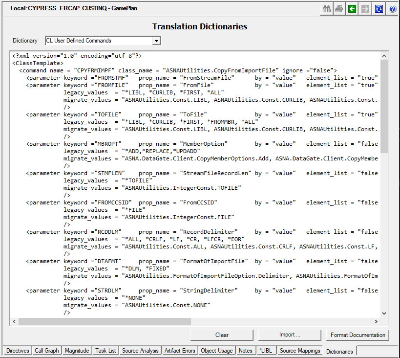

Migrating User defined CL commands automatically poses challenges due to the staggering number of possible combinations of: unique name, possible parameters, parameter elements, and value types. To successfully migrate as many user defined commands as possible, an XML Command Definition Dictionary is provided that serves as table-driven template in support of this effort.

To fully use this capability, you will need to update the Command Definition Dictionary for unsupported CL or user-defined commands.

## Configuration

The Command Definition Dictionary is stored as a **Translation Dictionary** in both Galleries and Gameplans.

The dictionary entry corresponding to the Command Definition is listed as the **CL User Defined Commands** in the Translation Dictionary Page as indicated below:



The **CL User Defined Commands Dictionary** comes pre-populated with the definition of the **CopyFromImportFile** command.

The contents of the Dictionary can be edited in place, or text can be copied/pasted from an external editor (such as Visual Studio), or imported from an existing external text file.

## Basic CL User Defined Commands Dictionary Syntax

```xml
<?xml version="1.0" encoding="utf-8"?>
<ClassTemplate>
   <Command name="MyUserDefCmd01">  
      <parameter keyword="FIRST_KEYWORD" data_type = "*Char" data_len="10"/>
      <parameter keyword="SECOND_KEYWORD" data_type = "*Dec" data_len="10,2"/>
      <parameter keyword="THIRD_KEYWORD" data_type = "*Dec" data_len="10,2"/>
   </Command>

   <Command name="MyUserDefCmd02">  
   </Command>

   <Command name="MyUserDefCmd03">  
   </Command>

   <Command name="MyUserDefCmd04">  
   </Command>
</ClassTemplate>
```

>Note: as any XML structure, *Element Node names* are unquoted and use "<" and ">" to define their hierarchy in the structure (with a "/" in the name to designate the end of the definition). *Element Nodes* may define *Attributes*. *Attributes* may have a string value (quoted) indicated with a "=" sign.

<br>

## Command Element Node

| Attribute | Description | Default value |
| --- | --- | --- |   
| name          | The name of the user defined command in the legacy source code that is being redefined. | (Required)
| program_name  | The name of the specific program to be used to migrate this user-defined command. Name may be qualified with namespace. | |
| function_name | The name of a specific function to be used to migrate this particular user-defined command. | |
| ignore        | Whether or not to ignore this command during migration. | false |

>Note: Either **program_name** or **function_name** must be provided.

<br>
<br>

## Parameter Element Node

| Attribute | Description | Default value |
| --- | --- | --- |   
| keyword         | The name of the keyword in the legacy source code that is being defined. | (Required)
| data_type       | The type of parameter. (See [Advanced parameter Data Types](https://asnaqsys.github.io/manuals/cocoon/cl-user-def-commands.html#advanced-parameter-data-types])). | (Required)
| data_len        | The length of parameter. | (Required)
| prop_name[^1]   | The name of the property to receive the parameter | 
| element_list    | The name of the property to receive the parameter |
| by              | How the parameter is passed, "value" or "reference" |
| element_list    | Contains a list of elements. |
| legacy_values   | The list of possible values that the parameter may contain, which will be replaced by the corresponding migrate_values.
| migrate_values  | The list of enumeration or constant values that will replace the corresponding legacy_values. For example, if legacy_values contained "*ADD, *REPL, *DEL" the corresponding values in migrate_values could be "enum.ADD, enum.REPLACE, enum.DELETE" to indicate the enumeration values to replace the legacy_values. |
| required        | Indicates if the parameter is required (*Yes) or not (*No). |
| position        | Position of the parameter. |
| default_value   | Default value of the parameter. |
| constructor_parm[^2] | Indicates if this is a constructor parameter (*True). When used, prop_name is invalid and by must be "reference". |

<br>
## Example : CL User defined Command calls a Program.

A simple use case would be where we have a User defined Command, for example: "SYSM60C" that should call an IBM i command in the system with the same name. That IBM i command may be implemented as a *PGM object (the source could have been RPGLE or CL - not relevant for this discussion - ).

Let's assume that the "SYSM60C" command has been migrated and it now exists in the *namespace* "ACME.MSYS.ERP".

Let's also assume that "ACME.MSYS.ERP.SYSM60C" accepts two parameters: **PRET** (Program return Value) and **PFNM** (Printer Filename).

The following is a simple **ExampleCL_Program** using the User-defined "SYSM60C" command:


```
0001.00             PGM                                                                040826
0002.00                                                                                040826
0002.01             DCL        VAR(&PRET) TYPE(*DEC) LEN(2 0)                          000000
0002.01             DCL        &pfnm            *char   10                             000000
0002.02                                                                                000000
0003.01             SYSM60C    PRET(&PRET) PFNM(&PFNM)                                 040826
0004.00             RETURN                                                             040826
0005.00                                                                                040826
0006.00             ENDPGM                                                             040826
```

<br>

>Note: The variables &PRET and &PFNM do not have any value assigned to keep the example simple. In the real world scenario, these variables should have a value populated according to logic in the CL program.

The *CL User Defined Commands* Dictionary may be defined as the following:

```xml
<?xml version="1.0" encoding="utf-8"?>
<ClassTemplate>
  <command name="SYSM60C" program_name="ACME.MSYS.ERP.SYSM60C" >
      <parameter keyword="PRET" data_type = "*Dec" data_len="10,2"/>
      <parameter keyword="PFNM" data_type = "*Char" data_len="10"/>
  </command>
</ClassTemplate>
```

>Note: For clarity, we removed any other command defined in the Dictionary.

When the CL Program listed in this example (which calls "SYSM60C") gets migrated using the *CL User Defined Commands* Dictionary in this example, the following is the Migrated source:

```cs
BegClass ExampleCL_Program Extends(CLProgram) Access(*Public)

    DclFld _PRET             Type( *Packed  )     Len(2, 0)
    DclFld _pfnm             Type( *Char    )     Len(10)

//------------------------------------------------------------------------------ 
//  "*Entry" Mainline Code (Monarch generated)
//------------------------------------------------------------------------------ 
    BegProc *Entry Access( *Public )

        *INLR = *ON


        CALLD ACME.MSYS.ERP.SYSM60C
            DclParm _PRET 
            DclParm _PFNM 
        
        Return


    EndProc

EndClass
```

>Note: For simplicity sake, the *using* statements and migration comments at the top of the source have been removed.

<br>
<br>
<br>

## Advanced parameter *data-types*

In addition to the basic data-types ( "*Char", "*Dec", "*String", "*Integer", etc.), the *data-type* parameter attribute may define the following advanced types.

| Value | Description | 
| --- | --- | 
| ListOfInt       | indicates that the CL Agent should use property indexers and removed quotes from values. 
| ListOfFile_Path | is a list of file_path (<library/name>) values.
| file_path       | is a string in the form of <library/name> where library can be *LIBL or *CURLBL.
| RangeOfInt      | is two values, 'from' and 'to', where 'from' value is less than the 'to' value.


<br>
<br>
<br>

---

[^1]: Only applies when Command **function_name** is used (not when **program_name** is used.)
[^2]: Only applies for 'class' types.

