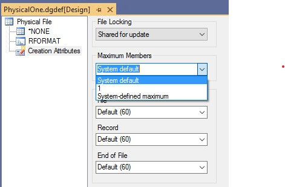
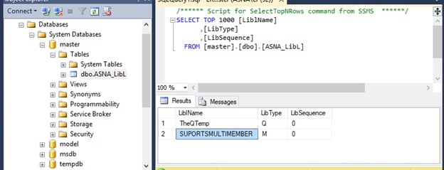

DataGate (DG) connects .NET clients with MS SQL Server.  The concepts surfaced by the DG API are based on the IBM i database ISAM style record level access. The DG client is delivered in the ASNA.QSys.DataGate.Client .NET assembly. 

There are two implementations, both available on the ASNA.QSys.DataGate.Client .NET assembly, of the DG client:
1. _DataGate Linear_ communicates directly with SQL Server via ADO.NET. See [Configure MSSQL for DG Linear](configure-mssql-for-dglinear.html)
2. _DataLink_ communicates with a DataGate Server via TCP/IP using its own [proprietary protocol](/manuals/datagate/programmers-guide/datagate-rpc-protocol.html). The server is implemented as _DataGate for SQL Server_ (DSS) [^1]

**.NET Framework** applications use the _DataLink_ version while newer **.NET** applications use typically the _DataGate Linear_ implementation.

In order to satisfy the ISAM style requests, DG makes use of Scrollable Server Cursors. DG associates a server cursor for each open file; it typically requests a single row at a time from the rowsets used in conjunction with the server cursor.  Each application can maintain a large set of active server cursors.  Record locks are maintained via row locks on the server cursor.

## Mapping OS/400 constructs to SQL Server
The mapping of OS/400 constructs to SQL Server is as follows:

| **OS/400 construct** | **SQL Server artifacts** |
| --- | --- |
| **Physical File** | Table with an optional index for keyed files. The Index is named as the Table name |
| **Logical File – Simple** | View plus an optional index on the base Table. The Index is named as the View name |
| **Logical File – Join** | View (outer or inner join) plus an index on the first Table. The Index is named as the View name |
| **Logical File - Multiformat** | Not supported |
| **Member** | If a physical of simple logical file allows for multiple members, in addition to the file's table (or view), each member also uses a table (or view). If the member's file is keyed, then an index is added to the member's table. |
| **Print file** | Table with a single row containing the print file description |
| **Data Area** | Table with a single row |
| **Library** | Database |
| **Library List** | Collection of database names |
| **QTEMP** | Temporary tables and view created on a designated database and associated with each session |
| **Record Lock** | Server Cursor Lock |
| **Object Lock** | SQL Server 'application lock' |

DSS 'decorates' the Tables and Views with the following custom properties

| **Property** | **Object** | **Value Usage** |
| --- | --- | --- |
| **ASNA_Access Path** | File's table or view | Key description: Key fields, direction and uniqueness |
| **ASNA_Description** | File or Member's table or view | User provided text description |
| **ASNA_FileOrMember** | File's table or view | \*BOTH: Single Member File\*FILE: Multimember File |
| **ASNA_FileOrMember** | Member's table or view | Member's parent file name |
| **ASNA_Wait for Record** | File's table or view | Seconds to wait for a record if it is locked by some other application |
| **ASNA_MaxMembers** | File's table or view | Maximum number of members allowed on the file |

## QTEMP on DataGate Linear
To implement the IBM i concept of QTEMP (a private library for each Job), DG uses the following technique:
- Designate an installation defined SQL Server database (e.g. QTempDB) as the repository of objects stored in the QTEMP libraries for ALL the 'Jobs' or connections.
- A DG Linear connection consists of exactly one, unique SqlClient session.  A SqlClient session, and thus the connection, is assigned a unique ID.
- Whenever a DataGate client refers to an object in the 'QTEMP' library, DG Linear appends the unique session ID to the name and attempts to locate it on the QTempDB database.
- When the connection gets closed (the DG Client goes away), DG Linear deletes all objects in QTempDB with the SqlClient's session ID.
- Users accessing QTEMP programmatically must have read write access to the SQL Server designated database (e.g. QTempDB)

## QTEMP on DataGate for SQL Server

To implement the IBM i concept of QTEMP (a private library for each Job), DG uses the following technique:

- Designate an installation defined SQL Server database (e.g. QTempDB) as the repository of objects stored in the QTEMP libraries for ALL the 'Jobs' or connections.
- Assign a unique ID to each DataGate client (connection)
- Whenever a DataGate client refers to an object in the 'QTEMP' library, DSS appends the unique ID to the name and attempts to locate it on the QTempDB database.
- When the connection gets closed (the DG Client goes away), DSS delete all objects in QTempDB with the client's ID.
- Users accessing QTEMP programmatically must have read write access to the SQL Server designated database (e.g. QTempDB)

## File Members
Support for Multi-Member files is limited: Physical and Simple Logical files can contain one or more members but Join files may not.

When a file is created, the creator specifies the maximum number of members (Maximum Members) the file can contain. This maximum number classifies files into Single Member or Multi-Member.

### Single Member Files

Single Member Files are a special case for those files allowing a maximum of one (1) member. The underlying SQL Server objects of Single Member Files are optimized to use a single table (or view) which represents both the file and the member. The name of the file is used to name the table (or view).

Single Member Files are forced to have exactly one member, and the member's assumed name is the same name of the file.

DG Versions prior to 14.0 treated every file as a Single Member File.

### Multi-Member Files

A file created with a Maximum Members greater than one is a Multi-Member File. These files employ one main table (or view) to represent the file and an additional table (or view) for each member.

The main table (or view) is named using the file's name and each member's table (or view) name is formed by concatenating the file's name, a pound sign '#', and the member name. Creating a physical file named 'CUSTMAST' with two members called 'EAST' and 'WEST' would create these three tables:

- CUSTMAST
- CUSTMAST#EAST
- CUSTMAST#WEST

The main table (or view) serves as the template for the record format and contains no record data. Records added to members are actually added to their corresponding table.

### Installation Configuration

The implementation of the Multi-Member Files facility could break compatibility for older programs that set a Maximum Member value greater than one while creating a new physical or logical file but expect to have a single table (or view) representing both the file and the member. ADBFM Classic users are particularly at risk.

In order to preserve compatibility with these older programs, the support for files with more than one member is configurable.

Each DG Installation can be configured to support multi-member files or be restricted to only support single member files.

Whenever a file is created on a restricted installation, the maximum number of members is forced to be exactly one (1).

When an installation of these versions has been configured to support files with multiple members, there will be a row in the configuration table 'Master.dbo.ASNA\_LibL' with a LibType of 'M' and a LiblName value of 'SUPORTSMULTIMEMBER' as shown below:

[^1]: The DataGate server implementation for MS SQL Server, DataGate for SQL Server, runs as a multi-threaded Windows system service (dgServer.exe); this service executes on the same machine where the SQL Server instance is running.  dgServer.exe is an unmanaged C++ program that uses SqlOleDB to access SQL Server data and schema. Each DataGate Client connection results in two OLEDB session connections from the DataGate Server to SQL Server. These connections can stay open throughout the day doing select, update, delete and insert operations. The OLEDB connections close when the application closes the DataGate connection.
