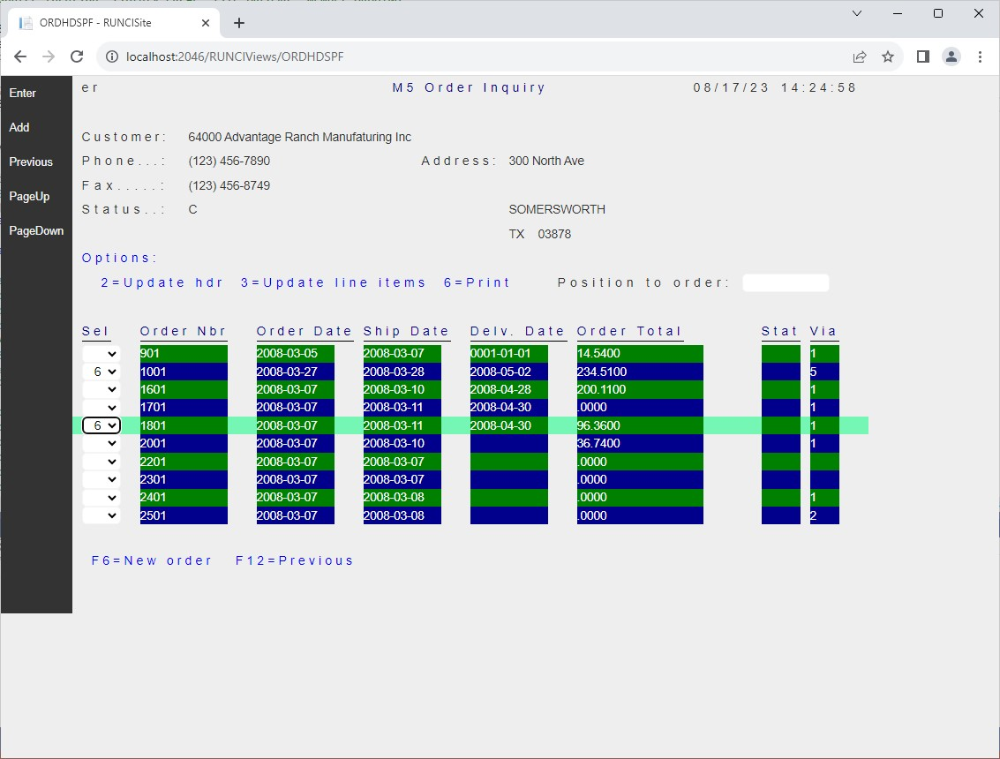

The report written by a program is typically used in only one of these ways:
 - Printed out to paper.
 - Read by a different program to extract some data from the report, commonly refered to *data scraping*.
 - Displayed on the screen to the user who generated the report.

This article shows the last usage by describing a facility to display a report to its User as soon as it is generated by a program. The way used to achieve this to have the program respond to the user’s request by displaying the report as a PDF on the user’s browser. 

## Screen Workflow Sample
The following example shows the screen that is used by a program that will generate a report as the user selects option '6' on a subfile record.



After the report is created, the program calls the facility's `ViewManuscript` to display the following screen to the user.


## Sample Facility
The following sample may help you in enhancing your application to display to the user a report just created by one of the programs.  The facility consists of three components:
 + A program called `ViewManuscript`.
 + A Razor Page called `ViewAPM`.
 + An MVC Controller called `PdfData`.

The facility has been written to show the general technique employed and requires better error handling for production purposes.

### ViewManuscript Program
The ViewManuscript program is called with the same convention as other programs in your application via dynamic calls.  ViewManuscript receives two parameters: 
 + ManuscriptPath – The path to the manuscript.
 + DeleteManuscript – Whether to delete the manuscript after displaying the PDF.

ViewManuscript can be called from the program that creates the report like this:

```cs
    QPRINT.Printer = "Microsoft Print to PDF";
    QPRINT.ManuscriptPath = Spooler.GetNewFilePath(QPRINT.DclPrintFileName);
    QPRINT.Open(CurrentJob.PrinterDB);
    . . .
    // Run code to actually create the report    
    . . .
    QPRINT.Close();
    . . .
    _DynamicCaller.CallD("AsnaSample.Manuscripts.ViewManuscript", out Indicator _, QPRINT.ManuscriptPath, false);
    . . .
```

ViewManuscript also exposes a method that can be used directly, however the ViewManuscript class would have to be added to a common utilities assembly and then add the reference to all calling program.

```cs
    QPRINT.Close();
    . . .            
    AsnaSample.Manuscripts.ViewManuscript viewManuscript = new AsnaSample.Manuscripts.ViewManuscript();
    viewManuscript.Show(QPRINT.ManuscriptPath, false);
    . . .
```

ViewManuscript uses a static property from the DataGate library that has to be initialized with the path to the Renderer.exe.  You can do this initialization in a static constructor of MyJob, like this:

```cs
    static MyJob()
    {
        . . . 
        DataGate.Client.Properties.PrintingProps.Default["Renderer"] = "C:/bin/AsnaRender_2023-07-25_11.59/Renderer.exe";
        . . .
    }
```

> The Render's path should be externalized to some application setting.

Also remember to enable on the website the Controller's end point (possibly in the Startup class)

```cs
    public void Configure(IApplicationBuilder app, IWebHostEnvironment env)
    {
        . . . 
        app.UseEndpoints(endpoints =>
        {
            endpoints.MapRazorPages();
            endpoints.MapControllers();
        });
        . . . 
```

### ViewAPM Razor Page
The Razor Page ViewAPM has a very simplistic styling which can be adapted to your application.

Instead of directly referencing and exposing the path to the PDF, ViewAPM stores the path in `Session` and adds an API call to the `PdfData` controller which will send down the PDF contents when requested by the browser.

ViewAPM includes:
 + A link that displays the PDF in a separate browser tab.
 + An `<object>` to show the PDF right on the page itself.  

Strictly speaking, only one of the two is necessary.


## Facility Code

Here is the complete code for the Facility.

### ViewManuscript Program (The Blue Side)

Let's start with the program.  It can be called like a 'regular' program.
```cs
    _DynamicCaller.CallD("AsnaSample.Manuscripts.ViewManuscript", out Indicator _, QPRINT.ManuscriptPath, false);
```

#### ViewManuscript.cs

```cs
using ASNA.QSys.Runtime;
using ASNA.QSys.Runtime.JobSupport;
using ASNA.DataGate.Client;
using ASNA.DataGate.Client.Properties;
using System.Diagnostics;
using System.Xml;

namespace AsnaSample.Manuscripts
{
    [ActivationGroup("*DFTACTGRP")]
    [ProgramEntry("_ENTRY")]
    public class ViewManuscript : ASNA.QSys.Runtime.JobSupport.Program
    {
        WorkstationFile ViewAPM;

        public string ManuscriptPath;
        public bool DeleteManuscript;
        FixedString<Len<_2, _5, _6>> PDFPATH;       // Field in Razor Page display file.

        //********************************************************************
        public ViewManuscript()
        {
            _IN = new IndicatorArray<Len<_1, _0, _0>>((char[])null);
            ViewAPM = new WorkstationFile(PopulateBufferAPM, PopulateFieldsAPM, null, "ViewAPM", "/AsnaManuView/ViewAPM");
        }

        public void Show(string manuscriptPath, bool deleteManuscript)
        {
            ManuscriptPath = manuscriptPath;
            DeleteManuscript = deleteManuscript;

            renderManuscriptAsPDF();

            ViewAPM.Open();
            ViewAPM.ExFmt("RDSPPDF", _IN.Array);
            ViewAPM.Close();

            // Delete PDF
            string pdfPath = PDFPATH.Trim();
            if (File.Exists(pdfPath))
            {
                File.Delete(pdfPath);
            }

            // Delete manuscript ?
            if (DeleteManuscript && File.Exists(ManuscriptPath))
            {
                File.Delete(ManuscriptPath);
            }
        }

        // Create a PDF out of a manuscript
        void renderManuscriptAsPDF()
        {
            string renderPath = PrintingProps.GetRendererPath();
            string printToFileName = null;

            FileStream manuscriptStream = null;
            XmlTextWriter xmlWriter = null;
            string newManuscriptPath = string.Empty;
            string deleteFlag = "";
            try
            {
                // Ensure Manuscript has its printToFileName attribute set
                manuscriptStream = File.OpenRead(ManuscriptPath);

                XmlDocument manuscript = new();
                manuscript.Load(manuscriptStream);
                XmlElement documentNode = (XmlElement)manuscript.SelectSingleNode("report/document");
                printToFileName = documentNode.GetAttribute("printtofilename");
                if (!string.IsNullOrWhiteSpace(printToFileName))
                {
                    newManuscriptPath = ManuscriptPath;
                }
                else
                {
                    // since Manuscript didn't have printToFileName, create new temp manuscript with attribute.
                    printToFileName = Path.ChangeExtension(ManuscriptPath, ".pdf");
                    documentNode.SetAttribute("printtofilename", printToFileName);

                    string workManuscriptPath = ManuscriptPath + "-viewing";
                    xmlWriter = new XmlTextWriter(workManuscriptPath, System.Text.Encoding.UTF8);
                    manuscript.WriteTo(xmlWriter);
                    xmlWriter.Close();

                    newManuscriptPath = workManuscriptPath;
                    deleteFlag = " /d";
                }
            }
            finally
            {
                manuscriptStream?.Dispose();
                xmlWriter?.Dispose();
            }

            // Invoke Renderer.exe and wait for it.
            string args = $"/m:\"{newManuscriptPath}\" /q{deleteFlag}";

            ProcessStartInfo startInfo;
            startInfo = new ProcessStartInfo(renderPath, args)
            {
                //do this to suppress the command window
                CreateNoWindow = true,
                UseShellExecute = false
            };

            using (Process proc = Process.Start(startInfo))
            {
                if (proc != null)
                {
                    proc.WaitForExit();
                }
            }
            PDFPATH = printToFileName;
        }

        public static void _ENTRY( ICaller _caller, out Indicator __inLR, string manuscriptPath, bool deleteManuscript)
        {
            ViewManuscript viewManuscript = new ViewManuscript();
            viewManuscript.Show(manuscriptPath, deleteManuscript);
            __inLR = true;
        }

        private void PopulateBufferDspPDFRecord(AdgDataSet _dataSet)
        {
            var _table = _dataSet.GetAdgTable("RDSPPDF");
            System.Data.DataRow _row = _table.Row;
            _row["PDFPATH"] = ((string)(PDFPATH));
        }

        private void PopulateBufferAPM(string _recordFormatName, AdgDataSet _dataSet)
        {
            if (string.Equals(_recordFormatName, "RDSPPDF", StringComparison.CurrentCultureIgnoreCase))
            {
                PopulateBufferDspPDFRecord(_dataSet);
            }
        }

        private void PopulateFieldsAPM(string _recordFormatName, AdgDataSet _dataSet)
        {
        }
    }
}

```

### AsnaManuView Area (The Yellow Side)

For convininence, the facility places all the website components it uses into a single **Area** named `AsnaManuView` which is composed of the following items:
 + A folder called `Pages` with the Razor Page `ViewAPM`.
 + An MVC controller called `PdfData`.


#### ViewAPM.cshtml
This sample page includes the directives for namespaces, and tag helpers to have the page complete but may be redundant in your website.  Also notice there are embedded styles that should be better placed in the website's `site.css`

```html
@page
@model ViewAPM
@{
    ViewData["Title"] = "DSPPDF";
}
@namespace AsnaSample.Manuscripts.AsnaManuView
@using ASNA.QSys.Expo.Model
@addTagHelper *, Microsoft.AspNetCore.Mvc.TagHelpers
@addTagHelper *, ASNA.QSys.Expo.Tags

<style>
    .CenteredAndRightAligned {
        display: flex;
        align-items: center;
    }

    .SpooledFilesTitle {
        font-size: x-large;
        color: royalblue;
        padding-bottom: 0.3em;
        margin-left: auto;
        margin-right: auto;
    }

    .HorizontalPaddedButton {
        padding: 0;
        padding-left: 1em;
        padding-right: 1em;
        padding-bottom: 0.5em;
        width: 32px;
        height: 32px;
    }

</style>

<form id="MonarchForm" method="post">
    <DdsFile DisplayPageModel="Model"  >

        <DdsFunctionKeys Location=Hidden />

        <main role="main" class="display-element-uninitialized">
            <DdsRecord For="RDSPPDF" KeyNames="F12 'Go Back'">
                <div class="CenteredAndRightAligned">
                    <span Color="DarkBlue" class="SpooledFilesTitle"> ASNA View PDF File</span>
                    <DdsButton ButtonStyle=Icon iconid="reply" AidKey="F12" Text="Go Back" Color="Red" class="HorizontalPaddedButton" />
                </div>
                <div>

                    @{
                        string pdfPath = "/api/PdfData/" + Model.RDSPPDF.PdfFileID;
                        if (Model.JobHandleForBrowser > 0)
                            pdfPath += "?JobHandle=" + Model.JobHandleForBrowser;
                    }
                    <p><a href="@pdfPath" target="_blank">Display PDF file</a></p>
                    <object data=@pdfPath type="application/pdf" style="width:100%; height:500px;">
                        <p>Unable to display PDF file. <a href="@pdfPath">Download</a> instead.</p>
                    </object>
                </div>

            </DdsRecord>

            <DdsMessagePanel class="dds-message-panel" />

        </main>
    </DdsFile>
</form>

```

#### ViewAPM.cshtml.cs
Here is the Model for ViewAPM.

```cs
using System;
using Microsoft.AspNetCore.Mvc;
using ASNA.QSys.Expo.Model;
using Microsoft.AspNetCore.Http;

namespace AsnaSample.Manuscripts.AsnaManuView
{
    [
        BindProperties,
        DisplayPage()
    ]
    public class ViewAPM : DisplayPageModel
    {
        public RDSPPDF_Model RDSPPDF { get; set; }

        public ViewAPM()
        {
            RDSPPDF = new RDSPPDF_Model();
        }


        [ Record( AttentionKeys = "F12 12") ]
        public class RDSPPDF_Model : RecordModel
        {
            [Char(256)]
            public string PDFPATH { get; private set; }

            public string PdfFileID { get; internal set; }
        }

        static readonly System.Random randomGenerator = new();

        protected override void OnCopyDspFileToBrowser()
        {
            base.OnCopyDspFileToBrowser();

            if (RDSPPDF != null && !string.IsNullOrWhiteSpace(RDSPPDF.PDFPATH))
            {
                string pdfFileID = randomGenerator.Next().ToString() + randomGenerator.Next().ToString();
                string sessionKey = $"PdfFileID.{pdfFileID}";
                HttpContext.Session.SetString(sessionKey, RDSPPDF.PDFPATH);
                RDSPPDF.PdfFileID = pdfFileID;
            }
        }
    }
}

```

### PdfData Controller

#### PdfData.cs
```cs
using Microsoft.AspNetCore.Http;
using Microsoft.AspNetCore.Mvc;

namespace Site.Pages.Monarch
{

    [Route("api/PdfData")]
    [ApiController]
    public class PdfDataController : ControllerBase
    {

        /// <summary>
        /// Get a PDF file stored at the Server.
        /// </summary>
        /// <param name="PdfFileID">The identifier for the requested PDF file.</param>
        /// <returns>The file contents result or a bad request result.</returns>
        [HttpGet("{PdfFileID}")]
        public IActionResult Get(string PdfFileID)
        {
            try
            {
                string sessionKey = $"PdfFileID.{PdfFileID}";

                string pdfFilePath = HttpContext.Session.GetString(sessionKey);

                if (pdfFilePath == null)
                    return new BadRequestResult();

                byte[] fileContent = System.IO.File.ReadAllBytes(pdfFilePath);

                FileContentResult fileContentResult = new FileContentResult(fileContent, "application/pdf");
                return fileContentResult;
            }
            catch
            {
                return new BadRequestResult();
            }
        }
    }
}
```
