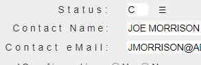

The main panel of a Display File Page generated by a migration process typically contains only constant text and input boxes. Selected pages may benefit from additional elements like buttons, dropdown boxes, images, checkboxes etc.

There are two ways of adding elements to a page, using standard html elements and using TagHelpers provided by ASNA.QSys.Expo. The Expo TagHelpers available are:
 + DdsButton
 + DdsContextMenu
 + DdsCheckboxField
 + DdsRadioButtonGroupField
 + DdsSignature

The DdsCharField and DdsDecField TagHelpers provide a mechanism to show values in a Dropdown list.

## Button

A [DdsButton](/reference/asna-qsys-expo/expo-tags/dds-button-tag-helper.html) is a convenient way of adding a button to a display file page to provide the user to select the function key he would have to press.  

The `DdsButton` allows the programmer to associated the location of the cursor when the DdsButton is pressed along with the name of then input field and even provide some data on the field when the DdsButton is clicked.

The button can be rendered to the user in one of four [styles](/reference/asna-qsys-expo/expo-tags/dds-button-tag-helper/button-styles.html):
 + Button
 + Icon
 + Image
 + Link

## DdsContextMenu

A [DdsContextMenu](/reference/asna-qsys-expo/expo-tags/dds-context-menu-tag-helper.html) is a convenient way of adding *contextual* menu-option listings (near input-capable fields) to execute **actions**. The *context* menu is presented as a  [☰ Hamburger button](https://en.wikipedia.org/wiki/Hamburger_button) in its *closed state*. 

To open the menu, the user clicks the **☰** button (using the left-mouse button or a finger *tap*). The list of available actions is presented in a pop-up window. Any action can be selected from the listing using the left-mouse button (or finger *tap*), or, to *collapse* the menu back to the [☰ Hamburger button](https://en.wikipedia.org/wiki/Hamburger_button) the user may click on any record - in an area outside the menu -.

### DdsMenuOption

Each of the available *actions* in a [DdsContextMenu](/reference/asna-qsys-expo/expo-tags/dds-context-menu-tag-helper.html), is specified with a 
[DdsMenuOption](/reference/asna-qsys-expo/expo-tags/dds-menu-option-tag-helper.html) tagHelper.

An *action* is described by a group of properties, allowing execution to:

1. *Change* the value of an existing field on the page. Optionally setting the *row,col* values for the virtual legacy application cursor-location, to allow the program that executed this DisplayPage to test current cursor-location to conditionally execute logic code.
2. *Push* an [AidKey](/reference/asna-qsys-expo/expo-model/aid-key.html) to submit the page.
3. Combination of *(1)* and *(2)* above to *Change* a field and then *Push* an [AidKey](/reference/asna-qsys-expo/expo-model/aid-key.html) to submit the page.

For example, legacy Applications frequently use `F4` aid-key to *prompt* a Window with valid values for a field. This was typically done by means of a **(F4)** text constant in front of an input field.

The following markup enhancement, replaces the `F4` DdsConstant with a `DdsContextMenu` describing a few actions: 


```html
<div Row="15">
    <DdsConstant Col="18" Text="Status:" />
    <DdsCharField Col="27" For="CUSTREC.STATUS" VirtualRowCol="15,27" PositionCursor="44" tabIndex=@pageTabIndex++ />
    @*<DdsConstant Col="30+5" Text="(F4)" Color="Blue" />*@

    <DdsContextMenu Col="31">
        <DdsMenuOption Text="Active" FocusField="CUSTREC.STATUS" FieldValue="A" />
        <DdsMenuOption Text="Closed" FocusField="CUSTREC.STATUS" FieldValue="C" />
        <DdsMenuOption Text="--" />
        <DdsMenuOption Text="Other . . ." FocusField="CUSTREC.STATUS" AidKey="F4" />
    </DdsContextMenu>
</div>
```
>Note: DdsContextMenuOption allows specifying group separators, by setting the Text property to "--" (two dashes). A separator renders as a horizontal line.

The context menu is rendered like the following images:

* First the [☰ Hamburger button](https://en.wikipedia.org/wiki/Hamburger_button) shows on `Col` 31.



<br>

* When user clicks on the **☰** button, the menu options: `Active`, `Closed` and `Other` are presented.


<br>

* Executing the action `Active` will find the field `"CUSTREC.STATUS"`, and change its value to `"A"`.

* Executing the action `Other ...` will set the cursor to the field `"CUSTREC.STATUS"` and *Push* the `F4` Aid key. The Page will submit to the server to continue application logic.

<br>

<br>

## Checkbox

A [DdsCheckbox](/reference/asna-qsys-expo/expo-tags/dds-checkbox-field-tag-helper.html) is a good candidate to replace the typical Legacy `Yes/No` - constant and field - combination, with a User-Friendly element.

The `DdsCheckbox` allows the programmer to specify for a field the value to be associated with the check state and the one for unchecked state.

## Dropdown Box 

When a decimal or character field's domain is limited by a finite set of discrete values the field can be displayed as a dropdown box. 

To display the [field as a dropdown box](/reference/asna-qsys-expo/expo-tags/field-as-dropdown-box.html), set the `ValuesText` property of the TagHelpers (`DdsCharField`, `DdsDecField`) to the options the user will see and the `Values` property of the Model's field attribute with the corresponding program values associated with the user values.

## Radio Button Group
An alternative to using a Dropdown box to list the available options for a field is using a set of radio buttons for the user to make her selection. 

The [DdsRadioButtonGroupField](/reference/asna-qsys-expo/expo-tags/dds-radio-button-group-field-tag-helper.html) facilitates the creation of a group of mutually exclusive radio buttons.

## Signature
The [DdsSignature](/reference/asna-qsys-expo/expo-tags/dds-signature-tag-helper.html) Tag Helper provides a Display element that shows a depiction of a hand written signature. When bound to an input-capable field in the Model, it allows to capture the signature by recording a series of line and curve sketches using an input device (such as mouse, or finger movements on a touch device).
