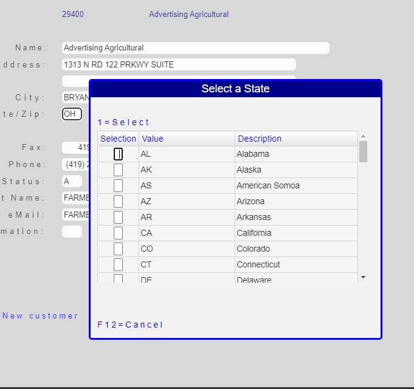
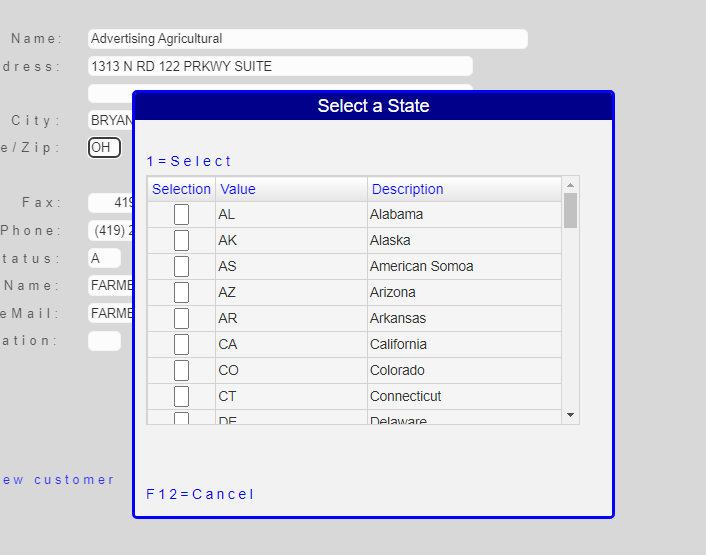
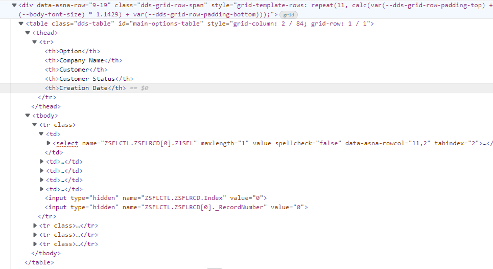

## Background


The [IBM i](https://www.ibm.com/it-infrastructure/power/os/ibm-i) defines a [subfile](https://www.ibm.com/docs/en/i/7.1?topic=files-using-subfiles) as: *A group of records that is read from or written to a display-device file. For example, a program reads records from a database file and creates a subfile of output records. When the entire subfile has been written, the program sends the entire subfile to the display device in one write operation*.

>Even when a subfile is similar to a file (as the name implies) - in which it can be read or written to - it is not a file (nor a Database View), maybe the *closest* computer term is a [Data Table](https://learn.microsoft.com/en-us/dotnet/framework/data/adonet/dataset-datatable-dataview/datatables).

A Subfile is defined using [DDS for Display Files](https://www.ibm.com/docs/en/i/7.2?topic=dds-display-files) syntax. The definition includes the declaration of the fields that make up the record; each field gets defined with its name, data type and usage. Additionally the Subfile definition specifies the location on the screen where the fields are to be displayed along with [DDS]((https://www.ibm.com/docs/en/i/7.2?topic=80-sfl-subfile-keyword-display-files)) keyword that specify their attributes, like color, that are used when rendering the display file to the screen.
 
RPG programs populate the subfile by writing one or more records to the Subfile Record. Programs can also read data entered by the user on the input capable fields of the Subfile Record.

While a `Subfile` is typically rendered on a Display as a *columnar* Table, the `Subfile` is frequently *not* easily represented as such. There are several peculiarities of a Subfile, that make it unique. 

### Subfile uniqueness
1. Records may be displayed in multi-line format.
2. Multi-line records may be toggled to a single-line with a command ([Drop](https://www.ibm.com/docs/en/i/7.1?topic=80-sfldrop-subfile-drop-keyword-display-files)).
3. Subfile-field heading text is usually displayed as constants, not logically associated with fields in the subfile.
4. Frequently Subfile-field heading text is *non-contiguous* (but composed by pieces, written at different positions).

>There are more *unique features* of Subfiles compared to plain Database Display Views, but these four are enough to make the case for this topic.


## Migrating Display Files containing Subfiles

Display accuracy is **the most important consideration** when Migrating Display Files. The initial (or *raw*) Migration should not make *any* wrong assumptions that may affect functionality.

Subfiles are migrated as a templated repetition of individual visible fields, each positioned on the Page using the legacy line-position definition in [DDS](https://www.ibm.com/docs/en/i/7.2?topic=dds-display-files) (converted to HTML [Grid](https://developer.mozilla.org/en-US/docs/Learn/CSS/CSS_layout/Grids) positioning ).

The following is a snippet of [RazorPage](https://learn.microsoft.com/en-us/aspnet/core/mvc/views/razor?view=aspnetcore-6.0) source for a Subfile:

```html
<div Row="7">
    <DdsConstant Col="3" Text="Sel" Color="DarkBlue" Underline="*True" />
    <DdsConstant Col="7+1" Text="Custno" Color="DarkBlue" Underline="*True" />
    <DdsConstant Col="14+1" Text="Customer Name" Color="DarkBlue" Underline="*True" />
    <DdsConstant Col="55+1" Text="City / State / Zip" Color="DarkBlue" Underline="*True" />
</div>
<div Row="8" RowSpan="@SFLC_SubfilePage">
    @for (int rrn=0; rrn < Model.SFLC.SFL1.Count; rrn++)
    {
        int row = 8 + rrn;
        <DdsSubfileRecord RecordNumber="rrn" For="SFLC.SFL1">
            <DdsDecField Col="4" For="SFLC.SFL1[rrn].SFSEL" VirtualRowCol="@row,4" EditCode="Z" ValuesText="'0','2','3','5','7','9','10','11'" tabIndex=@pageTabIndex++ />
            <DdsDecField Col="7+1" For="SFLC.SFL1[rrn].SFCUSTNO" Color="Green : !61 , DarkBlue : 61" EditCode="Z" Comment="CUSTOMER NUMBER" />
            <DdsCharField Col="14+1" For="SFLC.SFL1[rrn].SFNAME1" Color="Green : !61 , DarkBlue : 61" />
            <DdsCharField Col="55+1" For="SFLC.SFL1[rrn].SFCSZ" Color="Green : !61 , DarkBlue : 61" Comment="CITY-STATE-ZIP" />
        </DdsSubfileRecord>
    }
</div>
```

<br>
The subfile renders as the following image:


Notice:
1. Column headings are positioned individually as constants, not referencing the fields of the subfile.
2. The line to divide the column headings and the data in the subfile uses *Underline* font attribute (which does not extend the full column width).
3. The text for the Column headings could have been produced by multiple independent DdsConstant (i.e. `Customer` and `Name` may have been defined as two different constants.)
4. Column headings are not *centered*. (Centering text on IBM i requires manual calculation of positions).
5. `Col` field positioning is hard-coded. (These cannot be altered externally. I.e. using CSS styles).
6. The Subfile does not show Borders or field grid-lines.

<br>
This particular Subfile could be rendered as a HTML Table, as follows:


>Note: Not all Subfiles are candidates to be upgraded to Tables. Most Applications use a large percentage of Subfiles that may be upgraded. The rest can remain as they are.

## Steps

We want to transform the [RazorPage](https://learn.microsoft.com/en-us/aspnet/core/mvc/views/razor?view=aspnetcore-6.0) source listed above, to the following:

```html
<style>
    .wider-table-column {
        width: 45%;
    }
</style>

<div Row="7" RowSpan="@SFLC_SubfilePage+1" SpanStyle="GridPanel">
    <DdsTable Col="5" ColSpan="80" >
        @for (int rrn = 0; rrn < Model.SFLC.SFL1.Count; rrn++)
        {
            int row = 8 + rrn;
            <DdsTableRow RecordNumber="rrn" For="SFLC.SFL1">
                <DdsTableColumn Heading="Selection">
                    <DdsDecField For="SFLC.SFL1[rrn].SFSEL" VirtualRowCol="@row,4" EditCode="Z" ValuesText="'0','Update','Sales','Delivery Address','Create Sales','Print sales','Print sales batch','Orders'" tabIndex=@pageTabIndex++ />
                </DdsTableColumn>
                <DdsTableColumn Heading="Customer Name & Number" HeadingClass="wider-table-column">
                    <DdsDecField For="SFLC.SFL1[rrn].SFCUSTNO" EditCode="Z" Comment="CUSTOMER NUMBER" />
                    <DdsCharField For="SFLC.SFL1[rrn].SFNAME1" />
                </DdsTableColumn>
                <DdsTableColumn Heading="City / State / Zip">
                    <DdsCharField For="SFLC.SFL1[rrn].SFCSZ" Color="Green : !61 , DarkBlue : 61" InvertFontColors="*False" Comment="CITY-STATE-ZIP" />
                </DdsTableColumn>
            </DdsTableRow>
        }
    </DdsTable>
</div>
```

> Page [style rules](https://developer.mozilla.org/en-US/docs/Web/CSS/Reference) (like `wider-table-column`) may be defined externally, typically in `wwwroot/css/site.css` file.

1. On the div tagHelper that has the `RowSpan` property, add `SpanStyle` property and set it to value `GridPanel`. This defines [Grid Layout](https://developer.mozilla.org/en-US/docs/Web/CSS/CSS_Grid_Layout) so that we can position the new `DdsTable` at a upper-left coordinate using grid units.

2. Add new `DdsTable` element on the next line. 

   a) Indicate the position *upper-left* corner of the Table, by setting a value to `Col` property (`Col="5"` in this example).
   b) Define the Table `width` setting the value of property `ColSpan` to desired value (`80` columns in this example).
>The Width of a table may not be less than the specified. HTML Table rendering will try to adjust the Table columns (borders, etc.) according to the styles of internal table elements. When you don't get the exact Table with, experiment by adding one more column to get closer to the expected results (this may be particularly more important when vertical scroll bar appear, see next section *Tables taller than the GridPanel*)  

3. Leave the `@for ... { }` construct intact.

4. Replace `DdsSubfileRecord` tagHelper with `DdsTableRow` tagHelper.

5. Each field (or group of fields) we want on a Table column, is surrounded by a `DdsTableColumn` tagHelper. As properties for `DdsTableColumn` tagHelper we can define the `Heading` text and optionally a Style to be used for that Table element (property `HeadingClass`).

6. The field declaration tagHelpers (`DdsConstant`, `DdsCharField`, `DdsDecField`, etc.) remain almost intact. All the properties can be indicated, with the exception of `Col` which has no meaning for a table data element placement. (If provided, it will be ignored).

> Using the default styles, the `height` of the DdsTable is computed automatically based on the Table's contents.


<br>
## Tables taller than the GridPanel (scrollbar)

For tables that have data rows that exceed the vertical space given to the `GridPanel`, two more features are desirable:
1. A way to `lock` the Heading's title position (to avoid being scrolled out-of-view).
2. Scrollbars.

The `locking` of the Heading's title position is a rather new feature of the HTML table (allegedly non-intentional). The following `CSS` accomplishes the `locking` of the table heading at the top of the table.

```css
.dds-table thead th {
    position: sticky;
    top: 0px;
}
```
>This style is the default provided by ASNA Expo. It is described here for Web developers pursuing fine customization.

### Table Height and Element "Display" value.

The HTML [table](https://developer.mozilla.org/en-US/docs/Web/HTML/Element/table) uses the property [display](https://developer.mozilla.org/en-US/docs/Web/CSS/display) equals to `table` (by default) which means:

1. The table `Height` is set by the amount of `table-rows`. The [height](https://developer.mozilla.org/en-US/docs/Web/CSS/height) css property value is ignored.
2. When [overflow](https://developer.mozilla.org/en-US/docs/Web/CSS/overflow) *is-not* `hidden`, scrollbars appear in the container element (as close to the table as possible).

The following shows a subfile upgraded to a HTML table, showing scrollbars:



>Note: the scrollbar is not touching the right edge of the table.

If the [display](https://developer.mozilla.org/en-US/docs/Web/CSS/display) property value is changed to `block`:

1. The [height](https://developer.mozilla.org/en-US/docs/Web/CSS/height) css property value is used. Since `DdsTable` uses [Grid Layout](https://developer.mozilla.org/en-US/docs/Web/CSS/CSS_Grid_Layout), we can specify the `Height` using [grid-row](https://developer.mozilla.org/en-US/docs/Web/CSS/grid-row) property value.
2. When [overflow](https://developer.mozilla.org/en-US/docs/Web/CSS/overflow) *is-not* `hidden`, scrollbars appear inside the Table).



When using `display:block`, the `DdsTable` needs the *height* property to be explicit:

```html
<div Row="3" RowSpan="9" SpanStyle="GridPanel" ColSpan="40" >
    <DdsTable id="prompt-table" Col="2" ColSpan="40" Row="1" RowSpan="9">
        @for (int rrn = 0; rrn < Model.SFLC.SFL1.Count; rrn++)
        {
            int row = 5 + rrn;
            <DdsTableRow RecordNumber="rrn" For="SFLC.SFL1">
                <DdsTableColumn Heading="Selection">
                    <DdsDecField For="SFLC.SFL1[rrn].SFLSEL" VirtualRowCol="@row,3" EditCode="Z" tabIndex=@pageTabIndex++ />
                </DdsTableColumn>
                <DdsTableColumn Heading="Value">
                    <DdsCharField For="SFLC.SFL1[rrn].SFLVALUE" />
                </DdsTableColumn>
                <DdsTableColumn Heading="Description">
                    <DdsCharField For="SFLC.SFL1[rrn].SFLDESC" />
                </DdsTableColumn>
            </DdsTableRow>
        }
    </DdsTable>
</div>
```
>Note: Row="1" RowSpan="9" provided on `DdsTable` when `display` is set to `block`.

<br>
## CSS Selectors with Specificity rules

HTML Tables are one of the more complex HTML elements and choosing the right CSS styles may be challenging.

Oftentimes, the best approach to experiment with the style combination that will produce the desired output is by using Developer Tools provided by the Browser. Looking at the Table HTML component tree and selecting the different elements, will let you identify where to apply particular styles.

An alternative to specify class selectors (as we did for `DdsTableColumn HeadingClass` property above), is to use [Selector Specificity](https://developer.mozilla.org/en-US/docs/Web/CSS/CSS_Selectors) rules.

The topic on the use of [Selectors](https://developer.mozilla.org/en-US/docs/Web/CSS/CSS_Selectors) is extensive and we shall not attempt to cover all the details here, or duplicate what other references already document, instead we include some examples that show how powerful this technique may be.

The following appears on the markup of a RazorPage:

```html
<style>
    #main-options-table td:nth-child(1) {
        text-align: center;
        width: 20%;
    }
    #main-options-table td:nth-child(2) {
        width: 40%;
        padding-left: 0.5em;
    }
    #main-options-table td:nth-child(3) {
        text-align: center;
    }
    #main-options-table td:nth-child(5) {
        padding-left: 0.5em;
    }
</style>
```

Where there is a `DdsTable` specified with code similar to the following:

```html
<div Row="9" RowSpan="@ZSFLCTL_SubfilePage" SpanStyle="GridPanel">
    <DdsTable id="main-options-table" Col="2" ColSpan="82">
        @for (int rrn = 0; rrn < Model.ZSFLCTL.ZSFLRCD.Count; rrn++)
        {
            int row = 11 + rrn;
            <DdsTableRow RecordNumber="rrn" For="ZSFLCTL.ZSFLRCD">
                <DdsTableColumn Heading="Option">
                    <DdsCharField For="ZSFLCTL.ZSFLRCD[rrn].Z1SEL" VirtualRowCol="@row,2" PositionCursor="32" InvertFontColors="32" tabIndex=@pageTabIndex++ />
                </DdsTableColumn>
                <DdsTableColumn Heading="Company Name">
                    <DdsCharField For="ZSFLCTL.ZSFLRCD[rrn].Z1AETX" VirtualRowCol="@row,4" InvertFontColors="79" />
                </DdsTableColumn>
                <DdsTableColumn Heading="Customer">
                    <DdsDecField For="ZSFLCTL.ZSFLRCD[rrn].Z1ABNB" VirtualRowCol="@row,41" InvertFontColors="79" EditCode="Three" />
                </DdsTableColumn>
                <DdsTableColumn Heading="Customer Status">
                    <DdsCharField For="ZSFLCTL.ZSFLRCD[rrn].Z1ACST" VirtualRowCol="@row,51" />
                    <DdsConstant text=" "/>
                    <DdsCharField For="ZSFLCTL.ZSFLRCD[rrn].ZRAZTX" VirtualRowCol="@row,56" />
                </DdsTableColumn>
                <DdsTableColumn Heading="Creation Date">
                    <DdsDecField For="ZSFLCTL.ZSFLRCD[rrn].VRADDA" VirtualRowCol="@row,68" EditWord="  /  /  " />
                </DdsTableColumn>
            </DdsTableRow>
        }
    </DdsTable>
</div>
```

Note:
1. A unique `ID main-options-table` has been given to this Table (in case there are more than one Subfile on this Page).
2. The table has five columns (there are five `DdsTableColumn` tagHelper instances).  

Identifying the HTML Table with `id=main-options-table` reveal all HTML elements created by the `DdsTable` tagHelper, where we would want to affect by adding CSS styles.




Let's take each of the Selectors listed above and provide some explanation:

```css
    #main-options-table td:nth-child(1) {
        text-align: center;
        width: 20%;
    }
```

This selector reads: *Select the first [td](https://developer.mozilla.org/en-US/docs/Web/HTML/Element/td) which are descendants of the element with the unique id `main-options-table`; center the elements inside and allocate to this `td` 20% of the table width*. Which means, the first column uses 20% of the width of the `main-options-table` table and its cells will have the (horizontal) center alignment.


```css
    #main-options-table td:nth-child(2) {
        width: 40%;
        padding-left: 0.5em;
    }
```

This selector reads: *Select the second [td](https://developer.mozilla.org/en-US/docs/Web/HTML/Element/td) which are descendants of the element with the unique id `main-options-table`; allocate 40% of the width of the table and set the left-padding attribute to 0.5 [em](https://www.w3.org/Style/Examples/007/units.en.html) units*. Which means, the second column uses 40% of the width of the `main-options-table` table and its cells will have more padding to the left (half the current body font-size).

The other two selectors provide similar styling options.

>Using selectors, particularly when these are defined externally, de-couples the *Style-Design* from the *Development* **roles**. Selectors that fail to *select* elements are ignored (there is no harm of breaking the Application).


