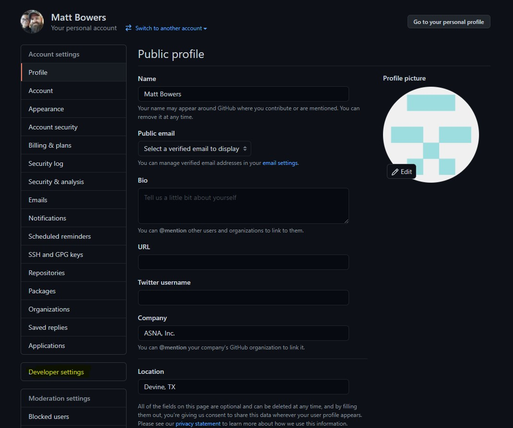
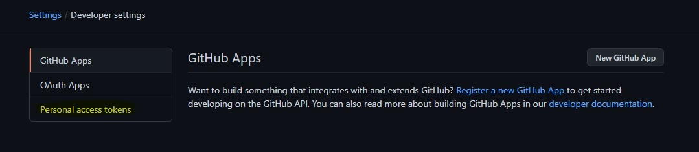
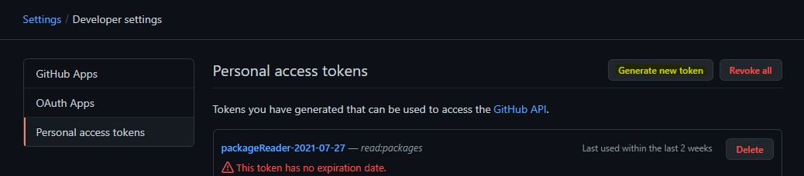
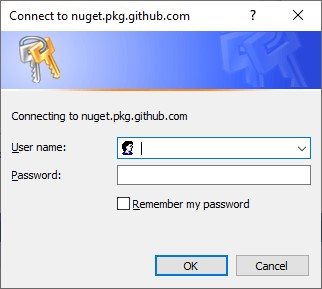

## NuGet Packages
To facilitate the building of migrated applications, Monarch Base is made available via the following NuGet packages:

- ASNA.DataGate.Client
- ASNA.QSys.Runtime
- ASNA.QSys.MonaServer
- ASNA.QSys.Expo

There are two main ways to get ahold of the NuGet packages:
 - Have ASNA ship you a zip file with the packages
 - Download them from GitHub

## Accessing ASNA QSys NuGet Packages on GitHub
The NuGet packages are available at [GitHub](https://github.com/orgs/asnaqsys/packages). In order to download them from this location you will need to have access to the AsnaQSys repository. Contact ASNA to be added to the ASNA QSys organization on the customer team.

Most developers will be using Visual Studio for their projects.  Visual Studio can be configured to directly access the NuGet packages.

## Configure Visual Studio with GitHub NuGet Packages
The following steps show how to create a personal access token at GitHub and use it to configure Visual Studio.

### Create a Personal Access Token in GitHub
a.	Register/Login to GitHub.

b.	Click on your profile picture in the upper right corner of GitHub then select **Settings**

c.	Click the **Developer settings** button on the left-hand menu

d.	Click **Personal access tokens** on the left-hand menu

e.	Click **Generate new token** at the top of the page, below the header

f.	Add a note to identify what the token is for (e.g. “Package Reader”)

g.	Set the Expiration for the token. Note: For these, we recommend **No expiration** because Visual Studio does not have a user-friendly way of updating the tokens.

h.	Check the box for **read:packages**

i.	Click **Generate token** at the bottom of the page

j.	The token will be displayed. Once you navigate away from the page, you will not see the code again and will have to repeat this process to generate another.

### Add a NuGet Package Source in Visual Studio
a.	Go to **Tools -> Options -> NuGet Package Manager -> Package Sources**

b.	Click the **+** button in the upper right corner to add a new source

c.	Change the name to something useful such as **GitHub-AsnaQSys**

d.	Change the Source to **https://nuget.pkg.github.com/asnaqsys/index.json**

e.	Click **Update**

f.	Click **OK**

### Set the Credentials for the Package Source.
a.	Open your Visual Studio solution.

b.	Right click on the project for which you would like to add the NuGet package(s) and select **Manage NuGet Packages…**

c.	Change the **Package source** in the upper right corner to the new source you just added

d.	Click **Browse**

e.	You should be prompted to enter credentials (if not, hit the refresh button)
  1.	Enter your **GitHub user name* (not email address).
  2.	Enter the **Personal Access Token** generated previously (not your GitHub password).
  3.	Check **Remember my password**
  4.	Click **OK**

Now you should be able to see the packages in the AsnaQSys organization.