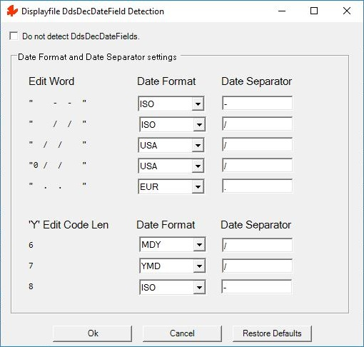

Display file decimal numbers that appear to be used as dates on the screen are migrated by Monarch using a Tag Helper called [DdsDecDateField](/reference/expo/qsys-expo-tags/dds-dec-date-field-tag-helper.html). `DdsDecDateField` shows the decimal value as a date on the browser and places a button to allow the user to pop-up a calendar.

In order to determine if a decimal number may be a date the following considerations are taken at migration time:
 - Field Size of (6,0) or (8,0)
 - Edit code:
   + 'Y' with Code length of 6, 7 or 8
 - Edit word:
   + "&nbsp;&nbsp;&nbsp;&nbsp;-&nbsp;&nbsp;-&nbsp;&nbsp;"
   + "&nbsp;&nbsp;&nbsp;&nbsp;/&nbsp;&nbsp;/&nbsp;&nbsp;"
   + "&nbsp;&nbsp;/&nbsp;&nbsp;/&nbsp;&nbsp;&nbsp;&nbsp;"
   + "0&nbsp;/&nbsp;&nbsp;/&nbsp;&nbsp;&nbsp;&nbsp;"
   + "&nbsp;&nbsp;.&nbsp;&nbsp;.&nbsp;&nbsp;&nbsp;&nbsp;"

If the value of the decimal number is not a valid date, it is displayed as a number instead of a date.

Monarch has this Directive dialog to select the type of date to be used based on the edit code or edit word.

