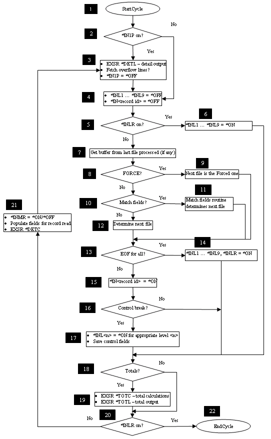

## Overview

The [IBM i RPG Program Cycle](https://www.ibm.com/docs/en/i/7.2?topic=logic-program-cycle) is a series of ordered steps that the main procedure goes through for each record read. Depending on the coded specifications, your program may or may not use each step in the cycle.

## QSys Cycle

The [RPG implicit logic](https://www.ibm.com/docs/en/i/7.2?topic=cycle-detailed-rpg-iv-program) is made explicit during the conversion to C#.

Each program that uses the `Cycle` is generated with the StartEntry method calling the generated _StartCycle method as indicated by the following pseudo-code:

```cs
void StarEntry(int cparms)
{
    _StartCycle();
    do
    {
        .
        .
        .
    } while (!(bool)_INLR);
}
```

Immediately after the `_StartCycle()` there is an explicit `do loop` that repeats until the **Last Record Indicator** (`_INLR`) is set. The program is said to have processed tha **Last Record** (on the primary file) and it should terminate.

The following [Flow Chart](https://en.wikipedia.org/wiki/Flowchart) shows the steps that are completed, the conditions that are tested and the points in which the following pre-defined methods are called:

* `_DetailCalc`
* `_DetailOutput`
* `_TotalCalc`
* `_TotalOutput`
* `_FetchOverflow`



> Note whenever \*INnn is mentioned in the flow-chart steps, the C# _INnn is referred. In the same fashion when \*On or \*Off are mentioned, the C# values *true* and *false* are assumed.

## Detailed numbered flow-chart building blocks

1. _StartCycle is the name of the subroutine that initializes the Cycle. It assumes the primary file and all secondary files are already open, which causes the first record from the primary and all secondary files to be read, and all program fields have their correct values including first page indicator (`_IN1P` is initialized to *true* in the class constructor).

2. If _IN1P is *true* (this is the first time _StartCycle is called), go to step 3. Otherwise, go to step 4.

3. Perform header and detail output (`DetailPrintSpec` and `HeaderPrintSpec` in AVR `CycleOutput` section). Set `_IN1P` to *false*.

4. Set all record identifying and `_L1` through `_L9` indicators to *false*.

5. If `_INLR` is *true*, go to step 6, otherwise go to step 7.

6. Set the level indicators `_INL1` through `_INL9` to *true*, and go to step 18.

7. If this is not the first time thru the loop, read a record from the last file processed.

8. If `FORCE` was issued on the previous time thru the loop, go to step 9, otherwise go to step 10.

9. The forced file is selected for processing. If the forced file is at `EOF`, go to step 10. Otherwise, the match record indicator (`_INMR`) is set to *OFF and the match fields in the forced file are saved. Continue at step 13.

10. If match fields are used in the program, go to step 11. Otherwise go to step 12.

11. The match field routine selects the next file. Continue at step 13.

12. The next file is selected. It will be either the primary if is not at `EOF`, or the first secondary that is not at `EOF`, selected in the order by which they are specified in the program.

13. If all files are at `EOF`, then go to 14. Otherwise go to 15.

14. Set `_INLR` to *true* and all level indicators `_INL1` through `_INL9` as well. Continue at 18.

15. The record identifying indicator is set *true* for the record selected for processing.

16. If there is a control break, go to 17. Otherwise go to 18.

17. The appropriate control level indicator (`_INL1` through `_INL9`) is set *ON. All lower level indicators are also set *true*.

18. Determine whether totals need to be executed and if so go to 19. Otherwise go to 20. If no control levels are specified for any record, totals are bypassed on the first cycle and are always processed after the first cycle. If control levels are specified, totals are bypassed until the first record containing control fields has been processed.

19. Total Calculations (`_TotalCalc`) and total output are processed (`TotalPrintSpec` in  `CycleOutput`).

20. If `_INLR` is *true*, go to step 22.

21. The match record indicator (`_INMR`) is set *true* or *false* depending on whether the record read is a matching record. Data from the last record read is made available for processing. Detail Calculations (`_DetailCalc`) are processed. Continue at step 3.

22. Return to the caller.

## AVR `Cycle Output` Specifications

During Migration, if there are [Output Specifications](https://www.ibm.com/docs/en/i/7.3?topic=specifications-output) of type `'H'`, `'D'`, `'T'`, a section of the intermediate [AVR](https://asna.com/us/products/visual-rpg) will be generated as follows:

```cs
BegCycleOutput
   DetailPrintSpec format Cond(expr)
   HeaderPrintSpec format Cond(expr)
   TotalPrintSpec format Cond(expr)
   DetailPrintSpec format Cond(expr)
   TotalDiskSpec file Op() Flds(expr)
EndCycleOutput
```

The explicit C# conversion will translate each of these records with its proper *Conditions*, Disk *Operations* and used *Fields* into the body of the methods discussed above (`_DetailCalc`, `_DetailOutput`, `_TotalCalc` etc.).

