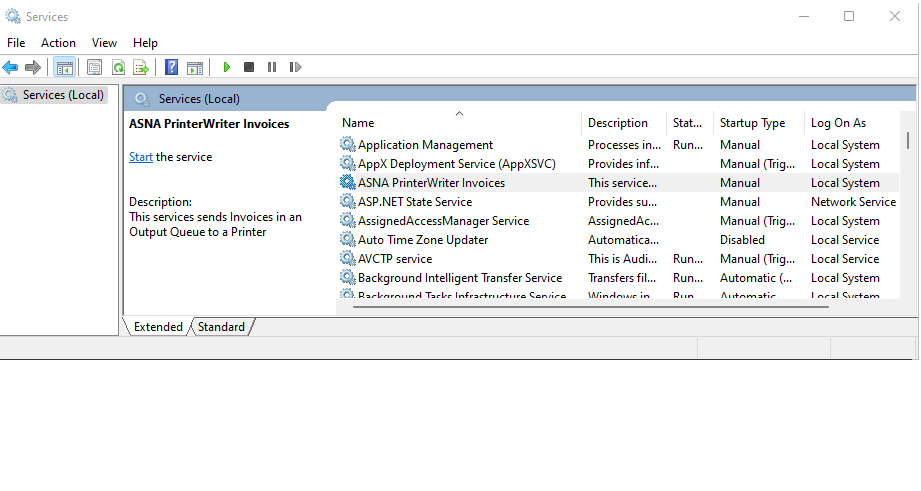

Monarch provides the program ```ASNA.QSys.PrinterWriter.exe``` to assist in the processing of spooled printouts waiting in an output queue.

You can read the [Concepts behind printing here](/concepts/printing/printing-introduction.html).


## Configuration Settings
The PrinterWriter's ```appsettings.json``` file is used to provide the default configuration for the writer. Command line arguments  override those in the json file.

The configuration settings are:

|        Setting       | Usage |
| -------------------- | ----- |
| OutputQueueRootPath  | The path to the root folder of the output queue's subfolders. This should be the same as the <a ref="/reference/asna-qsys-runtime-job-support/classes/job-config.html"> <code>JobConfig.OutputQueueRootPath</code></a> property used to instantiate the application's jobs.
| OutputQueueName      | The output queue's name.  The combination of the OutputQueueRootPath and OutputQueueName form the folder path where manuscripts will be expected. Each instance of PrinterWriter can only process manuscripts from a single queue.
| PrinterName          | The name of the printer where all output should be forced to. If not given, the printer's name in each manuscript will be used.
| TextOnly             | Set to ```true``` to direct the  Printer Writer to ignore all graphical settings and print only the output text.
| DataGateRendererPath | The location and name of DataGate's renderer.  Typically set to: ```C:/Program Files (x86)/Common Files/ASNA Shared/Client/Common/Renderer.exe```

Assume the following setup on a Windows machine:

|         Item          |            Location  |
|-----------------------| -------------------- |
| Output Queue Root     | C:/MonarchQueues/OutputQueues
| Printer Writer Exe    | C:/MonarchOperations/bin/ASNA.QSys.PrinterWriter.exe

### AppSettings
Given the locations above, the PrinterWriter's ```appsettings.json``` could be configured as follows:
```json
{
   . . . 

    "AppSettings": {
        "OutputQueueRootPath": "C:/MonarchQueues/OutputQueues",
        "DataGateRendererPath": "C:/Program Files (x86)/Common Files/ASNA Shared/Client/Common/Renderer.exe",
        "OutputQueueName": "QPRINT"
    }
}
```

In addition to the settings above, the ```PrinterName``` can be used to force all output to go to a particular printer and the ```TextOnly``` bypasses the DataGate Renderer and prints using text only without any graphical components.  

> The only printers that can be used by PrinterWriter are those those visible to the user account.  This is particularly important when running the PrinterWriter as a Service (see below).

Here is an example that forces output to the front office printer in text only mode.

```json
{
   . . . 

    "AppSettings": {
        "OutputQueueRootPath": "C:/MonarchQueues/OutputQueues",
        "DataGateRendererPath": "C:/Program Files (x86)/Common Files/ASNA Shared/Client/Common/Renderer.exe",
        "OutputQueueName": "QPRINT",
        "PrinterName": "\\\\FrontOfficeServer\\Brother MFC-L9570",
        "TextOnly": true
    }
}
```

The ```OutputQueueName``` in the ```appsetings.json``` file is the default queue name for the PrinterWriter. Each instance of PrinterWriter can only process manuscripts from a single output queue. If multiple queues are used by the application, an instance of PrinterWriter should be launched for each queue providing the queue's name to each instance with a command line parameter.

### Command Line Parameters
Command line arguments can be given when invoking the writer to override those settings found in the ```appsettings.json``` file.

The format of the parameters is the standard one for .NET configured applications.  One such style is prefixing each parameter with two dashes ```--```.  For example, to override the output queue name and the output queue root path, use:

```
--AppSettings:OutputQueueRootPath="C:/Print Output/Queues" --AppSettings:OutputQueueName MyOutputQueName
```


## Install PrinterWriter as a Windows Service

Maybe it is not possible to print from a Windows Service:
https://docs.microsoft.com/en-us/archive/blogs/dsui_team/printing-from-a-windows-service


To Create and Delete the PrinterWriter as a Windows Service, use the [```sc``` program](https://docs.microsoft.com/en-us/windows/win32/services/controlling-a-service-using-sc) in a  Command Prompt running as Administrator.

Use the ```sc create``` to installing a PrinterWriter 

For the assumptions above, here is an example of Creating/Installing the writer for the Invoices output queue:
```
> sc create "ASNA PrinterWriter Invoices" binpath= "C:/MonarchOperations/bin/ASNA.QSys.PrinterWriter.exe  --AppSettings:OutputQueueName Invoices"

> sc description "ASNA PrinterWriter Invoices" "This services sends Invoices in an Output Queue to a Printer"
```

To Delete/Uninstall the Writer Service issue this command
```
> sc delete "ASNA PrinterWriter Invoices"
```

The ```sc``` program allows further control of the Service with commands to Start, Stop and Pause the PrinterWriter.

You can also use the Services plugin on the Management Console to interactively manage the PrinterWriter.



> When running the PrinterWriter as a Service (see below), the only printers available to the Service are those visible to the user account running the Service.  If it is being run under the local system account, then the only visible printers are those installed locally, not network printers.

## Install Printer for 'All Users' on Windows

To add a printer on a computer basis, i.e.: available to all users, use the [printui.dll utility](https://docs.microsoft.com/en-us/windows-server/administration/windows-commands/rundll32-printui)

The process is as follows:

 1. Run the command prompt as an **Administrator**
 1. Type ```rundll32 printui.dll,PrintUIEntry /ga /n\\server\printer``` where server and printer make up the correct UNC path to the printer.
 1. Restart the spooler service with the commands:
    1. ```net stop spooler```
    1. ```net start spooler```

The printer should now be listed and available to all users that log onto the workstation.

