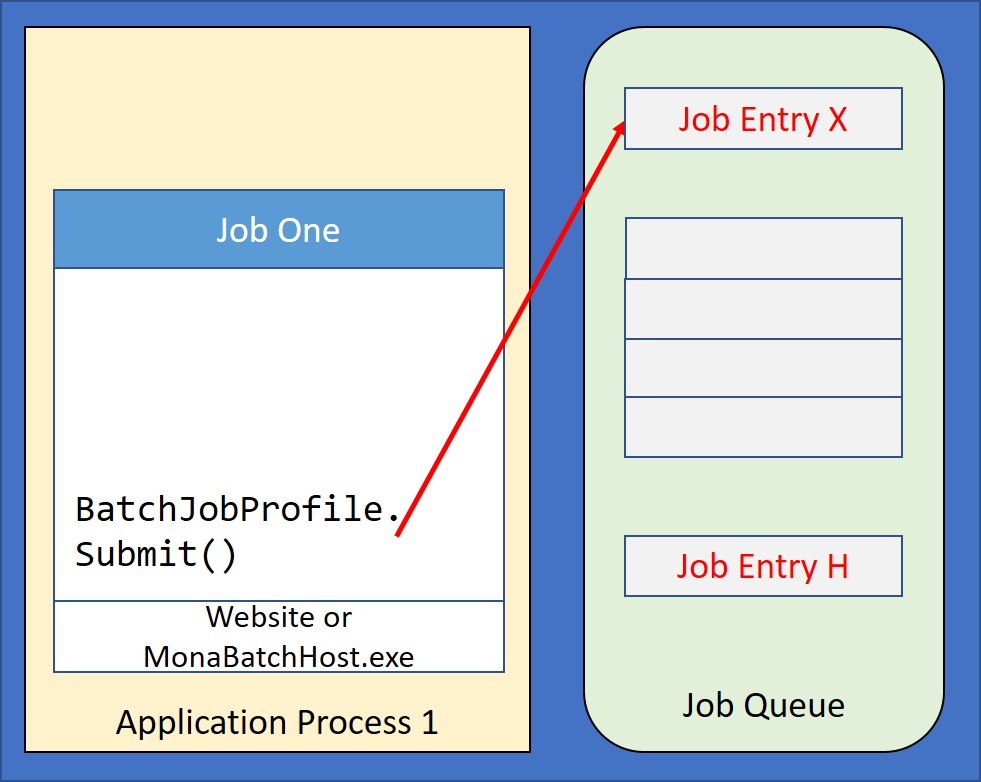
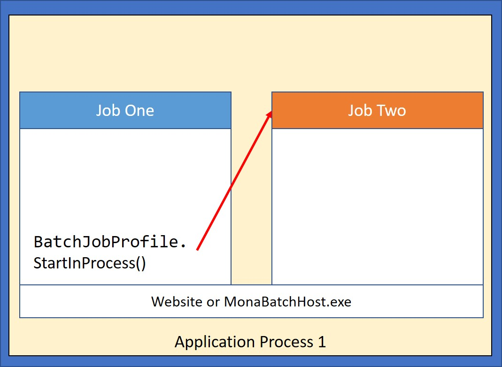

Batch jobs are characterized by not having to interact directly with a user. These jobs typically perform their work by accessing database files and updating them or producing reports or by waiting for work items to arrive in some data queue or service.

Batch jobs can be started immediately or can be scheduled in a job queue to be started at a later time.


## Job Queues[^1] According to IBM

A job queue contains an ordered list of jobs waiting to be processed by a subsystem. The job queue is the first place that a submitted batch job goes before becoming active in a subsystem. The job is held here until a number of factors are met.

In order for jobs on a job queue to be processed, there must be an active subsystem that is accepting work from that job queue. When a subsystem starts, it attempts to allocate the job queues that it is configured to accept work from, and it must successfully allocate a job queue in order to process jobs from that job queue. Therefore, while one subsystem can process jobs from multiple job queues, only one subsystem can process jobs from a particular job queue at a time.

Subsystems select jobs from job queues in priority order, within limits that can be configured for each priority. Each job has a job queue priority that can be managed when the job is on the job queue.


## Job Scheduling for Monarch Applications
There are three strategies for executing migrated batch programs:
1. Add the Batch Job description to a job queue managed by the Monarch’s batch subsystem (MBS).
2. Start the Batch Job immediately either in a separate .NET process or in a separate thread of the same process as the Job that is starting the new Batch job.
3. Use a Third Party Scheduler. 

The first two strategies are supported directly by Monarch Base. The migration tools give preference to the strategy of strarting the new batch job immediately, but it is easy to convert the migrated code to utilze a job queue.

It is also possible to submit the jobs to a third-party scheduler if it provides an API with a good functionality set. The work involved in adapting the migrated code to utilizing the third-party scheduler is dependent on the scheduler's capabilities, this work may include creating a Console program to launch the initial Migrated program.

## Standard Batch Job Creation
Monarch Base provides two classes to assist in the execution of Batch Jobs:
- [BatchJobProfile](/reference/runtime/qsys-runtime-job-support/batch-job-profile.html)
- [BatchOptions](/reference/runtime/qsys-runtime-job-support/batch-options.html)

The Class [BatchJobProfile](/reference/runtime/qsys-runtime-job-support/batch-job-profile.html) encapsulates the attributes for a Batch Job providing methods to Submit or Start the job.  When constructing a BatchJobProfile instance, it is necessary to provide the name of the migrated program that will be called in the new job along with the program's parameters.  Additionally, an instance of the Class BatchOptions is required.

The Class [BatchOptions](/reference/runtime/qsys-runtime-job-support/batch-options.html) provides many of the initial attributes for the new job. When an attribute is not set in the BatchOptions object, its value is taken from the parent Job.

Here is an example of creating first a BatchOptions object and using it to create a BatchJobProfile instance.

```cs
    BatchOptions options = new BatchOptions();
    options.AccountingCode = "EXTERNAL";
    options.LDA = new string(pType[0], 1024);
    options.JobName = "CREATESA";
    options.Switches = "01010101";
    options.JobOutputQueue = "NIGHTPRT";

    BatchJobProfile jobProfile = new BatchJobProfile(options, "Acme.CUSTCRTS", wkAlpha9, SndMessage3, OrdAmount);
```
Even after the BatchJobProfile has been created, additional options can be configured via the ```BatchOptions``` property. 

```cs
    jobProfile.BatchOptions.DBName = "ProdDB";
    jobProfile.BatchOptions.DBNamePrint = "PrintFilesDB";
```

#### SBMJOB Migration
The migration tool supports the following BatchOptions for the SBMJOB command:

| BatchOption Property | Legacy keyword |
|--------| ---------------|
| AccountingCode | AGGCDE
| UserLibraryList | INLLIBL
| JobName | JOB
| JobOutputQueue| OUTQ
| Switches | SWS

These parameters on the Submit method are set by the migration tool from keywords:

| BatchOption Property | Legacy keyword |
|--------| ---------------|
| JobQueuePriority | JOBPTY
| JobQueueName | JOBQ
| ScheduleDateString | SCDDATE
| ScheduleTimeString | SCDTIME

### Submitting the Job to a Queue
Once a BatchJobProfile has been created and configured, it can be submitted to a Job Queue via the Submit command. For example:
```cs
    jobProfile.Submit("NIGHTQUEUE","7");       
```

The [BatchJobProfile.Submit()](/reference/runtime/qsys-runtime-job-support/batch-job-profile.html#void-submitstring-jobqueuename-string-jobqueuepriority-string-scheduledatestring-string-scheduletimestring) method creates a Job Queue Entry in the proper Job Queue with the attributes needed to run the new job.  

{:width="65%"}

_Submitting the Job to a Queue_

The [Monarch Batch Subsystem](#monarch-batch-subsystem-mbs) is responsible for processing the Job Queue Entries launching the new Job.


### Start a Batch Job Immediately
When a Batch Job starts immediately, there is no Queue involved but instead a new process or thread is created and the job starts on it.

The main scenario for starting a Batch Job immediately is to allow a user to continue working in an Interactive Job while a report or some other long running operation is performed in a separate background job for the user.

There are two methods to start a Batch Job immediately as shown below:

```cs
    if (pType == "I")
        jobProfile.StartInProcess();
    else
        jobProfile.StartOutOfProcess();
```

#### In Process

When a Job is started in process via the [BatchJobProfile.StartInProcess()](/reference/runtime/qsys-runtime-job-support/batch-job-profile.html#void-startinprocess) method, a separate .NET thread is created within the current process and the new batch job runs in that separate thread. 

{:width="65%"}

_Starting Job Immediately in Process_

<a name="{out-of-process}"></a>

#### Out of Process

If the Job is started out of process via the [BatchJobProfile.StartOutOfProcess()](/reference/runtime/qsys-runtime-job-support/batch-job-profile.html#void-startoutofprocess) method, a new OS process is created and the Batch Job runs in the new process.

{:width="65%"}

_Starting Job Immediately out of Process_

The entry point for the new process is the [ASNA.QSys.BatchHost](#BatchHost) executable.

## Monarch Batch Subsystem (MBS)

The `BatchJobProfile.Submit()` method creates a human readable version of the Job Queue Entry that encapsulate a requests to run a program.   MBS employs the OS file system as follows:
 - Each Job Queue is represented by a folder with the name of the Queue.  It is located under the directory specified in the ```MonarchJob.JobQueueBaseQueuesPath``` property; assuming this is set to **C:\JobQueues**, then the QBATCH queue will reside in **C:\JobQueues\QBATCH**.
 - Each request is stored in a file with the extension JQE (for Job Queue Entry). Its name is composed by concatenating the following attributes:
   + Priority on Queue
   + Timestamp
   + Job Name

For instance, the job 'CREATESA' submitted on 11/23/2019 at 9:59:05.342 AM would generate a file named: **5_20191123095905342_CREATESA.jqe**

The advantage of this naming convention is the ease in which the state of a job queue can be inspected.   A Queue folder sorted alphabetically will show the job queue entries in the order they would be executed, with the lowest numbered priorities listed first in the order in which they were submitted.

The JQE file is a JSON document with the job attributes, for example:
 - program Name – fully qualified migrated program's name
 - parameters – for the program
 - AssemblyListProfile - name of the profile of the assembly list
 - libraryList – initial library list
 - outputQueue – default output queue
 - switches – the 8 job switches


Here is a shortened example of a JQE file.
```json
{
  "Version": "1.1",
  "CreationTimestamp": "2022-05-27T12:07:29.1564036-05:00",
  "ScheduleDateString": "*CURRENT",
  "ScheduleTimeString": "*CURRENT",
  "OutputQueueRootPath": "C:\\MonarchQueues\\OutputQueues",
  "IFSRootPath": "//MyServer/MyShare",
  "DLORoot": "\\QDLS",
  "MonarchMessageFileFolder": "C:\\Demos\\CAP\\CustApp\\MessageFiles\\",
  "BatchHostFolder": "C:\\MOM",
  "AssemblyListProfile": "REPORTS",
  "ProgramName": "Acme.CUSTCRTS",
  "ParmList": [
    "000068100",
    "No ",
    "76543.21"
  ],
  "JobName": "CREATESA",
  "JobOutputQueue": "NIGHTPRT",
  "DBName": "ProdDB",
  "Switches": "01010101",
  "PsdsJobUser": "USER1",
  "AccountingCode": "EXTERNAL",
}
```

### BatchDispatch

The MBS program `ASNA.QSys.BatchDispatch.exe` (BatchDispatch) is a console program that ‘watches’ a job queue’s windows folder processing the entries found in it. The folder works as a Queue for Jobs. As the entries of the queue are being processed, BatchDispatch creates a process for the entry and invokes the program, it then waits for the process to complete.  The entry point for the new process is the [ASNA.QSys.BatchHost](#batchhost) executable. BatchDispatch runs one job at a time.

{:width="75%"}

_Dispatching Job from a Queue_

The source code for BatchDispatch is in GitHub where customers can fork the repository and customize it to their particular needs.

 > BatchDispatch Repository: [https://github.com/asnaqsys/ASNA.QSys.BatchDispatch](https://github.com/asnaqsys/ASNA.QSys.BatchDispatch)

BatchDispatch receives these parameters when started, each parameters must be prefixed with either ‘-‘ or ‘/’:

| Option | Use                                 | Arg. Type | Required | Default |
| ------ | ----------------------------------- | --------- | -------- | ------- |
| q=     | Job queue name                      | String    |    Yes   |         |
| p=     | Full Path to the base queues folder | String    |    No    |  Note * |
| x=     | Extension to the job que entry      | String    |    No    |  "jqe"  |
| s      | Silent                              |    -      |    No    |  false  |
| h or ? | Show options and exit               |    -      |    No    |  false  |

Note *: %LocalAppData%/JobQueues

Example:
```
> ASNA.QSys.BatchDispatch.exe /q=NIGHTLY -p="C:/MonarchQueues/JobQueues"
BatchDispatch:
    Queue Name           = NIGHTLY
    Base Queues Path     = C:/MonarchQueues/JobQueues
    JQE Extension        = jqe

6/24/2022 5:05:16 PM => Processing entries of type jqe on job queue folder C:/MonarchQueues/JobQueues\NIGHTLY.
6/24/2022 5:05:16 PM =>   Processing entry C:\MonarchQueues\JobQueues\NIGHTLY\5_20220624120729100_CREATESA.jqe

6/24/2022 5:05:16 PM Starting Program: 'Acme.CUSTCRTS' in Assembly 'C:\Source\Demos\CAP\CustApp_20220406\MonarchExecutable\CUSTCRTS_CS\bin\Debug\net5.0\Acme.CUSTCRTS.dll'
6/24/2022 5:07:37 PM Time Elapsed: 00:02:20.69 Exit Code: 0x0
```
Read how to [configure ASNA.QSys.BatchDispatch](/manuals/configuration/configure-batch-processor.html).


### BatchHost

The console program `ASNA.QSys.BatchHost.exe` (BatchHost) serves as the entry point for jobs running on their own processes; these jobs get initiated immediately via the [BatchJobProfile.StartOutOfProcess()](#out-of-process) method or get placed in a queue via the [BatchJobProfile.Submit()](#submitting-the-job-to-a-queue) method.

The source code for ASNA.QSys.BatchHost is in GitHub in the MonaServer repositiory.

 > ASNA.QSys.BatchHost [Source](https://github.com/asnaqsys/ASNA.QSys.MonaServer/tree/main/src/ASNA.QSys.BatchHost) is in the MonaServer Repository: [https://github.com/asnaqsys/ASNA.QSys.MonaServer](https://github.com/asnaqsys/ASNA.QSys.MonaServer)

Read how to [configure ASNA.QSys.BatchHost](/manuals/configuration/configure-batch-processor.html) to set the dictionary of assembly lists. The JQE property AssemblyListProfile is used to select the AssemblyList for the dictionary.

----------

[^1]: https://www.ibm.com/docs/en/i/7.5?topic=concepts-job-queues


