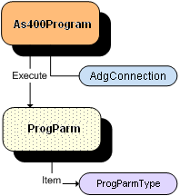

The DataGate Client class library is a set of classes, interfaces, and value types that provides access to DataGate functionality and is designed to be the foundation on which DataGate Database applications, components, and controls are built.

## Namespaces
The **ASNA DataGate assembly** contains 4 Namespaces that support the ability for client-side database access.

| Namespace | Description |
| ---- | ---- |
| [ASNA.DataGate.Client](datagate-client-namespace.html) | The primary Namespace used by client applications. Contains the most fundamental classes for accessing database server resources. |
| [ASNA.DataGate.Common](datagate-common-namespace.html) | Contains the common classes for accessing database server resources. |
| [ASNA.DataGate.DataLink](datagate-data-link-namespace.html) | Contains the fundamental classes for accessing data. |
| [ASNA.DataGate.Providers](datagate-providers-namespace.html) | Contains essential classes for supplying additional parameters for the **AdgConnection** Class. |

## Exceptions
The class library documentation lists the exceptions that each member throws along with a description of the condition under which it is thrown. 

## Thread Safety
All public static members (methods, properties, fields, and events) within the DataGate Client support concurrent access within a multithreaded environment. Therefore, any DataGate Client static member can be simultaneously invoked from two threads without encountering race conditions, deadlocks, or crashes.

For all classes and structures in DataGate Client, check the Thread Safety section in the Reference documentation to determine whether it is thread safe. If you want to use a class that is not thread-safe in a multithreaded environment you must wrap an instance of the class with code that supplies the necessary synchronization constructs. 

## Functionality
This model depicts an overview of the DataGate Client classes that are used for each function displayed below. 

[Database Access](adg-connection-class.html)
 

[Stored Procedure Call](as400program-class.html)
 

[File Access](file-adapter-class.html)

