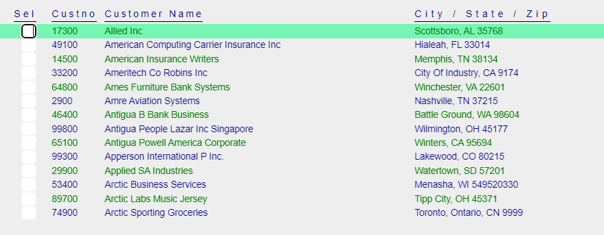

Defines a Context Menu.

**Namespace:** ASNA.QSys.Expo.Tags
**Assembly:** ASNA.QSys.Expo.Tags.dll

**Inheritance:** [Object](https://docs.microsoft.com/en-us/dotnet/api/system.object) --> [TagHelper](https://learn.microsoft.com/en-us/dotnet/api/microsoft.aspnetcore.razor.taghelpers.taghelper?view=aspnetcore-8.0)
<br>
<br>

## Remarks

Defines a Context Menu.

A Context Menu is a *non-field* element that renders as a [☰ Hamburger button](https://en.wikipedia.org/wiki/Hamburger_button).
It should contain a list of [DdsMenuOption](/reference/expo/qsys-expo-tags/dds-menu-option-tag-helper.html) *tagHelpers* that define the available **actions** a user may select for execution.

Typically, the Context Menu is designed to be positioned *next* to an input field, to provide its *context*. 

When a user *left-clicks* the [☰ Hamburger button](https://en.wikipedia.org/wiki/Hamburger_button), the list of [DdsMenuOption](/reference/expo/qsys-expo-tags/dds-menu-option-tag-helper.html)s are rendered, overlapping the position of the **☰** Hamburger button, popping-up from the Page ready for the user to select the Menu option to execute.

To collapse the Context Menu, the user may *left-click* on an area outside the pop-up menu.

A Context Menu is positioned by specifying a value to the the `Col` property (as any other `DdsField` or `DdsConstant` tagHelpers). When used inside a `DdsTableColumn` tagHelper, use `Name` instead of `Col` properties.

When defined within a [DdsSubfileRecord](/reference/expo/qsys-expo-tags/dds-subfile-record-tag-helper.html), the **☰** Hamburger button moves up and down the subfile records (as the user *hovers* over records using the mouse). The **☰** Hamburger button defines the context to be *the selected record* in the subfile.

More than one Context Menu, may be defined in a *DdsSubfileRecord*.

>To customize the appearance (color, padding, etc.) override the `dds-menu-* CSS` styles in your `~wwwroot\css\site.css` file.
<br>
<br>

## Example 1: Replace F4 Prompt Constant with a Context Menu

Legacy Applications frequently use `F4` aid-key to *prompt* a Window with valid values for a field. This was typically done by means of a **(F4)** text constant in front of an input field.

The following markup enhancement, replaces the `F4` DdsConstant with a `DdsContextMenu` describing a few actions: 


```html
<div Row="15">
    <DdsConstant Col="18" Text="Status:" />
    <DdsCharField Col="27" For="CUSTREC.STATUS" VirtualRowCol="15,27" PositionCursor="44" tabIndex=@pageTabIndex++ />
    @*<DdsConstant Col="30+5" Text="(F4)" Color="Blue" />*@

    <DdsContextMenu Col="31">
        <DdsMenuOption Text="Active" FocusField="CUSTREC.STATUS" FieldValue="A" />
        <DdsMenuOption Text="Closed" FocusField="CUSTREC.STATUS" FieldValue="C" />
        <DdsMenuOption Text="--" />
        <DdsMenuOption Text="Other . . ." FocusField="CUSTREC.STATUS" AidKey="F4" />
    </DdsContextMenu>
</div>
```
>Note: DdsContextMenuOption allows specifying group separators, by setting the Text property to `--` (two dashes). A separator renders as a horizontal line.

The context menu is rendered like the following images:

* First the [☰ Hamburger button](https://en.wikipedia.org/wiki/Hamburger_button) shows on `Col` 31.


<br>

* When user clicks on the **☰** button, the menu options: `Active`, `Closed` and `Other` are presented.


<br>

* Executing the action `Active` will find the field `"CUSTREC.STATUS"`, and change its value to `"A"`.

* Executing the action `Other ...` will set the cursor to the field `"CUSTREC.STATUS"` and *Push* the `F4` Aid key. The Page will submit to the server to continue application logic.

<br>

## Example 2: Set a value on 'Select' action field in a subfile using a Context Menu.

A typical user-interface paradigm used on IBM i was to define a decimal input-capable action-selector field in a subfile, where the user would enter an action identifier, like: "2" to Update, "3" to Display details etc. While this technique was powerful, since you could select the action for more than one record and then submit the request, getting all the actions executed one after the other, this requires some memorization of what each action id means (or additional help constants on the screen to list each option with a small description).

The following image presents such subfile on a page:



The Application logic would use the value(s) entered on the input field, and execute different actions (2=Update, 3=Display Sales, etc.)

This can be improved, by adding a Context Menu with the most used actions:


The DdsContextMenu with `Col="75"` can be easily added to the markup, with options: `Update Customer` and `Display Sales`, as follows:

```html
<div Row="8" RowSpan="@SFLC_SubfilePage">
    @for (int rrn = 0; rrn < Model.SFLC.SFL1.Count; rrn++)
    {
        int row = 8 + rrn;
        <DdsSubfileRecord RecordNumber="rrn" For="SFLC.SFL1">
            <DdsDecField Col="4" For="SFLC.SFL1[rrn].SFSEL" VirtualRowCol="@row,4" EditCode="Z" tabIndex=@pageTabIndex++ />
            <DdsDecField Col="7+1" For="SFLC.SFL1[rrn].SFCUSTNO" Color="Green : !61 , DarkBlue : 61" EditCode="Z" Comment="CUSTOMER NUMBER" />

            <DdsCharField Col="14+1" For="SFLC.SFL1[rrn].SFNAME1" Color="Green : !61 , DarkBlue : 61" />
            <DdsCharField Col="55+1" For="SFLC.SFL1[rrn].SFCSZ" Color="Green : !61 , DarkBlue : 61" Comment="CITY-STATE-ZIP" />

            <DdsContextMenu Col="75">
                <DdsMenuOption Text="Update Customer" FocusField="SFLC.SFL1[rrn].SFSEL" FieldValue="2" AidKey="Enter" />
                <DdsMenuOption Text="Display Sales" FocusField="SFLC.SFL1[rrn].SFSEL" FieldValue="3" AidKey="Enter" />
            </DdsContextMenu>

        </DdsSubfileRecord>
    }
</div>
```

Note that `AidKey="Enter"` was also added on each of the two Menu Options, to automatically submit the page, after their values are set to the `SFSEL` subfile record field at the selected `RRN`.

Also note that the image shows the Menu in its *open* state (after left-click was pushed). Normally there would be a **☰** Hamburger button displayed on the subfile record highlighted as the mouse pointer hovers over the subfile records.


## Properties

| Type | Name | Description
| --- | --- | --- 
| [Int32](https://learn.microsoft.com/en-us/dotnet/csharp/language-reference/builtin-types/integral-numeric-types) | Col | Gets or sets a value that indicates horizontal position for field/constant within the page. Valid values start at 1 typically up to 132.  |
| [String](https://learn.microsoft.com/en-us/dotnet/api/system.string?view=net-8.0) | Name | Gets or sets the menu-option unique name (used mostly for DdsTable container, where Col is not used). |
